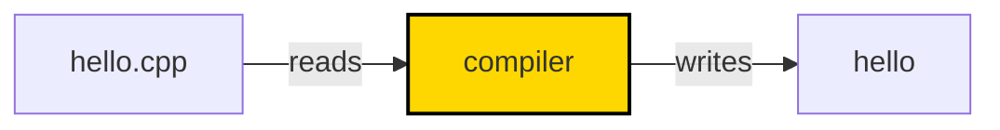
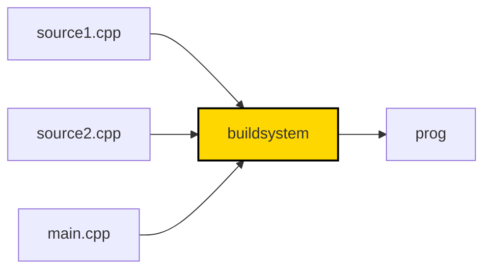
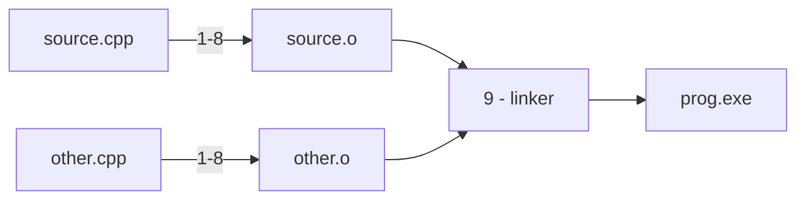

# Wykład 1 - Translacja

Zakres:
* budowanie programów w języku C++
* jednostki translacji, trajektoria kompilacji
* symbole, obiekty, zmienne
* algorytm linkera
* definicje i deklaracje
* one definition rule
* słowa kluczowe static/extern
* przestrzenie nazw

### Język C++

TODO

Język C++ jest:
* aktywnie rozwijany
* trudny
* wszechobecny
* wszechstronny


### Hello World

Zacznijmy od najprostrzego programu w C++ zaimplementowanego w jednym pliku `hello.cpp`:

```cpp
#include <iostream>

int main()
{
    std::cout << "Hello World!";
    return 0;
}
```

Mając treść takiego programu w pliku tekstowym na dysku możemy go zbudować:

```shell
# Linux z wykorzystaniem kompilatora gcc
g++ -o hello.gcc hello.cpp
```

```shell
# Linux z wykorzystaniem kompilatora clang
clang++ -o hello.clang hello.cpp
```

```shell
# Windows
cl /Fehello.exe hello.cpp
```

Do zbudowania potrzebny jest **kompilator** - program który tłumaczy kod z plików tekstowych na kod maszynowy.
Takich kompilatorów jest bardzo dużo, wszystkie się różnią, mają wiele wersji, wspierają rozwijający się
język [w różnym stopniu](https://en.cppreference.com/w/cpp/compiler_support).



Standard C++ nie mówi nic na temat szczegółów realizacji
kompilatora. W szczególności źródła nie muszą być plikami
w potocznym rozumieniu (niektóre systemy nie mają plików).
Definiuje uproszczony schemat tego jak proces budowania
ma działać, który jest realizowany różnie przez różnych dostawców
narzędzi (tzw. implementacja języka).

Dzisiaj można łatwo używać kompilatorów online do prostych nauki i pisania prostych programów, np. https://godbolt.org/.

Po wygenerowaniu pliku wyjściowego możemy go uruchomić:

```shell
./hello.gcc
```

Przeanalizujmy strukturę programu. Rozpoczynamy od **dyrektywy preprocesora**:

```cpp
#include <iostream>
```

Kompilator czytając plik źródlowy wykonuje w pierwszej kolejności interpretacji takich dyrektyw.
`#include` wkleja treść pliku `iostream` w miejscu dyrektywy.

Dalej następuje definicja funkcji `main()`:

```cpp
int main()
{
    ...
}
```

W ciele funkcji znajduje się instrukcja wypisania - użycie operatora `<<`:

```cpp
std::cout << "Hello World!";
```

### Trajektoria kompilacji

Program w języku C++ jest budowany z wielu tekstowych plików wejściowych - tzw. **jednostek translacji**.



Każdy plik źródłowy przechodzi przez [9 faz tłumaczenia](https://en.cppreference.com/w/cpp/language/translation_phases#Translation_phases):

1) mapowanie znaków źródłowych
2) sklejanie linii
3) lekser
4) preprocesor
   - pliki załączane dyrektywą `#include` rekursywnie przechodzą przez fazy 1 - 4
5) kodowanie znaków
6) łączenie string'ów
7) **kompilacja**
8) instancjonowanie szablonów
9) **linkowanie**




Formalnie jednostką translacji nazywa się wejście
fazy 7 - właściwego kompilatora. Potocznie, 
programiści często nazywają jednostkami translacji
pliki źródłowe.

Jedynie linkowanie jest procesem globalnym.
Pozostałe mogą być wykonywane niezależnie na każdym pliku wejściowym. 

W zależności od typu błędu będzie on
diagnozowany na różnych etapach tego potoku.

Kompilatory zwykle pozwalają na selektywne sterowanie
fazami kompilacji. Przykładowo `gcc` posiada serię flag
pozwalającą zatrzymywać proces po jednym z 4 etapów:
```
> gcc --help
...
  -E  Preprocess only; do not compile, assemble or link.
  -S  Compile only; do not assemble or link.
  -c  Compile and assemble, but do not link.
```

Wykorzystując je można zapisać i obejrzeć
produkty pośrednie procesu translacji.

```shell
g++ -E -o hello.i hello.cpp 
# hello.i zawiera wyjście preprocesora
```

```shell
g++ -S -o hello.s hello.i
# hello.s zawiera wyjście kompilatora
```

```shell
gcc -c hello.s
# hello.s zawiera wyjście assemblera
```

```shell
gcc -o hello hello.o
# hello zawiera zlinkowany plik wykonywalny
```

Tłumacząc to na wyżej opisane fazy:
Flaga `-E` spowoduje wykonanie faz 1-6, `-S` fazy 7 i 8 (częściowo),
`-c` kończy fazę `8`. Wywołanie bez flag wykonuje linker - fazę 9.

Jak widać nie wpisuje się to czysto w model abstrakcyjny, 
który nie wymusza istnienia asemblera. 

### Symbole, obiekty i zmienne
