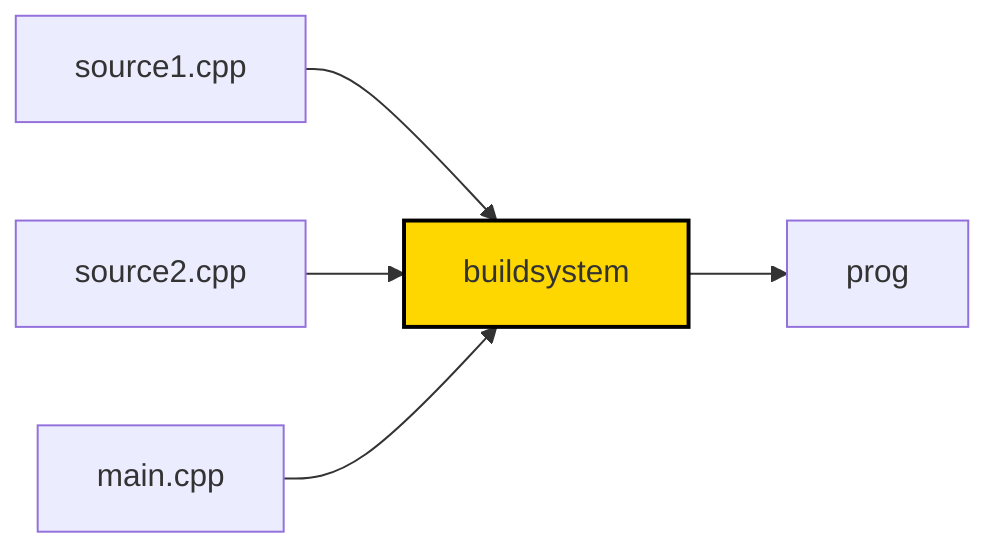
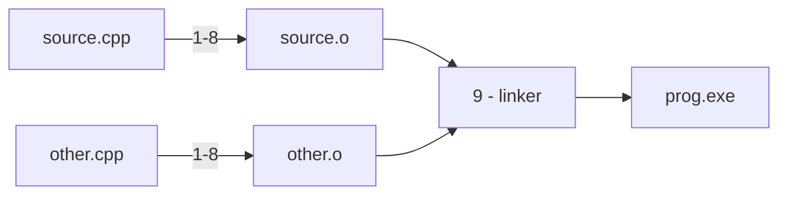
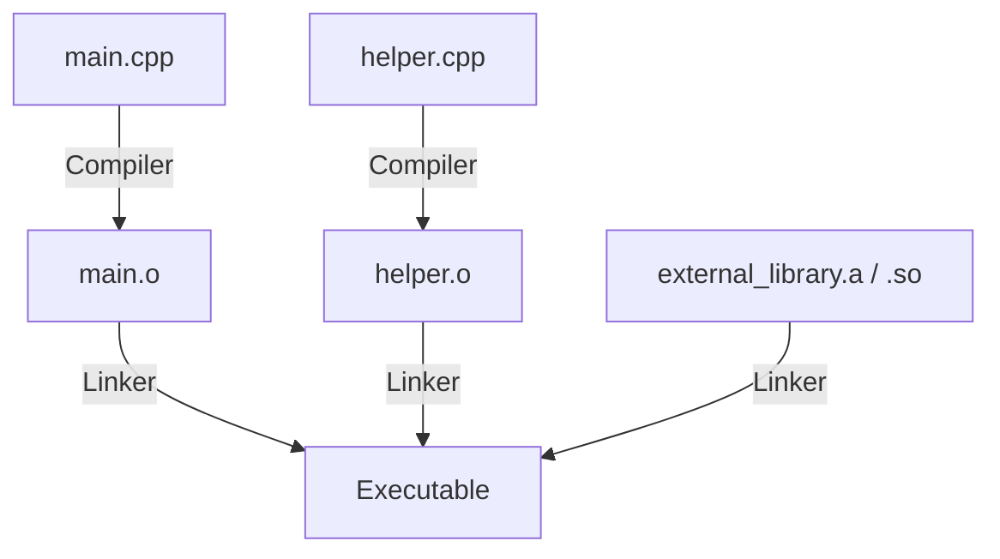
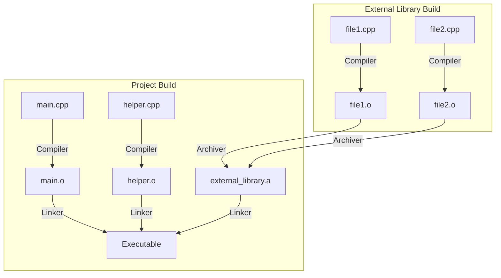
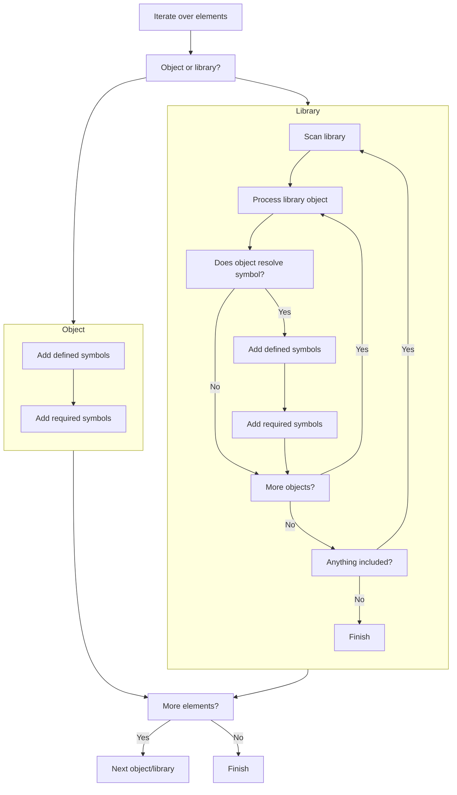

# Wykład 1 - Translacja

Zakres:
* budowanie programów w języku C++
* jednostki translacji, trajektoria kompilacji
* elementy programu, definicje i deklaracje
* przestrzenie nazw
* one definition rule
* słowa kluczowe `static`/`extern`
* biblioteki statyczne i dynamiczne
* algorytm linkera
* moduły

### Język C++

Język autorstwa duńskiego informatka [Bjarne Stroustrup'a](https://en.wikipedia.org/wiki/Bjarne_Stroustrup).
Rozpoczął prace jeszcze w roku 1979 mając na celu stworzenie _"C z klasami"_.
Nazwa C++ pojawiła się w roku 1982. Po latach rozwoju,
w 1998 roku pojawił się pierwszy standard ISO C++98.
Mimo ogromnej popularności język ewolułował powoli, aż do roku 2011.
Komitet ISO trzyma się od tego czasu 3-letniego cyklu w którym regularnie
publikowany jest nowy standard języka - C++11, C++14, C++17, C++20, C++23 (obecny).
Grupa regularnie publikuje postępy: https://isocpp.org/std/status.

C++ nadal jest jednym z **najpopularniejszych** języków, trzymając się 2-3 pozycji w indeksie TIOBE:
https://www.tiobe.com/tiobe-index/cplusplus/.
Znajduje bardzo szerokie zastosowanie, zwłaszcza w projektach wymagających najwyższej wydajności.

Ten język jest **wszechobecny**. Cięzko znaleźć platformę sprzętową, na której nie dałoby się go wykorzystać (podobnie do C).
Od urządzeń bez systemu operacyjnego (_baremetal_), przez aplikacje serwerowe, desktopowe, rozproszone systemy HPC, 
aplikacje graficzne i gry komputerowe. Jako jedno z nielicznych tego typu narzędzi
posiada szereg różnych, niezależnie rozwijanych _implementacji_ - systemów kompilatorów i bibliotek
umożliwiających uruchamianie oprogramowania napisanego w tym języku.

Język jest **ekstremalnie trudny** do nauki. Zyskanie biegłości trwa lata.
Historyczne zawiłości i błędy w projekcie języka wciąż są widoczne.
Gwałtowny rozwój w ostatnich latach tylko dodaje złożoności (i oczywiście możliwości).
Twórcy zakładają, że powinien pozwalać na implementację dowolnego przypadku użycia,
pozwolić na programowanie w różnych stylach, prioretyzując dodawanie użytecznych 
funkcjonalności nad spójnością i bezpieczeństwem.

C++ **nie jest** językiem obiektowym. Pozwala pisać w sposób obiektowy,
wspiera w tym programistę dostarczając mechanizmy takie jak klasy, 
enkapsulację, dziedziczenie, polifmorfizm, ale nie narzuca tego podejścia.
Można w C++ pisać tak jak w C, można pisać funkcyjnie, można wykorzystywać
elementy programowania generycznego i skomplikowanego metaprogramowania,
zgodnie powyższymi z założeniami.

> Semestr nauki C++ pozwoli wprowadzić kluczowe elementy, torując drogę
> do dalszej, samodzielnej praktyki.

C++ to **nie jest** rozszerzenie języka C. To zupełnie inne, samodzielne, posiadające niezależnie
rozwijaną specyfikację narzędzie. W pewnym podstawowym zakresie jest do języka C podobny, 
z czego będziemy bogato korzystać.

### Hello World

Zacznijmy od najprostrzego programu w C++ zaimplementowanego w jednym pliku `hello.cpp`:

```cpp
#include <iostream>

int main()
{
    std::cout << "Hello World!";
    return 0;
}
```
Source: [hello.cpp](hello.cpp)

Mając treść takiego programu w pliku tekstowym na dysku możemy go zbudować:

```shell
# Linux z wykorzystaniem kompilatora gcc
g++ -o hello.gcc hello.cpp
```

```shell
# Linux z wykorzystaniem kompilatora clang
clang++ -o hello.clang hello.cpp
```

```shell
# Windows
cl /Fehello.exe hello.cpp
```

Do zbudowania potrzebny jest **kompilator** - program który tłumaczy kod z plików tekstowych na kod maszynowy.
Takich kompilatorów jest bardzo dużo, wszystkie się różnią, mają wiele wersji, wspierają rozwijający się
język [w różnym stopniu](https://en.cppreference.com/w/cpp/compiler_support).


Standard C++ nie mówi nic na temat szczegółów realizacji
kompilatora. W szczególności źródła nie muszą być plikami
w potocznym rozumieniu (niektóre systemy nie mają plików).
Definiuje uproszczony schemat tego jak proces budowania
ma działać, który jest realizowany różnie przez różnych dostawców
narzędzi (tzw. implementacja języka).

Dzisiaj można łatwo używać kompilatorów online do prostych nauki i pisania prostych programów, np. https://godbolt.org/.

Po wygenerowaniu pliku wyjściowego możemy go uruchomić:

```shell
./hello.gcc
```

Przeanalizujmy strukturę programu. Rozpoczynamy od **dyrektywy preprocesora**:

```cpp
#include <iostream>
```

Kompilator czytając plik źródlowy wykonuje w pierwszej kolejności interpretacji takich dyrektyw.
`#include` wkleja treść pliku `iostream` w miejscu dyrektywy.

Dalej następuje definicja funkcji `main()`:

```cpp
int main()
{
    ...
}
```

W ciele funkcji znajduje się instrukcja wypisania - użycie operatora `<<`:

```cpp
std::cout << "Hello World!";
```

### Trajektoria kompilacji

Program w języku C++ jest budowany z wielu tekstowych plików wejściowych - tzw. **jednostek translacji**.




Każdy plik źródłowy przechodzi przez [9 faz tłumaczenia](https://en.cppreference.com/w/cpp/language/translation_phases#Translation_phases):

1) mapowanie znaków źródłowych
2) sklejanie linii
3) lekser
4) preprocesor
   - pliki załączane dyrektywą `#include` rekursywnie przechodzą przez fazy 1 - 4
5) kodowanie znaków
6) łączenie string'ów
7) **kompilacja**
8) instancjonowanie szablonów
9) **linkowanie**

Przykładowo dwuplikowy projekt byłby budowany tak:

```cpp
// main.cpp

int foo();

int main() {
    return foo();
}
```

```cpp
// helper.cpp

int foo() {
    return 123;
}
```

```shell
g++ main.cpp helper.cpp -o prog.exe
./prog.exe
```



Formalnie jednostką translacji nazywa się wejście
fazy 7 - właściwego kompilatora. Potocznie, 
programiści często nazywają jednostkami translacji
pliki źródłowe.

Jedynie linkowanie jest procesem globalnym.
Pozostałe mogą być wykonywane niezależnie na każdym pliku wejściowym. 

W zależności od typu błędu będzie on
diagnozowany na różnych etapach tego potoku.

Warto zwrócić uwagę na fazy 2 i 6 pozwalające na ciekawe zabiegi edytorskie:

```cpp
#include <iostream>

#define MULTI_LINE_MACRO(x, y) \
std::cout << "x: " << x << ", y: " << y << std::endl; \
std::cout << "This is a multi-line macro!" << std::endl;

const char* longString = "This is a very long string \
that is continued \
on the next line.";

const char* longerString = "This is a set of long string literals "
    "that has been split across multiple lines "
    "to improve code readability.";

const char* injectedString =
    "this is a string "
#include "middle.hpp"
    "from somewhere else.";
```
Source: [splice.cpp](splice.cpp)

```shell
g++ splice.cpp -o splice.exe && ./splice.exe
```

Kompilatory zwykle pozwalają na selektywne sterowanie
fazami kompilacji. Przykładowo `gcc` posiada serię flag
pozwalającą zatrzymywać proces po jednym z 4 etapów:
```
> g++ --help
...
  -E  Preprocess only; do not compile, assemble or link.
  -S  Compile only; do not assemble or link.
  -c  Compile and assemble, but do not link.
```

Wykorzystując je można zapisać i obejrzeć
produkty pośrednie procesu translacji.

```shell
g++ -E -o hello.i hello.cpp 
# hello.i zawiera wyjście preprocesora
```

```shell
g++ -S -o hello.s hello.i
# hello.s zawiera wyjście kompilatora
```

```shell
g++ -c hello.s
# hello.s zawiera wyjście assemblera
```

```shell
g++ -o hello hello.o
# hello zawiera zlinkowany plik wykonywalny
```

Tłumacząc to na wyżej opisane fazy:
Flaga `-E` spowoduje wykonanie faz 1-6, `-S` fazy 7 i 8 (częściowo),
`-c` kończy fazę `8`. Wywołanie bez flag wykonuje linker - fazę 9.

Jak widać nie wpisuje się to czysto w model abstrakcyjny, 
który nie wymusza nawet istnienia asemblera. Standard ponownie
nic nie może wyspecyfikować na temat tego jak programy wyglądają
po skompilowaniu, jak się je przechowuje, ani jak je uruchamia.

Typowy system budowania będzie niezależnie tłumaczył każdy z plików 
źródłowych do tzw. _obiektu_ (_object file_), czyli wymagającego linkowania wyjścia assemblera
a dopiero po utworzeniu wszystkich obiektów konsolidował je w kompletny program.

```shell
g++ -c main.cpp -o main.o
g++ -c helper.cpp -o helper.o
g++ main.o helper.o -o prog.exe
./prog.exe
```

### Makefile

Zamiast wydawać polecenia budowania ręcznie w większych projektach
potrzebny jest _system budowania_. Dzięki niemu programiści chcący zbudować oprogramowanie
mogą typowo wydać jedno polecenie. System budowania 
w postaci plików/skryptów zawiera flagi kompilacji, zależności projektu, skrypty instalacyjne, generatory kodu, itd.

Najprostrzym systemem z którego będziemy początkowo korzystać jest [Makefile](https://makefiletutorial.com/).

Korzystając z makefile projekt opisują pliki tekstowe zawierające deklaracje reguł w formacie:

```makefile
targets: prerequisites
    command
    command
    command
```

`targets` to lista plików generowanych przez wykonanie reguły (np. object file, executable).
`prerequisites` to lista plików niezbędnych do wykonania reguły (np. pliki źródłowe).
`command(s)` to lista poleceń powłoki uruchamiana celem wyprodukowania wyjść z wejść (np. `g++`)

Makefile uruchamia reguły, tylko jeżeli:
* plik wyjściowy nie istnieje
* (lub) plik wyjściowy jest starszy niż zależności reguły

Najprostrzy system budowania dla dwuplikowego projektu wyglądałby tak:

```makefile
all: prog.exe

main.o: main.cpp
    g++ -c main.cpp -o main.o
    
helper.o: helper.cpp
    g++ -c helper.cpp -o helper.o

prog.exe: main.o helper.o
    g++ main.o helper.o -o prog.exe
```
Source: [Makefile](Makefile)

Uruchamiamy poleceniem:

```shell
make
```

### Elementy programu

Program w C++ składa się z różnych [elementów](https://en.cppreference.com/w/cpp/language/basic_concepts) (_ang. entities_):
* wartości
* **obiekty**
* referencje
* funkcje
* enumeratory
* typy
* składowe klas
* szablony
* specjalizacje szablonów
* przestrzenie nazw

Niektóre elementy będą posiadać nazwę, niektóre nie.

```cpp
int a; // obiekt o nazwie 'a'
class c {}; // klasa o nazwie 'c'
```

```cpp
32; // nienazwana wartość
struct {}; // struktura anonimowa
```

Jednostki translacji skłądają się z **deklaracji**.
Deklaracje:
* wprowadzają elementy programu,
* **mogą** nadać im nazwę,
* **mogą** definiować ich właściwości;

Deklaracje, które w pełni opisują element,
pozwalając na jego użycie,
to również **definicje**.

```cpp
/* przykłady deklaracji */
class P;
void foo();
extern int x;
struct S {
  static int i;
}
```

```cpp
/* przykłądy definicji */
class P { int x; int y; };
void foo() {
   std::cout << "Hi!";
}
int x = 3;
extern int y = 5;
int S::x;
```

Należy znać dwie kluczowe zasady.

> Użycie elementu wymaga jego definicji

```cpp
// undefined.cpp

int foo();

int main() {
    return foo();
}
```

Naruszenie zasady wywołuje niezdefiniowane zachowanie programu, co w tym przypadku objawia się
błędem linkera:

```shell
g++ undefined.cpp
```

```
/usr/bin/ld: /tmp/cc2rq2Me.o: in function `main':
undefined.cpp:(.text+0x9): undefined reference to `foo()'
```

Druga, nawet istotniejsza zasada znana jako _one definition rule_:

> Jednostka translacji może zawierać co najwyżej jedną definicję danego elementu
> Program jako całość może zawierać co najwyżej jedną definicję zmiennej lub funkcji

Jej naruszenie również zwykle powoduje błędy linkera:

```cpp
// odr1.cpp
int a = 3;
int foo(int x) { return x; }
int main() { return foo(a); }
```

```cpp
// odr2.cpp
int a = 4;
int foo(int x) { return 2 * x; }
```

```shell
g++ odr1.cpp odr2.cpp
```

```
/usr/bin/ld: /tmp/ccGKwVIG.o:(.data+0x0): multiple definition of `a'; /tmp/ccxy9LGW.o:(.data+0x0): first defined here
/usr/bin/ld: /tmp/ccGKwVIG.o: in function `foo(int)':
odr2.cpp:(.text+0x0): multiple definition of `foo(int)'; /tmp/ccxy9LGW.o:odr1.cpp:(.text+0x0): first defined here
```

Klasy i struktury mogą być definiowane raz na jednostkę, ale deklaracje w całym programie muszą być
spójne (tekstowo identyczne). Inaczej występują ciekawe niezdefiniowane rzeczy:

```cpp
#include <iostream>

struct Point {
    int x;
    int y;
    int z;
};

int dist(Point p, Point q);

int main() {
    Point p = {1, 1, 1};
    Point q = {0, 0, 0};
    std::cout << dist(p, q) << std::endl;
    return 0;
}
```
Source: [classodr1.cpp](classodr1.cpp)

```cpp
struct Point {
    int x;
    int y;
};

int dist(Point p, Point q) {
    int dx = p.x - q.x;
    int dy = p.y - q.y;
    return dx * dx + dy * dy;
}
```
Source: [classodr2.cpp](classodr2.cpp)

```shell
g++ classodr1.cpp classodr2.cpp -o classodr.exe && ./classodr.exe
```

### Przestrzenie nazw

C++ daje możliwość umieszczania definicji i deklaracji w przestrzeniach nazw.
Przestrzenie nazw grupują te dwa elementy celem lepszej ogranizacji i czytelności kodu,
oraz uniknięcia konfliktów nazw. 

Do definiowania przestrzeni nazw używamy słowa kluczowego `namespace`:

```cpp
// Definicja przestrzeni nazw
namespace foo {
    int x = 42;

    void fun() {
        std::cout << "foo::x = " << x << std::endl;
    }
}

namespace goo {
   int x = 13; 
}

int x = 123;
```

W powyższym programie istnieją 3 zmienne `x` - jedna w przestrzeni nazw `foo`, jedna w `goo` i jedna w _globalnej przestrzeni nazw_.
Wszystkie elementy nieumieszczone w przestrzeni zdefiniowanej przez użytkownika są automatycznie umieszczane w tej globalnej przestrzeni.

Przestrzenie nazw można zagnieżdżać naturalnie oddając hierarchiczną strukturę projektu w kodzie:

```cpp
namespace foo {
    int x = 42;

    namespace goo {
         int x = 58;
    }
}

namespace foo::goo {
   int y = 10;
}
```

Kompilator widząc odwołanie do nazwanego elementu, np. `x` musi odnaleźć jego deklarację.
Przeszuka w pierwszej kolejności przestrzeń nazw, w której aktualnie jesteśmy (w której jest to odwołanie).
Jeżeli tam go nie znajdzie, rekurencyjnie przeszuka przestrzeń zewnętrzną, aż do przestrzeni globalnej.

Można jawnie odwołać się do elementu z konkretnej przestrzeni używając operatora `::`: 

```cpp
namespace foo
{
std::string ns = "foo";

namespace goo
{
std::string ns = "goo";
}

void fun()
{
    std::cout << "from foo namespace:\n"
        << "ns = " << ns << '\n'
        << "goo::ns = " << goo::ns << '\n'
        << "::ns = " << ::ns << std::endl;
}
}

void fun()
{
    std::cout << "from global namespace:\n"
        << "ns = " << ns << '\n'
        << "foo::ns = " << foo::ns << '\n'
        << "foo::goo::ns = " << foo::goo::ns << std::endl;
}

```
Source: [ns.cpp](ns.cpp)

Wszystkie elementy udostępniane przez bibliotekę standardową języka
są umieszczone w przestrzeni nazw `std::`.

> Przestrzeń `std::` jest zarezerwowana dla implementacji! Programy nie mogą umieszczać w niej swoich symboli.

Różnorodne biblioteki często w analogii do `std::` umieszczają swoje symbole 
w dedykowanej przestrzeni nazw, np. nagłówki biblioteki [libfmt](https://github.com/fmtlib/fmt) opakowują
wszystko w przestrzeń nazw `fmt::`, dzięki czemu eksponowane funkcje, klasy, zmienne nie będą 
konfliktować z potencjalnie tak samo nazwanymi elementami konsumującego programu.

```cpp
#include <fmt/core.h>

int main() {
  fmt::print("Hello, world!\n");
}
```

Jeżeli jednostka translacji często korzysta z symboli z jakiejś przestrzeni nazw to może zadeklarować jej domyślne
przeszukiwanie korzystając ze składni `using namespace ns;`.

### Tryb linkowania

Jednostki translacji mogą korzystać z elementów programu definiowanych w innych jednostkach translacji.
To podstawowy mechanizm, dzięki możliwa jest jakakolwiek komunikacja pomiędzy niezależnie budowanymi plikami.
Pozwala modularyzować bardziej skomplikowane projekty, unikając pojedynczej, 
monolitycznej jednostki. Umożliwia również optymalizację procesu budowania - wiele jednostek translacji
może być przetwarzanych równolegle.

Zdefiniowany element może być deklarowany wielokrotnie! C++ określa, kiedy dana nazwa użyta 
w różnych jednostkach translacji odnosi się do tego samego elementu.

```cpp
// a.cpp
int x;
// b.cpp
int x; // czy to ten sam x?
```

```cpp
// a.cpp
void foo() { ... }
// b.cpp
void foo(); // czy to ten sa sama funkcja?
```

Odpowiedź brzmi tak, jeżeli deklaracje/definicje są w tej samej jednostce translacji lub mają zewnętrzny [**tryb linkowania**:](https://en.cppreference.com/w/cpp/language/storage_duration#Linkage).
Tryb linkowania może być zewnętrzny lub wewnętrzny (lub brak).

Reguły, kiedy jaki tryb są zawiłe, zależą od tego:
* w jakim zakresie występuje nazwa (namespace, ciało funkcji, klasa, itp.)
* jakie kwalifikatory ma deklaracja `const`, `extern`, `static`, `inline`.

Nalepiej zrozumieć to na powszechnie występujących przykładach.

#### Tryb zewnętrzny

Symbole linkowane zewnętrznie są widoczne z innych jednostek.

Nazwy w zakresie przestrzeni nazw (na dowolnym poziomie) mają tryb zewnętrzny.

```cpp
int f();
class P;
namespace foo {
   int x;
}
```

Słowem kluczowym `extern` wymuszamy tryb zewnętrzny: 

```cpp
extern const int eci;
namespace foo {
   extern int x;
}
```

#### Tryb wewnętrzny

Elementy o linkowaniu wewnętrznym są niejako prywatne dla jednostki translacji.
Wiele jednostek może definiować tę samą nazwę, bo odnoszą się one do innych instancji.

Słowem kluczowym `static` wymuszamy tryb wewnętrzny:

```
static int sf();
namespace foo {
  static int si;
}
```

Elementy w anonimowych przestrzeniach nazw mają tryb wewnętrzny:

```cpp
namespace {
int x;
}
```

Stałe domyślnie mają tryb wewnętrzny:

```cpp
const int ci;
```

Ciekawy detal różniący języki C i C++:

> Names at the top-level namespace scope (file scope in C) that are const and not extern have external linkage in C, but internal linkage in C++.

### Pliki nagłówkowe

Pliki nagłówkowe są starym, sprawdzonym i odchodzącym powoli do lamusa sposobem na deduplikację 
deklaracji i definicji pomiędzy jednostkami translacji. Chcąc korzystać w całym programie
z jakiegoś elementu (funkcji, zmiennej, klasy), każda jednostka translacji musi go
przynajmniej zadeklarować. Deklaracje te muszą być spójne w całym programie.
Stąd najczęściej wydzielamy je do osobnego pliku i załączamy we wszystkich korzystających
jednostkach translacji za pomocą dyrektywy `#include`.

```cpp
#ifndef POINT_HPP
#define POINT_HPP

struct Point {
    int x, y;
};

int dist(Point p, Point q);

extern int factor;

#endif
```
Source: [point.hpp](point.hpp)

Nagłówki zwykle zawierają definicje typów
(które mogą być definiowane wielokrotnie w programie) oraz deklaracje zmiennych i funkcji.
Te zostaną zdefiniowane w dokładnie jednej dedykowanej jednostce translacji:

```cpp
#include "point.hpp"

int factor = 2;

int dist(Point p, Point q) {
    int dx = p.x - q.x;
    int dy = p.y - q.y;
    return factor * (dx * dx + dy * dy);
}
```
Source: [point.cpp](point.cpp)

Bariery kompilacji (`#ifndef POINT_HPP`) blokują wielokrotne załączenie tego pliku,
a przez to nie dopuszczają do wielokrotnego definiowania, np. `Point`.

### Biblioteki

Modularyzacja na poziomie jednostek translacji jest w przypadku większych projektów
niewystarczająca. Często w miarę wzrostu złożoności programiści wydzielają całe 
komponenty stanowiące spójną całość, posiadające dobrze opisany interfejs,
składające się z wielu jednostek translacji. Taki kod często jest re-używalny. 
Zawiera ogólne definicje, funkcje pomocnicze, narzędzia do wykorzystania w wielu projektach. 

Dystrybucja takiego oprogramowania może przebiegać w drodze udostępnienia wszystkich plików źródłowych.
Konsument jest zmuszony wtedy budować nie tylko swój kod, ale i wszystkie zależności.
Aby tego uniknąć, można dystrybuować biblioteki: skompilowany kod, niebędący programem,
spakowany do postaci pojedynczego pliku.



#### Biblioteki statyczne

Podstawowym typem biblioteki jest tzw. _biblioteka statyczna_, czyli archiwum zawierające kilka
skompilowanych plików obiektowych. Tworzymy ją za pomocą archiwizatora, zwykle `ar`:

```shell
ar rcs libexternal_library.a file1.o file2.o
```

Raz utworzone archiwum jest gotowe do wykorzystania w procesie linkowania:

```shell
g++ main.o helper.o -L. -lexternal_library -o my_executable
```



System budowania opisujący całość takiego projektu wyglądałby następująco:

```makefile
all: my_executable

my_executable: main.o helper.o libexternal_library.a
	g++ main.o helper.o -L. -lexternal_library -o my_executable

main.o: main.cpp
	g++ -c main.cpp -o main.o

helper.o: helper.cpp
	g++ -c helper.cpp -o helper.o
	
libexternal_library.a: file1.o file2.o
	ar rcs libexternal_library.a file1.o file2.o

file1.o: file1.cpp
	g++ -c file1.cpp -o file1.o

file2.o: file2.cpp
	g++ -c file2.cpp -o file2.o
```
Sources: [Makefile](libraries/static/Makefile) 
[main.cpp](libraries/static/main.cpp) 
[helper.cpp](libraries/static/helper.cpp)
[helper.hpp](libraries/static/helper.hpp)
[file1.cpp](libraries/static/file1.cpp)
[file2.cpp](libraries/static/file2.cpp)
[external.hpp](libraries/static/external.hpp)

Do użycia biblioteki potrzeba nie tylko samego pliku archiwum, ale również plików nagłówkowych
zawierających deklaracje tego, co siedzi w skompilowanej bibliotece.

Istotne jest, że linker nie włącza do programu domyślnie wszystkich obiektów z biblioteki.
Włącza wyłącznie obiekty, które mają odniesienia w samym programie! Nieużywane funkcje i zmienne
w zbudowanym pliku wykonalnym nie istnieją!

##### Kolejność linkowania

Biblioteki mogą zależeć od innych bibliotek.
Przy pracy z dużymi projektami składającymi się z wielu zależności istotne staje się
zrozumienie jak działa linker.

Linker iteracyjnie analizuje pliki obiektowe i biblioteki w takiej kolejności,
w jakiej zostały podane w linii zlecenia, np.:

```shell
g++ object1.o object2.o -llib1.a -llib2.a object3.o -llib3.a
```

Linker utrzymuje 2 tablice symboli:
- symbole zdefiniowane - takie, które już pojawiły się w przeanalizowanych elementach 
- symbole poszukiwane - takie, do których są odniesienia w przeanalizowanych elementach

**Obiekty i biblioteki są traktowane inaczej!**

Linker napotykając na **obiekt**:
- dodaje obiekt do programu wyjściowego
- bezwarunkowo dodaje definiowane przez niego symbole do tablicy symboli zdefiniowanych, 
usuwając je z tablicy symboli poszukiwanych, jeżeli tam są.
Jeżeli dany symbol już był zdefiniowany z błędem podwójnej definicji (_one definition rule_)!
- dodaje symbole potrzebne obiektowi do listy symboli poszukiwanych

Kiedy linker napotyka **bibliotekę** dzieje się coś ciekawszego.
Linker przechodzi przez wszystkie obiekty w bibliotece. Dla każdego:
- dodaje obiekt do programu wyjściowego, tylko jeżeli obiekt zawiera definicję, która jest obecnie poszukiwana
- tylko jeśli obiekt został dodany to symbole mu potrzebne są dodawane do poszukiwanych

Następnie, jeżeli którykolwiek obiekt z biblioteki został włączony to biblioteka jest skanowana ponownie.



Dzięki re-skanowaniu całej biblioteki nie ma znaczenia kolejność
obiektów w bibliotece.

Ma natomiast ogromne znaczenie kolejność bibliotek/obiektów w linii zlecenia!
Linker przechodzi przez listę jednokrotnie. Jeżeli element występujący dalej
w linii potrzebuje wcześniej definiowanego symbolu, a ten nie został włączony
to kończymy z błędem linkera.

Przykładowo mając program, który potrzebuje biblioteki lib1, a ta z kolei potrzebuje biblioteki lib2
poprawnym będzie:

```shell
g++ main.o -L. -l1 -l2 -o my.exe # ok
# g++ -L. -l1 -l2 main.o -o my.exe # undefined, l1 i l2 odrzucone
# g++ main.o -L. -l2 -l1 -o my.exe # undefined, l1 potrzebuje l2 później 
```
Source:
[Makefile](libraries/order/Makefile)
[lib1.cpp](libraries/order/lib1.cpp)
[lib1.hpp](libraries/order/lib1.hpp)
[lib2.cpp](libraries/order/lib2.cpp)
[lib2.hpp](libraries/order/lib2.hpp)
[main.cpp](libraries/order/main.cpp)

Więcej szczegółów w [artykule](https://eli.thegreenplace.net/2013/07/09/library-order-in-static-linking).

#### Biblioteki dynamiczne

Biblioteki statyczne są bezpośrednio włączane w plik wynikowy, co skutkuje jego powiększeniem.
Biblioteki potrafią być ogromne (w GB!). Dołączanie ich osobno do każdego pliku wykonywalnego
sumarycznie zwiększa zajętość dysku i pamięci komputera przy ich jednoczesnym wykonaniu.

Dlatego stworzono biblioteki dynamiczne (albo współdzielone).

Biblioteki dynamiczne są produkowane przez linker, tak samo jak pliki wykonywalne.
`g++` robi to po użyciu przełącznika `-shared`:

```makefile
libexternal_library.so: file1.o file2.o
	g++ -shared -o libexternal_library.so file1.o file2.o

file1.o: file1.cpp
	g++ -c -fPIC file1.cpp -o file1.o

file2.o: file2.cpp
	g++ -c -fPIC file2.cpp -o file2.o
```

Programy korzystające z biblioteki dynamicznej linkuje się bardzo podobnie do statycznych:

```makefile
my.exe: main.o helper.o libexternal_library.so
	g++ main.o helper.o -L. -lexternal_library -o my.exe
```

Source:
[Makefile](libraries/shared/Makefile)
[external.hpp](libraries/shared/external.hpp)
[file1.cpp](libraries/shared/file1.cpp)
[file2.cpp](libraries/shared/file2.cpp)
[helper.cpp](libraries/shared/helper.cpp)
[helper.hpp](libraries/shared/helper.hpp)
[main.cpp](libraries/shared/main.cpp)

Tu natomiast program wyjściowy nie zawiera kodu z biblioteki. Do uruchomienia
niezbędna jest sama biblioteka:

```shell
LD_LIBRARY_PATH=:$LD_LIBRARY_PATH ./my.exe
```

Biblioteka standardowa jest duża i zwykle kompilator linkuje ją dynamicznie.
Nasze programy uruchamiają się tylko dlatego, że gdzieś w systemie obecny jest plik `.so`
zawierający skompilowane funkcje z przestrzeni nazw `std::`.

### Moduły

> Ten rozdział jest w ramach ciekawostki, praktyka dla chętnych 

C++20 wprowadza nowy sposób modularyzacji w odpowiedzi na wady podejścia opartego o pliki nagłówkowe:
1. Tekstowe wklejanie kodu za pomocą `#include` niepotrzebnie powiększa jednostki translacji, nagłówki są analizowane wielokrotnie
2. Bariery kompilacji `#ifndef` są niewygodne, nieczytelne
3. Globalne zmienne i funkcje definiowane w różnych jednostkach translacji mogą ze sobą łatwo konfliktować

Odpowiedzią są **moduły**. Moduł musi jawnie eksportować publiczne symbole:

```cpp
export module math;

export double add(double a, double b) {
    return a + b;
}

export double subtract(double a, double b) {
    return a - b;
}

double internal_multiply(double a, double b) {
    return a * b;
}
```

Eksportowane symbole są prekompilowane do małych plików opisujących interfejs modułu:
```makefile
math.pcm: math.cppm
	clang++ -std=c++20 --precompile math.cppm -o math.pcm

math.o: math.pcm
	clang++ -c math.pcm -o math.o
```

Konsumenci zamiast tekstowo wklejać nagłówki importują moduł:

```cpp
import math;

#include <iostream>

int main() {
    double a = 5.0, b = 3.0;

    std::cout << add(a, b) << "\n";
    std::cout << subtract(a, b) << "\n";

    return 0;
}
```

Source: [Makefile](modules/Makefile) [math.cppm](modules/math.cppm) [main.cpp](modules/main.cpp)

Moduły mają obecnie słabą adopcję. Kompilatory wspierają je niepełnie.
