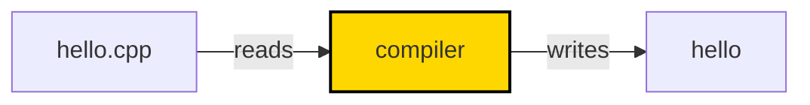
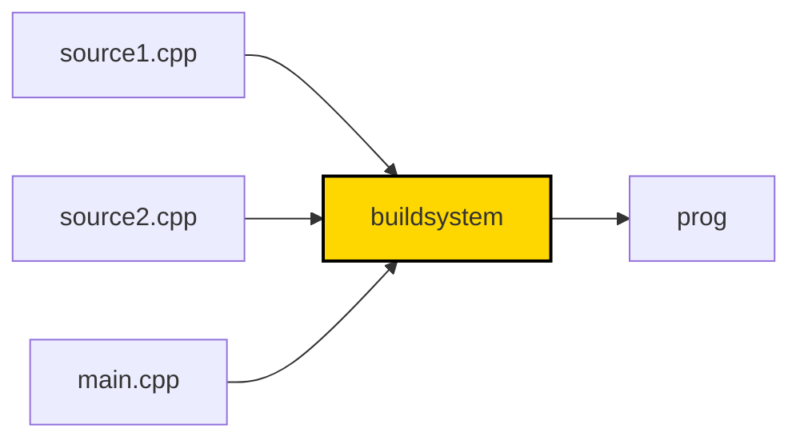

# Wykład 1 - Translacja

Zakres:
* budowanie programów w języku C++
* jednostki translacji, trajektoria kompilacji
* algorytm linkera
* symbole, obiekty, zmienne
* definicje i deklaracje
* one definition rule
* słowa kluczowe static/extern
* przestrzenie nazw

### Język C++

Język C++ jest:
* aktywnie rozwijany
* trudny
* wszechobecny
* wszechstronny


### Hello World

Zacznijmy od najprostrzego programu w C++ zaimplementowanego w jednym pliku `hello.cpp`:

```cpp
#include <iostream>

int main()
{
    std::cout << "Hello World!";
    return 0;
}
```

Mając treść takiego programu w pliku tekstowym na dysku możemy go zbudować:

```shell
# Linux z wykorzystaniem kompilatora gcc
g++ -o hello.gcc hello.cpp
```

```shell
# Linux z wykorzystaniem kompilatora clang
clang++ -o hello.clang hello.cpp
```

```shell
# Windows
cl /Fehello.exe hello.cpp
```

Do zbudowania potrzebny jest **kompilator** - program który tłumaczy kod z plików tekstowych na kod maszynowy.
Takich kompilatorów jest bardzo dużo, wszystkie się różnią, mają wiele wersji, wspierają rozwijający się
język [w różnym stopniu](https://en.cppreference.com/w/cpp/compiler_support).



Dzisiaj można łatwo używać kompilatorów online do prostych nauki i pisania prostych programów, np. https://godbolt.org/.

Po wygenerowaniu pliku wyjściowego możemy go uruchomić:

```shell
./hello.gcc
```

Przeanalizujmy strukturę programu. Rozpoczynamy od **dyrektywy preprocesora**:

```cpp
#include <iostream>
```

Kompilator czytając plik źródlowy wykonuje w pierwszej kolejności interpretacji takich dyrektyw.
`#include` wkleja treść pliku `iostream` w miejscu dyrektywy.

Dalej następuje definicja funkcji `main()`:

```cpp
int main()
{
    ...
}
```

W ciele funkcji znajduje się instrukcja wypisania - użycie operatora `<<`:

```cpp
std::cout << "Hello World!";
```

### Trajektoria kompilacji

Program w języku C++ jest budowany z wielu tekstowych plików wejściowych - tzw. **jednostek translacji**.



Każdy plik źródłowy przechodzi przez [9 faz tłumaczenia](https://en.cppreference.com/w/cpp/language/translation_phases#Translation_phases):


