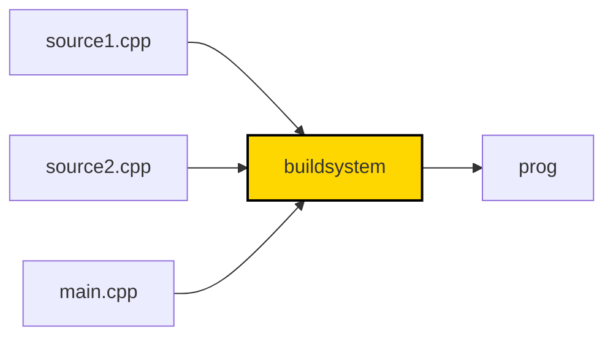
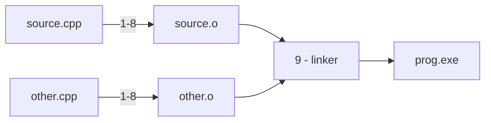

# Wykład 1 - Translacja

Zakres:
* budowanie programów w języku C++
* jednostki translacji, trajektoria kompilacji
* elementy programu, definicje i deklaracje
* obiekty, zmienne
* algorytm linkera
* one definition rule
* słowa kluczowe `static`/`extern`
* przestrzenie nazw

### Język C++

Język autorstwa duńskiego informatka [Bjarne Stroustrup'a](https://en.wikipedia.org/wiki/Bjarne_Stroustrup).
Rozpoczął prace jeszcze w roku 1979 mając na celu stworzenie _"C z klasami"_.
Nazwa C++ pojawiła się w roku 1982. Po latach rozwoju,
w 1998 roku pojawił się pierwszy standard ISO C++98.
Mimo ogromnej popularności język ewolułował powoli, aż do roku 2011.
Komitet ISO trzyma się od tego czasu 3-letniego cyklu w którym regularnie
publikowany jest nowy standard języka - C++11, C++14, C++17, C++20, C++23 (obecny).
Grupa regularnie publikuje postępy: https://isocpp.org/std/status.

C++ nadal jest jednym z **najpopularniejszych** języków, trzymając się 2-3 pozycji w indeksie TIOBE:
https://www.tiobe.com/tiobe-index/cplusplus/.
Znajduje bardzo szerokie zastosowanie, zwłaszcza w projektach wymagających najwyższej wydajności.

Ten język jest **wszechobecny**. Cięzko znaleźć platformę sprzętową, na której nie dałoby się go wykorzystać (podobnie do C).
Od urządzeń bez systemu operacyjnego (_baremetal_), przez aplikacje serwerowe, desktopowe, rozproszone systemy HPC, 
aplikacje graficzne i gry komputerowe. Jako jedno z nielicznych tego typu narzędzi
posiada szereg różnych, niezależnie rozwijanych _implementacji_ - systemów kompilatorów i bibliotek
umożliwiających uruchamianie oprogramowania napisanego w tym języku.

Język jest **ekstremalnie trudny** do nauki. Zyskanie biegłości trwa lata.
Historyczne zawiłości i błędy w projekcie języka wciąż są widoczne.
Gwałtowny rozwój w ostatnich latach tylko dodaje złożoności (i oczywiście możliwości).
Twórcy zakładają, że powinien pozwalać na implementację dowolnego przypadku użycia,
pozwolić na programowanie w różnych stylach, prioretyzując dodawanie użytecznych 
funkcjonalności nad spójnością i bezpieczeństwem.

C++ **nie jest** językiem obiektowym. Pozwala pisać w sposób obiektowy,
wspiera w tym programistę dostarczając mechanizmy takie jak klasy, 
enkapsulację, dziedziczenie, polifmorfizm, ale nie narzuca tego podejścia.
Można w C++ pisać tak jak w C, można pisać funkcyjnie, można wykorzystywać
elementy programowania generycznego i skomplikowanego metaprogramowania,
zgodnie powyższymi z założeniami.

> Semestr nauki C++ pozwoli wprowadzić kluczowe elementy, torując drogę
> do dalszej, samodzielnej praktyki.

### Źródła

TODO

### Hello World

Zacznijmy od najprostrzego programu w C++ zaimplementowanego w jednym pliku `hello.cpp`:

```cpp
#include <iostream>

int main()
{
    std::cout << "Hello World!";
    return 0;
}
```

Mając treść takiego programu w pliku tekstowym na dysku możemy go zbudować:

```shell
# Linux z wykorzystaniem kompilatora gcc
g++ -o hello.gcc hello.cpp
```

```shell
# Linux z wykorzystaniem kompilatora clang
clang++ -o hello.clang hello.cpp
```

```shell
# Windows
cl /Fehello.exe hello.cpp
```

Do zbudowania potrzebny jest **kompilator** - program który tłumaczy kod z plików tekstowych na kod maszynowy.
Takich kompilatorów jest bardzo dużo, wszystkie się różnią, mają wiele wersji, wspierają rozwijający się
język [w różnym stopniu](https://en.cppreference.com/w/cpp/compiler_support).


Standard C++ nie mówi nic na temat szczegółów realizacji
kompilatora. W szczególności źródła nie muszą być plikami
w potocznym rozumieniu (niektóre systemy nie mają plików).
Definiuje uproszczony schemat tego jak proces budowania
ma działać, który jest realizowany różnie przez różnych dostawców
narzędzi (tzw. implementacja języka).

Dzisiaj można łatwo używać kompilatorów online do prostych nauki i pisania prostych programów, np. https://godbolt.org/.

Po wygenerowaniu pliku wyjściowego możemy go uruchomić:

```shell
./hello.gcc
```

Przeanalizujmy strukturę programu. Rozpoczynamy od **dyrektywy preprocesora**:

```cpp
#include <iostream>
```

Kompilator czytając plik źródlowy wykonuje w pierwszej kolejności interpretacji takich dyrektyw.
`#include` wkleja treść pliku `iostream` w miejscu dyrektywy.

Dalej następuje definicja funkcji `main()`:

```cpp
int main()
{
    ...
}
```

W ciele funkcji znajduje się instrukcja wypisania - użycie operatora `<<`:

```cpp
std::cout << "Hello World!";
```

### Trajektoria kompilacji

Program w języku C++ jest budowany z wielu tekstowych plików wejściowych - tzw. **jednostek translacji**.



Każdy plik źródłowy przechodzi przez [9 faz tłumaczenia](https://en.cppreference.com/w/cpp/language/translation_phases#Translation_phases):

1) mapowanie znaków źródłowych
2) sklejanie linii
3) lekser
4) preprocesor
   - pliki załączane dyrektywą `#include` rekursywnie przechodzą przez fazy 1 - 4
5) kodowanie znaków
6) łączenie string'ów
7) **kompilacja**
8) instancjonowanie szablonów
9) **linkowanie**

Przykładowo dwuplikowy projekt byłby budowany tak:

```cpp
// main.cpp

int foo();

int main() {
    return foo();
}
```

```cpp
// helper.cpp

int foo() {
    return 123;
}
```

```shell
g++ main.cpp helper.cpp -o prog.exe
./prog.exe
```



Formalnie jednostką translacji nazywa się wejście
fazy 7 - właściwego kompilatora. Potocznie, 
programiści często nazywają jednostkami translacji
pliki źródłowe.

Jedynie linkowanie jest procesem globalnym.
Pozostałe mogą być wykonywane niezależnie na każdym pliku wejściowym. 

W zależności od typu błędu będzie on
diagnozowany na różnych etapach tego potoku.

Warto zwrócić uwagę na fazy 2 i 6 pozwalające na ciekawe zabiegi edytorskie:

```cpp
// splice.cpp

#include <iostream>

#define MULTI_LINE_MACRO(x, y) \
std::cout << "x: " << x << ", y: " << y << std::endl; \
std::cout << "This is a multi-line macro!" << std::endl;

const char* longString = "This is a very long string \
that is continued \
on the next line.";

const char* longerString = "This is a set of long string literals "
    "that has been split across multiple lines "
    "to improve code readability.";

const char* injectedString =
    "this is a string "
#include "middle.hpp"
    "from somewhere else.";
```

```shell
g++ splice.cpp -o splice.exe && ./splice.exe
```

Kompilatory zwykle pozwalają na selektywne sterowanie
fazami kompilacji. Przykładowo `gcc` posiada serię flag
pozwalającą zatrzymywać proces po jednym z 4 etapów:
```
> g++ --help
...
  -E  Preprocess only; do not compile, assemble or link.
  -S  Compile only; do not assemble or link.
  -c  Compile and assemble, but do not link.
```

Wykorzystując je można zapisać i obejrzeć
produkty pośrednie procesu translacji.

```shell
g++ -E -o hello.i hello.cpp 
# hello.i zawiera wyjście preprocesora
```

```shell
g++ -S -o hello.s hello.i
# hello.s zawiera wyjście kompilatora
```

```shell
g++ -c hello.s
# hello.s zawiera wyjście assemblera
```

```shell
g++ -o hello hello.o
# hello zawiera zlinkowany plik wykonywalny
```

Tłumacząc to na wyżej opisane fazy:
Flaga `-E` spowoduje wykonanie faz 1-6, `-S` fazy 7 i 8 (częściowo),
`-c` kończy fazę `8`. Wywołanie bez flag wykonuje linker - fazę 9.

Jak widać nie wpisuje się to czysto w model abstrakcyjny, 
który nie wymusza nawet istnienia asemblera. Standard ponownie
nic nie może wyspecyfikować na temat tego jak programy wyglądają
po skompilowaniu, jak się je przechowuje, ani jak je uruchamia.

Typowy system budowania będzie niezależnie tłumaczył każdy z plików 
źródłowych do tzw. _obiektu_ (_object file_), czyli wymagającego linkowania wyjścia assemblera
a dopiero po utworzeniu wszystkich obiektów konsolidował je w kompletny program.

```shell
g++ -c main.cpp -o main.o
g++ -c helper.cpp -o helper.o
g++ main.o helper.o -o prog.exe
./prog.exe
```

### Elementy programu

Program w C++ składa się z różnych [elementów](https://en.cppreference.com/w/cpp/language/basic_concepts) (_ang. entities_):
* wartości
* **obiekty**
* referencje
* funkcje
* enumeratory
* typy
* składowe klas
* szablony
* specjalizacje szablonów
* przestrzenie nazw

Niektóre elementy będą posiadać nazwę, niektóre nie.

```cpp
int a; // obiekt o nazwie 'a'
class c {}; // klasa o nazwie 'c'
```

```cpp
32; // nienazwana wartość
struct {}; // struktura anonimowa
```

Jednostki translacji skłądają się z **deklaracji**.
Deklaracje:
* wprowadzają elementy programu,
* **mogą** nadać im nazwę,
* **mogą** definiować ich właściwości;

Deklaracje, które w pełni opisują element,
pozwalając na jego użycie,
to również **definicje**.

```cpp
/* przykłady deklaracji */
class P;
void foo();
extern int x;
```

```cpp
/* przykłądy definicji */
class P { int x; int y; };
void foo() {
   std::cout << "Hi!";
}
int x = 3;
```

Należy znać dwie kluczowe zasady.

> Użycie elementu wymaga jego definicji

```cpp
// undefined.cpp

int foo();

int main() {
    return foo();
}
```

Naruszenie zasady wywołuje niezdefiniowane zachowanie programu, co w tym przypadku objawia się
błędem linkera:

```shell
g++ undefined.cpp
```

```
/usr/bin/ld: /tmp/cc2rq2Me.o: in function `main':
undefined.cpp:(.text+0x9): undefined reference to `foo()'
```

Druga, nawet istotniejsza zasada znana jako _one definition rule_:

> Program może zawierać co najwyżej jedną definicję dla danego elementu

Jej naruszenie również zwykle powoduje błędy linkera:

```cpp
// odr1.cpp
int a = 3;
int foo(int x) { return x; }
int main() { return foo(a); }
```

```cpp
// odr2.cpp
int a = 4;
int foo(int x) { return 2 * x; }
```

```shell
g++ odr1.cpp odr2.cpp
```

```
/usr/bin/ld: /tmp/ccGKwVIG.o:(.data+0x0): multiple definition of `a'; /tmp/ccxy9LGW.o:(.data+0x0): first defined here
/usr/bin/ld: /tmp/ccGKwVIG.o: in function `foo(int)':
odr2.cpp:(.text+0x0): multiple definition of `foo(int)'; /tmp/ccxy9LGW.o:odr1.cpp:(.text+0x0): first defined here
```

### Przestrzenie nazw

C++ daje możliwość umieszczania definicji i deklaracji w przestrzeniach nazw.


### Tryb linkowania

Jednostki translacji mogą korzystać z elementów programu definiowanych w innych jednostkach translacji.
To podstawowy mechanizm, pozwalający modularyzować bardziej skomplikowane projekty unikając pojedynczej, 
monolitycznej jednostki. Pozwala to również na optymalizację procesu budowania - wiele jednostek translacji
może być przetwarzanych równolegle.

C++ musi określać kiedy dana nazwa użyta w różnych jednostkach translacji odnosi się do tego samego elementu.

```cpp
// a.cpp
int x;
// b.cpp
int x; // czy to ten sam x?
```

```cpp
// a.cpp
void foo() { ... }
// b.cpp
void foo(); // czy to ten sa sama funkcja?
```

Każda nazwa wprowadzana przez deklaracje i definicje posiada [**tryb linkowania**:](https://en.cppreference.com/w/cpp/language/storage_duration#Linkage)
* zewnętrzny - mog
* wewnętrzny
* brak

```cpp
// In namespace scope or global scope.
int i; // extern by default
const int ci; // static by default
extern const int eci; // explicitly extern
static int si; // explicitly static

// The same goes for functions (but there are no const functions).
int f(); // extern by default
static int sf(); // explicitly static 
```

TODO


> Names at the top-level namespace scope (file scope in C) that are const and not extern have external linkage in C, but internal linkage in C++.


### Pliki nagłówkowe


### Biblioteki


### Moduły


