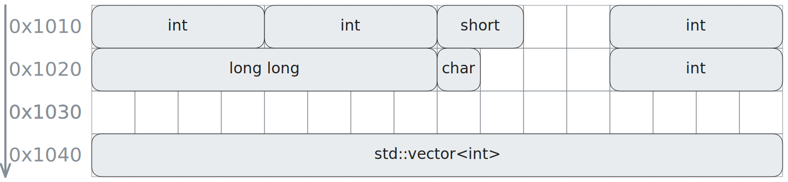
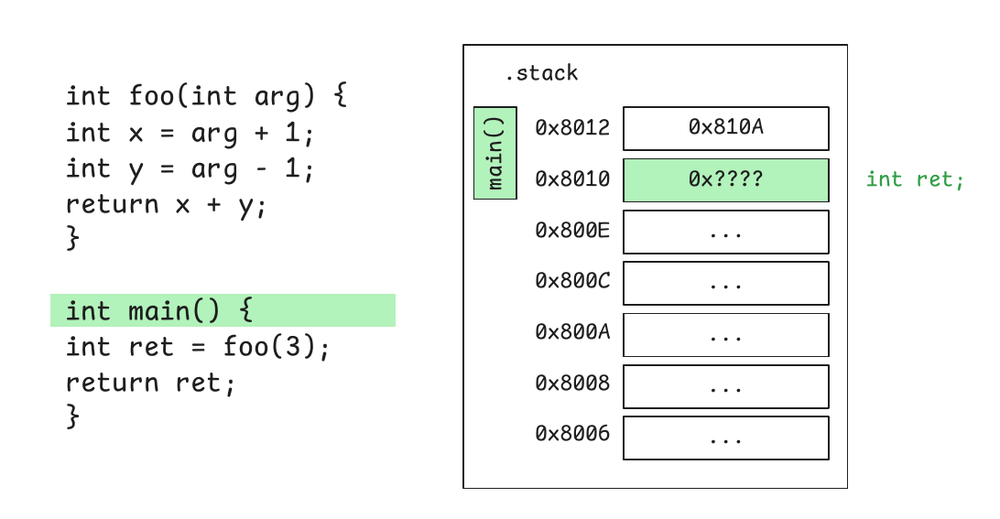
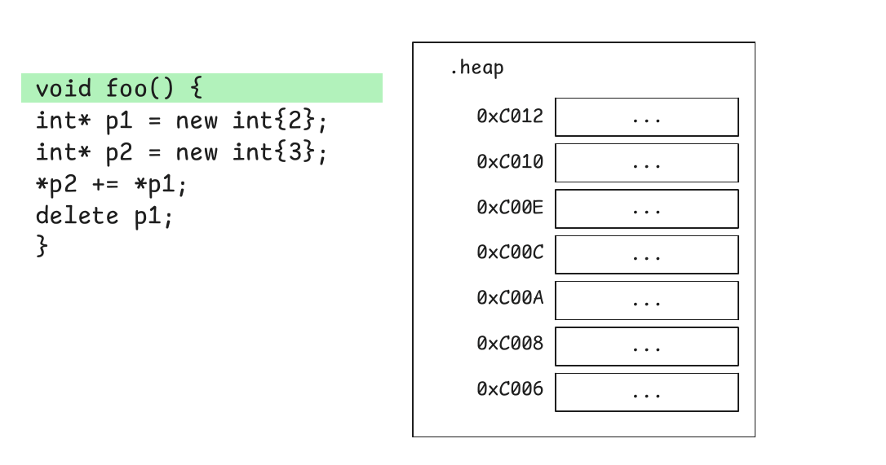

# Wykład 2 - Pamięć

Zakres:

* obiekty
* rozmiar i wyrównanie
* system typów
    * typy podstawowe
    * tablice
    * enumeracje
    * referencje
    * wskaźniki
    * struktury, klasy i unie
* własności `const` i `volatile`
* rzutowania
* strict aliasing rule
* trwałość obiektów
* czas życia obiektów
* operatory `new`/`new[]`/`delete`/`delete[]`
* address sanitizer (ASan)

## Obiekty

Programy w C++ manipulują [obiektami](https://en.cppreference.com/w/cpp/language/object).
Cechy obiektów:

* rozmiar (`sizeof()`)
* wyrównanie (`alignof()`)
* trwałość pamięci (automatyczna, statyczna, dynamiczna, thread-local)
    * określa zasady, kiedy pamięć na obiekt będzie pozyskiwana i zwalniana
* czas życia
    * jasno określone punkty początku i końca życia obiektu w czasie wykonania programu
* typ
* wartość
* nazwa (opcjonalna)

Zadeklarowane obiekty (i referencje) nazywamy **zmiennymi**.

Przykłady obiektów:

```cpp
long global;
 
int uninit;
int x = 3;
vector<int> v;
int* ptr = &x;

int* ptr = new int(3); // 2 obiekty - wskaźnik i obiekt wskazywany
// ...
delete ptr;
```

### Rozmiar, adres, wyrównanie

Obiekty żyją **w pamięci** programu. Pamięć składa się z bajtów, posiadających adresy.

Każdy obiekt ma **rozmiar** pozyskiwany operatorem `sizeof()`. To liczba zajmowanych przez obiekt bajtów.
Obiekty (z pewnymi wyjątkami) muszą zajmować przynajmniej 1 bajt, tak by miały unikalne adresy.
Ciąg bajtów w pamięci, które zajmuje obiekt, rozmiaru `sizeof(val)`, jest nazywany **reprezentacją obiektu**.

Typ obiektu narzuca minimalne wymagania na **wyrównanie** pozyskiwane operatorem `alignof()`.
To liczba, zawsze potęga dwójki, przez którą adres musi być podzielny, lub inaczej,
jest to odstęp, który musi być zachowany pomiędzy następującymi po sobie obiektami tego samego typu.
Można zażądać większego, bardziej restrykcyjnego wyrównania
za pomocą operatora [alignas](https://en.cppreference.com/w/cpp/language/alignas).

Każdy obiekt ma **adres** pozyskiwany operatorem `&`.
Przez adres obiektu należy rozumieć adres pierwszego zajmowanego bajtu.



```cpp
struct Point
{
    int x;
    int y;
};

int main()
{
    char c = 'a';
    int x = 3;
    std::vector<int> vec = {1, 2, 3};

    std::cout << "sizeof(c) = " << sizeof(c) << ", alignof(char) = " << alignof(char) << ", &c = " << (void*)&c << '\n';
    std::cout << "sizeof(x) = " << sizeof(x) << ", alignof(int) = " << alignof(int) << ", &x = " << &x << '\n';
    std::cout << "sizeof(vec) = " << sizeof(vec) << ", alignof(vector<int>) = " << alignof(vec) << ", &vec = " << &vec <<'\n';

    Point p = {1, 2};

    std::cout << "sizeof(p) = " << sizeof(p) << ", alignof(Point) = " << alignof(Point) << ", &p = " << &p <<'\n';
    std::cout << "sizeof(p.x) = " << sizeof(p.x) << ", alignof(int) = " << alignof(int) << ", &p.x = " << &p.x <<'\n';
    std::cout << "sizeof(p.y) = " << sizeof(p.y) << ", alignof(int) = " << alignof(int) << ", &p.y = " << &p.y <<'\n';

    return 0;
}
```

Source: [addresses.cpp](addresses.cpp)

Obiekty mogą zawierać **podobiekty**, np.:

* podobiektami struktur są pola struktury
* podobiektami tablic są ich elementy

Podobiekty zajmują tę samą przestrzeń co nadobiekt, mogą więc współdzielić z nim adres.
Jeżeli 2 żyjące obiekty nie są zagnieżdżone, to muszą zajmować
rozłączne obszary pamięci i mieć unikalne adresy. Porównanie adresów
jest wtedy właściwą metodą sprawdzenia _czy to ten sam obiekt_.

## Typy postawowe

C++ zawiera szereg wbudowanych [typów podstawowych](https://en.cppreference.com/w/cpp/language/types).

### void

Typ pusty. Nie ma obiektów typu `void`. Używany jako typ zwracany w procedurach i
do konstrukcji wskaźników `void*`.

### bool

Typ mogący przechowywać jedną z dwóch wartości `true` lub `false`.
Wyrażenia logiczne są typu `bool`.

```cpp
int x = 0;
bool flag = x > 3;
if (flag) {
  // ...
  flag = false;
}
```

C++ **nie specyfikuje**, jak wygląda reprezentacja tego typu w pamięci.
Daje natomiast gwarancje w zakresie konwersji.
Rzutowanie liczby całkowitej `0` na typ `bool` daje `false`, a każdej innej - `true`.

```cpp
int a = 0;
bool b = static_cast<bool>(a); //false

int c = 42;
bool d = static_cast<bool>(c); // true
```

Rzutowanie `true` na liczbę całkowitą daje `1` a `false` - `0`.

```cpp
bool a = false;
int b = static_cast<int>(a); // 0

bool c = true;
int d = static_cast<int>(c); // 1
```

### Typy całkowitoliczbowe

C++, tak jak C, dostarcza szereg typów całkowitoliczbowych, nie specyfikując dokładnie,
jakiej mają być szerokości bitowej. Narzuca jedynie minima.
Szerokości w typowych implementacjach przedstawiono w kolumnach tabeli:

| **Typ**              | **Standard C++** | **LP32** | **ILP32** | **LLP64** | **LP64** |
|----------------------|------------------|----------|-----------|-----------|----------|
| `char`               | \>= 8            | 8        | 8         | 8         | 8        |
| `signed char`        | \>= 8            | 8        | 8         | 8         | 8        |
| `unsigned char`      | \>= 8            | 8        | 8         | 8         | 8        |
| `short`              | \>= 16           | 16       | 16        | 16        | 16       |
| `unsigned short`     | \>= 16           | 16       | 16        | 16        | 16       |
| `int`                | \>= 16           | 16       | 32        | 32        | 32       |
| `unsigned int`       | \>= 16           | 16       | 32        | 32        | 32       |
| `long`               | \>= 32           | 32       | 32        | 32        | 64       |
| `unsigned long`      | \>= 32           | 32       | 32        | 32        | 64       |
| `long long`          | \>= 64           | 64       | 64        | 64        | 64       |
| `unsigned long long` | \>= 64           | 64       | 64        | 64        | 64       |

LP32, ILP32, LLP64 i LP64 są mnemonicznymi nazwami najpopularniejszych modeli długości
słowa (**I**nteger), długiego słowa (**L**ong) i wskaźnika (**P**ointer) przyjmowanych na różnych platformach.
Przykładowo, 32-bitowy windows i Linux stosują ILP32. 64-bitowy Windows ma LLP64, a 64-bitowy Linux LP64.

Rozmiar w bajtach jest jeszcze słabiej wyspecyfikowany. Jedyne co standard gwarantuje to:

```
1 == sizeof(char) ≤ sizeof(short) ≤ sizeof(int) ≤ sizeof(long) ≤ sizeof(long long)
```

Co pozwala na teoretyczną implementację z 64-bitowymi bajtami i wszystkimi powyższymi rozmiarami
równymi 1. To ciekawa zaszłość historyczna: istniały maszyny z bajtami rozmiarów od 1 do 42 bitów.
Programy nie powinny zakładać żadnych rozmiarów, tylko korzystać z operatora `sizeof()` do ich pozyskania.

Co często zaskakuje, dopiero od C++20, typy ze znakiem (signed) muszą być reprezentowane standardowym kodem uzupełnień
do dwóch.

Arytmetyka liczb **bez znaku** jest dobrze określona, przepełnienia zawsze skutkują _zawijaniem_ modulo
`2^n`.

```cpp
unsigned short a = std::numeric_limits<unsigned short>::max();
unsigned short b = 1;

unsigned short c = a + b; // overflow
std::cout << "a + b = " << c << std::endl; // 0

a = 0;

unsigned short c = a - b; // underflow
std::cout << "a - b = " << c << std::endl; // 65535
```

Analogiczna operacja na typach **ze znakiem** ma **niezdefiniowane zachowanie** i zawsze jest błędem!
Poprawny program nie dopuszcza do przepełnień!

```cpp
int a = std::numeric_limits<int>::max();
int b = 1;

int c = a + b; // error!
std::cout << "a + b = " << c << std::endl; // ???
```

### Typy znakowe

Obecnie C++ dostarcza następujące typy całkowitoliczbowe
przeznaczone do przechowywania znaków:

* `char` - znaki w kodowaniu ASCII, nie wiadomo czy jest `signed`, czy `unsigned`
* `signed char` - jednobajtowa liczba ze znakiem
* `unsigned char` - jednobajtowa liczba bez znaku, typ używany do wglądu w bajtową reprezentację obiektów
* `wchar_t` - szerokie znaki, zależy od platformy, w praktyce 32-bit na Linux, 16-bit na Windows
* `char8_t` - znaki w kodowaniu UTF-8
* `char16_t` - znaki w kodowaniu UTF-16
* `char32_t` - znaki w kodowaniu UTF-32

Każdy typ znakowy ma swój sposób tworzenia literałów:

| Typ        | Kodowanie | Znak    | Ciąg znaków |
|------------|-----------|---------|-------------|
| `char`     | ASCII     | `'a'`   | `"abcd"`    | 
| `wchar_t`  | ?         | `L'a'`  | `L"abcd"`   | 
| `char16_t` | UTF-16    | `u'a'`  | `u"abcd"`   | 
| `char32_t` | UTF-32    | `U'a'`  | `U"abcd"`   | 
| `char8_t`  | UTF-8     | `u8'a'` | `u8"abcd"`  |

```cpp
char32_t c = U'猫';
const char32_t cstr[] = U"🌍🚀🧑";
std::u32string str = U"🌍🚀🧑";
```

Source: [chars.cpp](chars.cpp)

##### Surowe literały znakowe

Umieszczanie znaków specjalnych, w szczególności końca linii w stringach wymaga poprzedzania ich backslashami:

```cpp
char txt = "hello\nworld!";
```

Czasem, w przypadku długich, sformatowanych tekstów nie jest to wygodne ani czytelne. Nowszy standard C++ pomaga
dostarczając nową składnię `R"(<string>)"` niewymagającą escapowania:

```cpp
const char* prog = R"(
int main() {
    int x = 10;
    return x;
}
)";
```

### Typy zmiennoprzecinkowe

Standard dostarcza 3 typy: `float`, `double`, `long double`, różniące się precyzją.
Typowo reprezentowane zgodnie ze standardem IEEE-754 słowami długości 32-bit, 64-bit, 80-bit.

### std::nullptr_t

Typ pustego wskaźnika `nullptr`. Wprowadzony dla lepszej kontroli typów.

```cpp
void* p = nullptr;
char* cp = nullptr;
```

Znane z C macro `NULL` było równe `0`, czyli było liczbą. Prowadzi to do niejednoznaczności, np.

```cpp
void func(int);
func(NULL);
```

Wartości typu `nullptr_t` są konwertowalne na dowolny inny typ wskaźnikowy.

## Wskaźniki

Wskaźniki przechowują adresy obiektów, pośrednio wskazują na inny obiekt.
Typ wskaźnika zawsze mówi o typie obiektu wskazywanego.

```cpp
Point p = {1, 3};
Point* pp = &p;
*p = {2, 4};
p->x = 0;

```

Zmienna wskaźnikowa też jest obiektem - można więc na nią wskazywać.

```cpp
Point** ppp = &pp;
```

Wartość wskaźnika nie musi być poprawna. Obiekt wskazywany może już nie żyć, albo jeszcze nie żyć, albo adres może
nie być adresem żadnego obiektu. Dereferencja takiego niepoprawnego wskazania to błąd.

```cpp
Point* pp = nullptr;
{
    Point p {1, 2};
    pp = &p;
}
pp->x = 0; // !
```

## Referencje

Referencje to również pośrednie odwołania do obiektów.
W przeciwieństwie do wskaźników muszą być zainicjalizowane w momencie tworzenia. Nie istnieje _null-referencja_.

```cpp
Point p = {1, 2};
Point& pref = p;
pref.x = 0;
```

Referencje **nie są** obiektami, nie mają rozmiaru, nie mają adresu, nie muszą (ale mogą) być przechowywane w pamięci.
Nie da się więc pozyskać referencji do referencji. Inicjalizacja referencji inną referencją tworzy nową referencję
na pierwotny obiekt.

```cpp
Point p = {1, 2};
Point& pref = p;
Point& pref2 = pref;
```

Referencje tak samo jak wskaźniki mogą być niepoprawne jeżeli obiekt uległ już zniszczeniu:

```cpp
std::vector<int> v = {1, 2, 3};
int& i0 = v[0];
int& i1 = v[1];
int& i3 = v[2];
v.clear();
i0 = 10; // !
```

Powszechne jest przekazywanie parametrów wejściowo/wyjściowych do funkcji przez referencję.

```cpp
void fill(vector<int>& v) {
    v.push_back(1);
    v.push_back(2);
    v.push_back(3);
}

int main() {
    vector<int> v;
    fill(v);
    return 0;
}
```

## Enumeracje

C++ wspiera enumeracje, podobnie do C:

```cpp
enum Color { red, green, blue };
Color r = red;
 
switch(r)
{
    case red  : std::cout << "red\n";   break;
    case green: std::cout << "green\n"; break;
    case blue : std::cout << "blue\n";  break;
}
```

Enumeracje przechowują liczbę całkowitą pewnego typu. Enumeratory to stałe tego typu.
Typ jest wybierany automatycznie, tak żeby pomieścił wszystkie możliwe wartości, chyba że go wymusimy:

```cpp
enum Color : unsigned char { red, green, blue };
```

Enumeracje podlegają niejawnemu rzutowaniu na liczby:

```cpp
void foo(int x) { ... }

Color c = red;
foo(c);
```

Enumeratory `red`, `green`, `blue` są stałymi widocznymi w tym samym zakresie, w którym zdefiniowana jest enumeracja.

To _zaśmiecanie_ przestrzeni nazw i brak kontroli typów przy konwersjach skłoniło język do wprowadzenia silnych
enumeracji, przy których enumeratory
trzeba klasyfikować typem enuma:

```cpp
enum class Color { red, green, blue };
Color r = Color::red;
 
switch(r)
{
    case Color::red  : std::cout << "Color::red\n";   break;
    case Color::green: std::cout << "Color::green\n"; break;
    case Color::blue : std::cout << "Color::blue\n";  break;
}
```

## Struktury i klasy

Struktury i klasy to typy, których obiekty zawierają serię podobiektów, różnych typów.

```cpp
struct S {
  int x;
  char txt[3];
};

class C {
  std::vector<S> v;
  std::string name;
};
```

Jedyną różnicą między słowami kluczowymi `struct` i `class` jest domyślna _widoczność_ ich składowych: publiczna
w przypadku struktur, prywatna w przypadku klas. O widoczności będziemy mówić na następnym wykładzie dotyczącym
programowania obiektowego.

Rozmiar struktur podobnie jak rozmiar tablic wynosi **co najmniej** tyle ile zsumowany rozmiar składowych.
Typy pól mają swoje wymagania na wyrównanie, co może zmusić kompilator do wstawienia nieużywanych przestrzeni między nimi (tzw. _padding bytes_). 

```cpp
S s = {'a', 3};
static_assert(sizeof(S) == 8, "surprise!");
```

Source: [structures.cpp](structures.cpp)

Struktury i klasy można przypisywać. Domyślnie takie przypisanie, przypisuje pole po polu.

```cpp
S s = {'a', 3};
S copy = s;
```

## Tablice

Tablice to obiekty typu `T[n]` składające się z `n` następujących po sobie
podobiektów typu `T`. Mają stały rozmiar `n` wynikający z ich typu, niezmienny
od początku do końca życia tablicy.

```cpp
int tab[3] = {1, 2, 3};
char txt[] = "txt"; // dedukcja typu tablicy `char[4]`
std::string poem[3] = { "ala", "ma", "kota" };
```

Tablic nie da się przypisywać. Trzeba przenosić element po elemencie.

```cpp
int a[3] = {1, 2, 3}, b[3] = {4, 5, 6};
a = b; // !
```

Ale struktury, zawierające tablice już można:

```cpp
struct S { int c[3]; };
S s1 = {1, 2, 3}, s2 = {3, 4, 5};
```

Rozmiar tablicy zwykle wynosi `n * sizeof(T)`, ale nie zawsze:

```cpp
alignas(4) struct My1BStruct
{
    char c;       
};
My1BStruct stab[3];
static_assert(sizeof(stab) == 12, "surprise!");
```

Tablice są niejawnie rzutowalne na wskaźnik na ich pierwszy element typu `T*`:

```cpp
void f(int* p) {
    std::cout << *p << '\n';
}

int a[3] = {1, 2, 3};
int* p = a;

f(a); // ok
f(p);
```

Nie podając rozmiaru uzyskujemy niekompletny typ `T[]`. Można deklarować zmienne takiego typu,
tak samo, jak wskaźniki do zadeklarowanych tylko struktur:

```cpp
extern int gtab[]; // deklaracja

int main() {
  f(gtab);
}

int gtab[] = {1, 2, 3}; // definicja
```

Te własności, pochodzące jeszcze z C są nieintuicyjne, zwłaszcza w przypadku wielowymiarowych tablic.
C++11 dostarczył typ `std::array<T, N>`, który jest
strukturą opakowującą tablicę. Da się ją kopiować,
budować do niej wskaźniki, referencje, tak jak zwykle:

```cpp
std::array<int, 3> ax = {1, 2, 3};
std::array<int, 3> ay;
ay = ax;
```

## Własności `const` i `volatile`

Każdy typ może być dodakowo kwalifikowany słowami kluczowymi `const` i/lub `volatile`.

* `const` czyni obiekty tego typu niemodyfikowalnymi po ich utworzeniu
* `volatile` tworzy obiekty, których zmiany w pamięci muszą być _widoczne z zewnątrz programu_.

Kompilator jest zobowiązany przetłumaczyć każdy zapis i odczyt obiektów typu `volatile` na odpowiadające operacje
zapisu/odczytu z pamięci fizycznej. Nie może ich wyoptymalizować (tak jak to się dzieje w przypadku zwykłych zmiennych).

> Typowym przykładem użycia `volatile` są urządzenia zamapowane do pamięci. W wielu systemach komputerowych
zapis pod pewien adres będzie fizycznie przetłumaczony przez kontroler pamięci na przesłanie rozkazu do urządzenia, np. dysku.
Odczyt będzie z kolei pobraniem wartości z urządzenia, np. temperatury procesora. W takiej sytuacji dostępy do pamięci
muszą być przez kompilator traktowane dosłownie. Ich zmiana/wyoptymalizowanie zaburzy intencje programisty. 

Aby zapewnić, że własności `const`/`volatile` będą zachowane przy dostępie do obiektu
z dowolnego miejsca w programie, również za pośrednictwem wskaźników i referencji, te przenoszą
tę informację w swoim typie. Do zmiennych typu `const int` można tworzyć tylko wskaźniki na typ `const int`.
Do znaków tablicy typu `volatile char[10]` można dobierać się tylko za pomocą wskaźnika `volatile char*`.

```cpp
void set(int* ptr) {
    *ptr = 30;
}

void setref(int& i) {
    i = 40;
}

const int x = 10;
const int* cpx = &x;
// int* p = &x; //! porzucenie const
// int* px = cpx; //! porzucenie const
// *cpx = 10; //! zapis do const
// set(cpx); //! porzucenie const przy przekazaniu parametru
// setref(*cpx); //! porzucenie const przy przekazaniu parametru

const int& crx = x;
// int& rx = x; //! porzucenie const
// setref(crx); //! porzucenie const przy przekazaniu parametru
```

Silna kontrola typów zapewnia bezpieczeństwo. Mimo to, za pomocą sprytnych zabiegów da się ominąć ten mechanizm, np.:

```cpp
set((int*)cpx); 
```

Taki program ma niezdefiniowane zachowanie. Zapis do obiektów typu `const` jest groźnym błędem, tak
jak dostęp do zmiennych typu `volatile` za pomocą zwykłych wskaźników.

Zmienne typów złożonych też mogą korzystać z tych kwalifikatorów:

```cpp
const std::string str = "Hello";
char c = str[3]; // odczyt ok!
// str[3] = 'a'; //! modyfikacja obiektu const
std::size_t s = str.size(); // ok! .size() nie modyfikuje
// str.append(" world"); //! modyfikacja obiektu const
```

## Rzutowania

C++ ma 4 operatory rzutowania: `static_cast`, `const_cast`, `reinterpret_cast`, `dynamic_cast`

`static_cast<T>(U)`: bezpiecznie konwertuje argument typu `U` na typ `T`. Kompilator
sprawdza, czy konwersja jest bezpieczna.

```cpp
int i = 3;
float f = static_cast<float>(i);
int flag = static_cast<int>(true);
```

Nie pozwala na konwersje między typami niezwiązanymi:

```cpp
int x;
float* f = static_cast<float*>(&x); //!
```

Nie pozwala np. na porzucenie `const`.

```cpp
const int i = 1;
int* ptr = static_cast<int*>(&i); //!
```

`const_cast<T>()`: dodaje lub usuwa kwalifikatory `const`/`volatile`. Nie pozwala
na zmianę typu.

```cpp
const int i = 1;
int* ptr = const_cast<int*>(&i);
*ptr = 3; // to i tak błąd, wkazywany obiekt jest const
```

To rzadko potrzebny, zaawansowany mechanizm. Kiedy użycie `const_cast` przychodzi nam do głowy, zwykle oznacza to,
że problem leży gdzie indziej.

`dynamic_cast<T>` służy do bezpiecznego rzutowania wskaźników i referencji na typy pochodne lub bazowe.
Współpracuje z mechanizmem dziedziczenia, o którym będziemy mówić poźniej.

`reinterpret_cast<T>` potrafi zmienić typ wskazywany wskaźnika/referencji na dowolny inny.
Nie może zmienić kwalifikacji `const`/`volatile`. Można go użyć, tylko jeżeli
wiemy, że we wskazywanej pamięci istotnie jest obiekt typu T.

```cpp
float f = 1.0f;
int* i = reinterpret_cast<int*>(&f);
*i = 3; //! błąd - tam nie ma int'a
```

## Reprezentacja obiektów

Obiekty są reprezentowane w pamięci jako ciąg bajtów. Typ `unsigned char` ma bardzo ważne zastosowanie:
można z jego pomocą analizować reprezentację wszystkich obiektów w pamięci:

```cpp
int x = 12345; // Jakiś obiekt
unsigned char* bytes = reinterpret_cast<unsigned char*>(&x);
for (std::size_t i = 0; i < sizeof(x); ++i) {
    std::cout << "Byte " << i << ": "
              << "0x" << std::hex << std::setw(2) << std::setfill('0') << static_cast<int>(bytePtr[i]) << "\n";
}
```

Source: [objrep.cpp](objrep.cpp)

> Typy `char`, `unsigned char` i `std::byte` są jedynymi, które na to pozwalają.
> Dobieranie się obiektów za pomocą wyrażeń innych typów jest niepoprawne!

Dostęp do obiektu typu `T` jest możliwy tylko za pomocą wyrażeń typu:

* `T`
* `const/volatile T`
* `signed/unsigned T`
* `const/volatile signed/unsigned T`
* klas zawierających pola typu `T`
* klas bazowych `T`
* `char`, `unsigned char` i `std::byte`

To reguła znana jako _strict aliasing rule_.

> Dostęp do obiektu za pomocą wyrażeń innych typów ma niezdefiniowane zachowanie!

Przykładowo mając funkcję przyjmującą 2 wskazania:

```cpp
int foo(float *f, int *i) { 
    *i = 1;               
    *f = 0.f;            
   
   return *i;
}
```

Kompilator ma prawo założyć, że parametry nie będą wskazywać
na ten sam region w pamięci. Typy `float` oraz `int` nie są kompatybline.
Poprawny program nie może odwoływać się do obiektu typu `float` za pomocą `int*` i na odwrót.

Programista może złamać zasadę:

```cpp
int main() {
    int x = 0;
    
    x = foo(reinterpret_cast<float*>(&x), &x);
    std::cout << x << "\n";   // Expect 0?
}
```

Zachowania tego programu nie da się przewidzieć.
W praktyce optymalizator generując kod funkcji `foo` może założyć, że instrukcja `*f = 0.f;` nie może mieć
wpływu na wartość `*i`. Zamiast odczytywać więc ponownie zwracaną daną pamięci, po prostu zwróci `1` w kodzie
maszynowym.

```asm
foo(float*, int*):
        mov     DWORD PTR [rsi], 1
        mov     eax, 1
        mov     DWORD PTR [rdi], 0x00000000
        ret
main:
        mov     eax, 1
        ret
```

Source: [https://godbolt.org/z/ToeK7dM5Y](https://godbolt.org/z/ToeK7dM5Y)

Więcej na ten temat można znaleźć
w [bardzo dobrym artykule](https://gist.github.com/shafik/848ae25ee209f698763cffee272a58f8).

## Dynamiczna alokacja pamięci

Język C++ wprowadza jawne operatory `new`/`new[]`/`delete`/`delete[]` do tworzenia i usuwania obiektów alokowanych
dynamicznie. Znane z C funkcje `std::malloc`/`std::free` są dostępne, ale ich użycie jest nietypowe w programach C++.

```cpp
int main() {
    int* ptr = new int;
    int* tab = new int[10];
    
    *ptr = 10;
    for (int i = 0; i < 10; i++) {
        tab[i] = i;
    }
    
    delete ptr;
    delete[] tab;
}
```

Operator `new` jest silnie typowany. Wymaga podania typu alokowanych obiektów.
To kluczowa różnica w stosunku do C zwiększająca bezpieczeństwo.
`new T` robi tak naprawdę 2 następujące po sobie rzeczy:

* alokuje pamięć rozmiaru `sizeof(T)`
* inicjalizuje obiekt typu `T` w zaalokowanej pamięci.

`new T[n]` tworzy `n` obiektów:

* alokuje pamięć rozmiaru `sizeof(T[n])`
* iteracyjnie inicjalizuje obiekt typu `T` w kolejnych komórkach pamięci

Tak samo, jak obiekty automatyczne można inicjalizować w momencie tworzenia,
obiekty alokowane dynamiczne również:

```cpp
int* x = new int{4};
```

Wartość `4` będzie użyta do zainicjalizowania nowo powstałego obiektu w drugim kroku.

Operator `delete` też jest silnie typowany. Jest wywoływany na wskaźniku, typu `T*`.
`delete` również robi 2 rzeczy:

* niszczy obiekt typu `T` we wskazywanej pamięci
    * dla typów prostych fizycznie nie robi nic, dla klas będzie tu wywoływany destruktor (o tym będzie następny
      wykład)
* dealokuje pamięć rozmiaru `sizeof(T)`, wskazywaną przez operand

Podobnie, `delete[]` wpierw niszczy interacyjnie wszystkie elementy tablicy,
a potem dealokuje jej pamięć.

### Błędy alokacji

Pamięci zawsze może zabraknąć. `new` i `new[]` raportują błędy za pomocą wyjątków.
Jeżeli alokacja się nie powiedzie operator `new` _rzuca_ wyjątek:

```cpp
void allocate_all_the_thing() {
    for(int i = 0; i < 1000000; ++i) {
        std::cout << "allocating [" << i << ']' << std::endl;
        int* tab = new int[100'000'000]; // 400MB
    }
}
```

Wyjątek powoduje natychmiastowe wychodzenie z funkcji, w górę stosu wywołań, aż do `main()`.
Wyjątek opuszczając funkcję `main` kończy program z błędem, wywłoując `std::terminate()`:

```
terminate called after throwing an instance of 'std::bad_alloc'
  what():  std::bad_alloc
```

Wyjątek można przechwycić za pomocą bloku `try { ... } catch(...) {...}`:

```cpp
try
{
    int* tab = new int[100'000'000]; // 400MB    
} catch (std::bad_alloc& e) {
    std::cout << "bad_alloc" << std::endl;
    return;
}
```

Source: [new.cpp](new.cpp)

Zwykle nie ma takiej potrzeby. Żeby przechwytywanie `std::bad_alloc` miało sens, program musiałby umieć
sensownie obsłużyć błąd braku pamięci. Wyjątki znoszą z programisty obowiązek jawnego sprawdzania, czy funkcja alokująca
zwróciła `NULL`, tak jak to się działo w C.
Program, który chce obsłużyć błąd alokacji, może też zrezygnować z domyślnego trybu raportowania błędów przez wyjątki
i oczekiwać pustego wskaźnika:

```cpp
int* tab = new (nothrow) int[100'000'000];    
if (tab == nullptr) {
    // allocation failed
}
```

## Trwałość pamięci obiektów

Obiekty potrzebują miejsca w pamięci. To miejsce ma swój określony czas życia. C++ klasyfikuje 4 typy trwałości pamięci
obiektów:
automatyczna, dynamiczna, statyczna i związana z wątkiem (`thread_local`).

### Obiekty automatyczne

Obiekty zadeklarowane w zakresie bloku `{ ... }`, np. w ciele funkcji lub niżej, są automatycznie alokowane
przy wejściu kontroli do bloku i dealokowane przy wyjściu z bloku.

Nie dotyczy to obiektów oznaczonych jako `extern`, `static`, lub `thread_local` ani obiektów deklarowanych na poziomie
przestrzeni nazw.

```cpp
std::string foo(int y) { // początek życia pamięci x
  int x = 0;
  
  if (x > y) { // początek życia pamięci str 
    std::string str = "asdf";
    // ...
    return str;
  } // koniec życia pamięci str
  
  return "asdf";
} // koniec życia pamięci x
```

Fizycznie pamięć obiektów automatycznych jest pozyskiwana ze **stosu**.
W momentach wejścia do bloku kompilator generuje instrukcje zwiększające stos o rozmiar wszystkich obiektów
zadeklarowanych w bloku. W momencie wyjścia generuje instrukcje odwrotne.



### Obiekty dynamiczne

Pamięć na obiekty alokowane dynamiczne musi być jawnie pozyskana i zwolniona za pomocą operatorów `new`,`delete`, lub
funkcji bibliotecznych takich jak `malloc`/`free`. Nie jest zarządzana i zwalniana automatycznie, programista
jest odpowiedzialny za czas życia tej pamięci.

Fizycznie pamięc obiektów dynamicznych jest pozyskiwana ze **sterty**, czyli osobnego
segmentu (lub segmentów) pamięci pozyskanej od systemu operacyjnego, rosnącego z przybywającymi alokacjami,
malejącego z dealokacjami. Biblioteka standardowa implementuje algorytm zarządzania stertą, który układa
na niej obiekty, oznacza je jako zwolnione, pozyskuje i oddaje pamięć do systemu operacyjnego.
Takie algorytmy poza właściwymi obiektami przechowują na stercie metadane, zwykle w postaci małego nagłówka
poprzedzającego każdą alokację. Znajdują się tam informacje takie jak rozmiar alokacji, czy blok jest wolny, czy zajęty,
wskaźniki na następny/poprzedni blok itp. 



### Obiekty statyczne

Pamięć obiektów statycznych alokowana jest na początku programu i zwalniana na końcu.
Dotyczy to wszystkich obiektów deklarowanych w zakresie przestrzeni nazw, jak i zmiennych blokowych
opatrzonych słowami `static` lub `extern`:

```cpp
int globaxl_x = 3;
namespace ns {
  std::string text = "asdf";
}

void foo() {
  static int counter = 0;
}
```

W powyższym przykładzie pamięć na wszystkie 3 obiekty: `x`, `text` i `counter` jest alokowana na starcie programu.
Fizycznie takie zmienne są lokowane w dedykowanym segmencie pamięci statycznej. Dzieje się to w momencie ładowania
programu do pamięci operacyjnej.

### Obiekty `thread_local`

Podobnie do obiektów statycznych, obiekty `thread_local` są alokowane z początkiem życia wątku i zwalniane z jego
końcem. O wątkach będziemy rozmawiać na późniejszym wykładzie.

## Czas życia obiektów

Każdy obiekt ma **czas życia** w trakcie wykonania programu.
To jest inna cecha niż trwałość (czas życia) jego pamięci.
W ogólności pamięć musi żyć przynajmniej tyle, co sam obiekt.

Czas życia obiektu typu `T` rozpoczyna się gdy:

* program pozyskał odpowiednią pamięć na obiekt: rozmiaru `sizeof(T)` i wyrównaniu `alignof(T)`.
* zakończyła się inicjalizacja obiektu

To rozłączne kroki. Program może niezależnie pozyskać pamięć,
a potem ręcznie utworzyć w tej pamięci obiekt i go zainicjalizować:

```cpp
void reuse() {
  alignas(int) char storage[sizeof(int)]; // pamięć
  int* ptr = new (&storage) int{3}; // utworzenie int w pamięci tablicy
  *ptr = 3;
}
```

Czas życia obiektu typu `T` kończy się w kilku sytuacjach:

* zniszczenia obiektu w typów prostych
* rozpoczęcie wykonania destruktora klasy `T`
* zwolnienia pamięci obiektu
* utworzenia innego obiektu w tej samej pamięci

Te reguły pozwalają na wykorzystanie pamięci jednego obiektu
do utworzenia innych obiektów.

```cpp
void reuse() {
  alignas(int) char storage[sizeof(int)]; // pamięć
  int* ptr = new (&storage) int{3}; // utworzenie int w pamięci tablicy
  *ptr = 3;
  float* fptr = new (&storage) float{1.0f}; // utworzenie float kończy życie int
  *fptr *= 2.0f;
}
```

> Dostęp do obiektu poza czasem jego życia jest błędem!

## Typowe błędy

Bezpośredni dostęp do pamięci daje ogromne możliwości, ale i otwiera drogę do licznych, trudnych do wychwycenia okiem
błędów:

* użycie obiektu ze stosu po jego zwolnieniu

```cpp
int* foo() {
     int x = 0;
     return &x;
}

int main() {
    int* ptr = foo();
    *ptr = 1;
    return 0;
}
```

Source: [stack-use-after-free.cpp](asan/stack-use-after-free.cpp)

* użycie obiektu po zwolnieniu za pomocą `delete`

```cpp
int main() {
    int* ptr = new int{3};
    *ptr = 0;
    delete ptr;
    *ptr = 1;
    return 0;
}
```

Source: [heap-use-after-free.cpp](asan/heap-use-after-free.cpp)

* podwójne zwolnienie za pomocą `delete`

```cpp
void add(int* acc, int* ptr) {
       *ptr = 0;
       delete ptr;
}

int main() {
    int acc = 0;
    int* ptr = new int{3};
    add(&acc, ptr);
    add(&acc, ptr);
    return 0;
}
```

Source: [double-free.cpp](asan/double-free.cpp)

* zwolnienie za pomocą niepoprawnego adresu

```cpp
int acc = 0;

void add(int* ptr) {
       acc += *ptr;
       delete ptr;
}

int main() {
    int a = 0;
    int* b = new int{3};
    add(&a);
    add(b);
    return 0;
}
```

Source: [invalid-free.cpp](asan/invalid-free.cpp)

* niezwolnienie pamięci w czasie działania programu

```cpp
#include <cstddef>

int main() {
    const std::size_t size = 128;
    auto arr = new int*[size];
    for (int i = 0; i < size; i++) {
        arr[i] = new int{i};
    }
    int sum = 0;
    for (std::size_t i = 0; i < size; i++) {
        sum += *arr[i];
    }
    delete[] arr;
    return 0;
}

```

Source: [memory-leak.cpp](asan/memory-leak.cpp)

* przepełnienie bufora na stosie

```cpp
#include <cstring>

int main() {
    char command[10];
    char output[250];
    std::strcpy(command, "/usr/bin/verylongcommand");
    std::strcpy(output, command);
    return 0;
}
```

Source: [stack-buffer-overflow.cpp](asan/stack-buffer-overflow.cpp)

* przepełnienie bufora na stercie

```cpp
#include <vector>

int main() {
    std::vector<int> vec = {1, 2, 3, 4, 5, 6, 7};
    for (int i = 0; i <= vec.size(); i++) {
        vec[i] = 2 * vec[i];
    }
    return 0;
}
```

Source: [heap-buffer-overflow.cpp](asan/heap-buffer-overflow.cpp)

* przepełnienie statycznego (globalnego) bufora

Wszystkie powyższe programy są niepoprawne, ale najgorsze błędy to takie, które nie
ujawniają się natychmiastowo. Program (błędny) może tak funkcjonować miesiącami
w produkcyjnym środowisku.

## Address Sanitizer

Z pomocą przychodzą nowoczesne narzędzia. Postawowym, bez którego ciężko obecnie
wyobrazić sobie pracę nad większym projektem w C++ jest Address Sanitizer (ASan)
wprowadzony przez [Google](https://static.googleusercontent.com/media/research.google.com/en//pubs/archive/37752.pdf).

ASan instrumentuje produkowany kod maszynowy, dodając do niego instrukcje sprawdzające
poprawność odwołań do pamięci i przerywając działanie programu natychmiast po wykryciu błędu.
Jest częścią kompilatora, którą trzeba jawnie włączyć, typowo przez podanie flagi takiej jak
`-fsanitize=address` w lini zlecenie. Narzędzie zwiększa użycie pamięci i procesora
przechowując dodatkowe dane i dodając instrukcje, dlatego zwykle jest używane tylko
w konfiguracjach deweloperskich.

```shell
g++ -g -fsanitize=address asan/stack-buffer-overflow.cpp -o prog.exe && ./prog.exe
```

Przykładowe wyjście z błędem prezentuje miejsce w którym nastąpiło niepoprawne odwołanie do pamięci:

```
==9118==ERROR: AddressSanitizer: stack-buffer-overflow on address 0x7c3308f0902a at pc 0x7c330b6fb303 bp 0x7fffad4a1a20 sp 0x7fffad4a11c8
WRITE of size 25 at 0x7c3308f0902a thread T0
    #0 0x7c330b6fb302 in memcpy ../../../../src/libsanitizer/sanitizer_common/sanitizer_common_interceptors_memintrinsics.inc:115
    #1 0x5769492672f4 in main asan/stack-buffer-overflow.cpp:6
    #2 0x7c330ae2a1c9 in __libc_start_call_main ../sysdeps/nptl/libc_start_call_main.h:58
    #3 0x7c330ae2a28a in __libc_start_main_impl ../csu/libc-start.c:360
    #4 0x576949267164 in _start (/cpp-site/content/wyk/w2/prog.exe+0x1164) (BuildId: 69d828a34f8704fac3eb3dc2ecfaaa8eaf256b24)
```

#### Jak to działa

ASan przechowuje w dodatkowym segmencie pamięci dodatkowe dane
opisujące stan pamięci właściwej - sterty, stosu, itd. To tzw. _shadow memory_.
Na każde 8 bajtów przypada jeden _shadow byte_ opisujący stan tych 8'miu bajtów, którego
wartość mówi czy ten region jest poprawny czy nie:

* 0 oznacza, że wszystkie 8 bajtów jest poprawne
* wartość `n` z zakresu `1-7` oznacza że pierwszych `n` bajtów jest poprawnych
* wartość ujemna oznacza, że cały blok jest niepoprawny (_poisoned_)

Mapowanie adresu na adres bajtu shadow jest prostą operacją:

```
ShadowAddress = (RealAddress >> 3) + ShadowOffset
```

Kompilator z włączonym ASan'em dodaje sprawdzenie wartości bajtu shadow przy każdym odwołaniu
do pamięci.

Podczas alokowania pamięci (i na stosie i na stercie) nowo pozyskane bajty są oznaczane jako poprawne.
W celu wykrywania przepełnień buforów, nawet przyległych do siebie, ASan dodaje
mały niepoprawny region przed i po każdej alokacji na stosie i stercie (tzw. _redzone_).


Dla alokacji na stosie ASan modyfikuje ramkę stosu każdej funkcji.
_Rozsuwa_ zmienne i co za tym idzie - modyfikuje wszystkie odwołania do nich.
Dodaje instrukcje w momencie alokowania ramki ustawiające flagi poprawności dla rejonów
zajmowanych przez zmienne i flagi niepoprawności dla _redzone_'ów.

Dla alokacji dynamicznych, na stercie, ASan podmienia podmienia implementację
funkcji alokujących `malloc/realloc/free`. Przechwycony `malloc()`, powiększa fizycznie każdą alokację,
dodając _redzone_ przed i po właściwym buforze. Zawiera również instrukcje ustawiające wartości w pamięci shadow.
