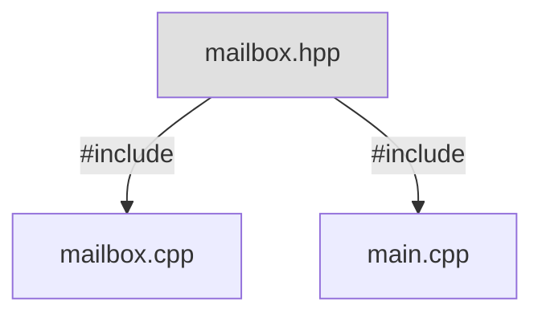

# Wykład 3 - Klasy

Zakres:

* cechy programowania obiektowego
* klasy, metody, widoczność
* przeładowywanie funkcji, argumenty domyślne
* konstruktory i destruktory
* RAII
* konstruktory kopiujące i operatory przypisania
* konstruktory przenoszące i operatory przeniesienia
* reguła 3-ch, reguła 5-ciu
* ~~przeciążanie operatorów~~
* ~~konwersje~~
* ~~literały zdefiniowane przez użytkownika~~
* ~~składowe statyczne~~

## Programowanie Obiektowe

Programy obiektowe manipulują zbiorem obiektów, które mogą
się ze sobą komunikować. Obiekty łączą w sobie stan i zachowanie,
to definiująca je cecha.
Stan to najczęściej dane przechowywane w pamięci obiektu, czyli pola.
Zachowanie modelujemy za pomocą funkcji obiektem, czyli metod.

> Nie należy łączyć tak samo brzmiących pojęć: _obiekt_ języka C++
> i _obiekt_ w paradygmacie programowania obiektowego.

Język programowanie nie musi zawierać mechanizmów wspierających
programowanie obiektowe. W C też można napisać program obiektowy
i często się to robi:

```c
struct Vector2f { float x, y; }; // definicja klasy

struct Vector2f make_vector(float x, float y) // konstruktor
{
    struct Vector2f v = {x, y};
    return v;
}

float vector2f_length(const struct Vector2f* this) // metoda
{
    return (float)sqrt(this->x * this->x + this->y * this->y);
}

struct Vector2f vector2f_add(struct Vector2f* this, const struct Vector2f* other) // metoda z argumentem
{
    this->x += other->x;
    this->y += other->y;
    return *this;
}
```

W tym przykładzie typ `Vector2f` łączy w sobie 2 pola danych: `x` i `y` oraz dostarcza interfejs
modyfikujący i odczytujący ten stan w postaci dwóch funkcji, z których każda operuje na instancji typu `Vector2f`.

## Cechy programowania obiektowego

#### Abstrakcja

Polega na ukrywaniu zbędnych szczegółów implementacyjnych i prezentowaniu jedynie istotnych cech obiektu.
Dzięki abstrakcji obiekty mają zrozumiały dla programisty interfejs, odzwierciedlający rzeczywiste obiekty
lub zjawiska. Użytkownik operuje na interfejsie, a szczegóły techniczne są ukryte.

#### Hermetyzacja (Enkapsulacja)

To cecha polegająca na ukrywaniu wewnętrznego stanu obiektu oraz dostarczaniu kontrolowanego dostępu do niego przez
metody
(np. _gettery_ i _settery_). Hermetyzacja chroni przed bezpośrednią ingerencją w strukturę obiektu i pozwala na większą
kontrolę nad jego spójnością.

#### Dziedziczenie

Umożliwia tworzenie nowych typów obiektu, na podstawie istniejących,
dzięki czemu można ponownie wykorzystać kod oraz dodawać lub modyfikować funkcjonalności.
Typ bazowy udostępnia pola i metody typom dziedziczącym (klasom pochodnym),
co poprawia organizację i minimalizuje redundancję kodu.

#### Polimorfizm (Wielopostaciowość)

Pozwala na różne zachowanie obiektów w zależności od ich konkretnego typu,
korzystając z tego samego interfejsu. Wybór konkretnej implementacji zachowania
może zachodzić w czasie kompilacji, np. wybór funkcji przeciążonej, wybór operatora,
lub co bardziej charakterystyczne, w czasie wykonania programu.

> Te 4 cechy to bardzo często zadawane pytania na obronie :)

Użytkownik typu `Vector2f` nie musi wnikać w to, jak są przechowywane składowe wektora. Na stosie, stercie,
w tablicy w niezależnych zmiennych. To bez znaczenia, bo posługuje się jasno określonym interfejsem
`make_vector`. Mamy abstrakcję.

Na tym przykładzie widać, że C nie dostarcza dobrej hermetyzacji.
Każdy może ręcznie dobrać się do pól obiektu i je zmodyfikować, potencjalnie wprowadzając w niepoprawny stan.
Hermetyzacji brakuje. Możnaby ukryć pola korzystając z idiomu _pointer to the implementation_:

```c
// vector2f.h - publiczny nagłówek

struct _vector2f_impl; // coś ukrytego
struct Vector2f { _vector2f_impl* _impl; };

float vector2f_length(const struct Vector2f* this);

// impl.c - prywatna jednostka translacji

struct _vector2f_impl { float x, y; }

float vector2f_length(const struct Vector2f* this) {
    // tu widać czym _vector2f_impl jest
    return (float)sqrt(this->_impl->x * this->_impl->x + this->_impl->y * this->_impl->y);
}
```

Niewygodne, ale można.

Może wydawać się, że dziedziczenie i polimorfizm nie są w C do zrealizowania, ale to nieprawda!
Do reazliacji dziedziczenia wystarczy zagnieżdżać struktury bazowe w pochodnych:

```c
struct Shape { char name[10]; }
struct Circle { Shape base; float cx, cy, r; }
struct Square { Shape base; float x1, y1, x2, y2; }
```

Struktury dziedziczące, re-używają pól struktury bazowej, a ponieważ `Circle*` można rzutować na `Shape*`
(bo `Shape` to pierwszy pod-obiekt) to funkcje dostarczane przez `Shape`, oczekujące `Shape*` będą działać też
z typami pochodnymi.

Polimorfizm dynamiczny, czyli wybór implementacji zachowania w zależności od typu można zrealizować,
przechowując w strukturze wskaźniki na funkcje. Wskaźniki będą ustawione na różne wartości
w zależności od konkretnego typu obiektu.

```c
struct Shape;
typedef float (*area_func_t)(const Shape*); 
struct Shape {
    char name[10];
    area_func_t f_area; // funkcja obliczająca pole zależna od konkretnego kształtu
}

float shape_area(Shape* s) {
    return s.f_area(s); // Skok do dynamicznie wybranej implementacji
}
```

Warto spojrzeć na kompleksowy przykład: [cobj.c](cobj.c)

## Klasy

C++ wspiera programowanie obiektowe. Dostarcza kilka mechanizmów językowych, ułatwiających
programowanie z zachowaniem wyżej wymienionych cech. Programowanie obiektowe w C++ jest oparte o **klasy**.

Klasy to zdefiniowane przez programistę typy obiektów, enkapsulujące stan i dostarczające abstrakcyjny interfejs
w postaci metod.

```cpp
class Mailbox {
private:
    std::vector<std::string> messages;

public:
    void post(const std::string& message) {
        messages.push_back(message);
    }

    std::string get() {
        if (messages.empty()) {
            return "";
        }

        std::string message = messages.front();
        messages.erase(messages.begin());
        return message;
    }
    
    std::size_t size() const { 
        return messages.size();
    }

    bool empty() const {
        return messages.empty();
    }
};
```

Klasa `Mailbox` modeluje skrzynkę odbiorczą przechowującą wiadomości. Przykład użycia:

```cpp
int main()
{
    Mailbox box;

    box.post("Hello, my name is Adam. Nice to meet You");
    box.post("Hey, wanna buy some crypto?");
    box.post("I'm looking for a good deal. Call me");

    while (!box.empty())
    {
        std::string msg = box.get();
        std::cout << "Received message: \"" << msg << "\"\n";
    }

    return 0;
}
```

Jej stan to lista wiadomości, implementowana jako `std::vector<std::string>`.
Stan jest hermetyzowany w sekcji `private:`. Tylko kod tej klasy ma prawo dobierać się do zmiennych i metod z tej
sekcji.
Próba dostępu do pola `messages` z zewnątrz zakończy się błędem kompilacji.

```
/cpp-site/content/wyk/w3/mbox.cpp: In function ‘int main()’:
/cpp-site/content/wyk/w3/mbox.cpp:47:9: error: ‘std::vector<std::__cxx11::basic_string<char> > Mailbox::messages’ is private within this context
   47 |     box.messages;
      |         ^~~~~~~~
/cpp-site/content/wyk/w3/mbox.cpp:8:30: note: declared private here
    8 |     std::vector<std::string> messages;
```

Publiczny interfejs klasy składa się z metod `post()`, `get()`, `size()` i `empty()`.
Tylko to jest widoczne dla użytkownika obiektu klasy `Mailbox`. Budujemy w ten sposób abstrakcję.
Użytkownik (tu kod `main()`) używa zdefiniowanego przez klasę, abstrakcyjnego interfejsu, nieświadomy,
jak jest od pod spodem implementowany, z czego składa się stan skrzynki, gdzie jest on przechowywany.
Wie tylko tyle, że może dodać wiadomość, odczytać wiadomość i sprawdzić ilość wiadomości.

Mając zahermetyzowany stan i abstrakcyjny interfejs, wymiana implementacji jest fantastycznie prosta.
Jeżeli wiadomości stałyby się ogromne i miały być przechowywane w postaci plików na dysku
zamiast string'ów w pamięci, to z punktu widzenia użytkownika klasy nic się nie zmienia!

W programie powołujemy do życia **obiekt klasy** `Mailbox`. Program może oczywiście tworzyć wiele obiektów
tego samego typu. Definicja pełni więc rolę wzorca, na podstawie którego powstają obiekty, czasem nazywane **instancjami
**.

## Metody

Funkcje składowe, czyli inaczej metody, to kluczowy element języka pozwalający modelować zachowanie obiektów.
Implementacyjnie, metody to po prostu funkcje znajdujące się w ciele klasy. Tak jak funkcje mają
typ zwracany, nazwę i listę parametrów. Nazwy metod leżą w tej samej przestrzeni nazw (klasie), mieszając się z nazwami
pól składowych. Nie można zatem utworzyć metody o tej samej nazwie co pole.

Do pól klasy możemy dostawać się operatorami `.` i `->`. Tak samo jest w przypadku metod.
Dysponując obiektem lub referencją na obiekt, możemy wywołać jego metodę:

```cpp
void fill(Mailbox& box) {
    box.post("spam");
    box.post("spam");
    box.post("spam");
}

void main() {
    Mailbox box;
    box.post("Hello, my name is Adam. Nice to meet You");
    fill(box);
}
```

Dysponując wskaźnikiem używamy operatora `->`:

```cpp
void fill(Mailbox* box) {
    box->post("spam");
    box->post("spam");
    box->post("spam");
}

void main() {
    Mailbox box;
    fill(&box);
}
```

Metody zawsze są wywoływane _na rzecz_ konkretnego obiektu (instancji klasy).
Nie da się wywołać metody, nie mając obiektu:

```cpp
Mailbox::post("hey");
```

```
/cpp-site/content/wyk/w3/mbox.cpp:43:18: error: cannot call member function ‘void Mailbox::post(const std::string&)’ without object
   43 |     Mailbox::post("asdf");
      |     ~~~~~~~~~~~~~^~~~~~~~
```

### Wskaźnik `this`

Metody mają dostęp do obiektu, na rzecz którego są wywoływane.
Możemy w ich ciele posługiwać się nazwami pól, np. `messages`, mimo,
że nie wiadomo, którego konkretnie obiektu jest to pole.

Jak to działa?

Metody posiadają ukryty parametr `T* const` o nazwie `this` wskazujący na obiekt, na rzecz którego metoda jest
wywoływana.
Przy wywołaniu metody kompilator niejawnie przekazuje ten parametr razem z innymi argumentami.

```cpp
class Mailbox {
private:
    std::vector<std::string> messages;

public:
    void post(/*T* const this, */const std::string& message) {
        this->messages.push_back(message);
    }
};


void main() {
    Mailbox box;
    box.post("Hello, my name is Adam. Nice to meet You");
    // Mailbox::post(&box, "Hello, my name is Adam. Nice to meet You");
    fill(box);
}
```

Kompilator widząc odwołania do nazw będących polami lub metodami w kodzie metody niejawnie korzysta ze wskaźnika `this`.
Metody mogą wywoływać inne metody na rzecz tego samego obiektu.

```cpp
class Mailbox {
private:
    std::vector<std::string> messages;

public:
    void post(const std::string& message) {
        if (size() < 10) { // Mailbox::size(this);
            messages.push_back(message);
        }   
    }
        
    std::size_t size() const { 
        return messages.size();
    }
};
```

### Metody `const` i `volatile`

Niektóre metody w przykładach zawierają słowo kluczowe `const` za listą parametrów:

```cpp
std::size_t size() const { 
    return messages.size();
}
```

To tak zwane metody stałe, które zobowiązują się, nie zmieniać stanu obiektu.
Można z ich implementacji tylko odczytywać pola i wołać inne metody oznaczone jako `const`.

Po co coś takiego? Po pierwsze jest czytelniej i bezpieczniej. Programista, oznaczając metodę jako stałą,
komunikuje użytkownikom klasy, że to wywołanie nic w obiekcie nie zmieni. Kompilator to kontroluje,
generując błędy przy modyfikujących operacjach.

Po drugie, obiekty mogą być zadeklarowane jako `const` (i/lub `volatile`).
Wszystkie ich pola również są wtedy stałymi. Wywołanie metod modyfikujących na rzecz takich obiektów byłoby
niebezpieczne.

```cpp
const Mailbox box;
int size = box.size(); // powinno działać
box.post("hey!"); // nie ma sensu
```

Niejawny parametr `this` w zwykłych metodach ma typ `T* const` a w metodach stałych `const T* const`.
Dzięki temu kompilator łatwo wyłapie błędy w wywołaniach:

```cpp
const Mailbox box;
int size = box.size(); // Mailbox::size(&box) 
// ok! const T* przekazany jako parametr const T*
// const Mailbox* const this = &box; 
box.post("hey!"); // Mailbox::post(&box, "hey!") 
// błąd! const T* przekazany jako parametr T*, porzucając const
// Mailbox* const this = &box;
```

Ponieważ parametru `this` nie widać na liście parametrów język musiał jakoś inaczej umożliwić dodanie do
niego słowo `const`. Zrobił to pozwalając na `const` po liście parametrów.

To samo aplikuje się w przypadku słowa `volatile`.

### Definicje i deklaracje

Podobnie jak w przypadku zwykłych funkcji, metody można deklarować, nie podając ich implementacji.

```cpp
class Mailbox {
private:
    std::vector<std::string> messages;
public:
    void post(const std::string& message);
    std::string get();
    std::size_t size() const;
    bool empty() const;
};
```

Definicje metod znajdujące się poza klasą muszą być kwalifikowane nazwą klasy:

```cpp
void Mailbox::post(const std::string& message) {
    messages.push_back(message);
}

std::string Mailbox::get() {
    if (messages.empty()) {
        return "";
    }

    std::string message = messages.front();
    messages.erase(messages.begin());
    return message;
}

std::size_t Mailbox::size() const { 
    return messages.size();
}

bool Mailbox::empty() const {
    return messages.empty();
}
```

Programując klasę, musimy wybrać czy dana funkcja będzie zaimplementowana w ciele, czy też poza klasą.

Typowym podejściem jest posiadanie pliku `*.hpp` z definicją klasy, zawierającą same deklaracje metod.
Ich implementacja jest dostarczana przez odpowiadający plik `*.cpp`. Użytkownicy klasy nie muszą znać implementacji
metod. Wystarczy im dołączenie samego nagłówka.



Dla krótkich funkcji, prostych setterów/getterów, wydzielanie implementacji do
pliku `*.cpp` często nie jest pożądane. Można wtedy pozostawić implementację
w ciele klasy w nagłówku. Pojawia się jednak problem podwójnej definicji.

```cpp
// mailbox.hpp
class Mailbox {
private:
    std::vector<std::string> messages;
public:
    void post(const std::string& message);
    std::string get();
    std::size_t size() const { return messages.size(); } // implementacja w nagłówku 
    bool empty() const;
};
```

Definicja metody `Mailbox::size() const` znajdzie się wtedy w każdej jednostce translacji,
która dołączyła ten nagłówek. Aby sobie z tym poradzić C++ specyfikuje, że metody
zaimplementowane w ciele klasy są domyślnie `inline`!

Source: [mailbox.cpp](mailbox.cpp)
[mailbox.hpp](mailbox.hpp)
[mailbox_main.cpp](mailbox_main.cpp)

```shell
g++ mailbox.cpp mailbox_main.cpp -o mailbox.exe && ./mailbox.exe
```

### Przeładowywanie funkcji i metod

Funkcje i metody w C++ można przeładowywać, czyli definiować funkcje o tej samej nazwie, różniące się parametrami.

```cpp
int add(int a, int b) {
    return a + b;
}

double add(double a, double b) {
    return a + b;
}

double add(double a, double b, double c) {
    return a + b + c;
}
```

To ułatwienie w stosunku do C, gdzie takie podobne funkcje trzeba by rozróżniać nazwą.

Widząc wywołanie funkcji kompilator sam wybiera przeładowanie
analizując argumenty w wywołaniu.

```cpp
add(5, 10); // -> add(int, int)
add(1.0, 2.0); // -> add(double, double)
add(1.0, 2.0, 3.0); // -> add(double, double, double)
```

Nie można przeładowywać zmieniając tylko typ zwracany:

```cpp
int add(int a, int b) { ... }
double add(int a, int b) { ... } //!
```

Niektóre typy są do siebie na tyle podobne, że nie pozwolą na przeładowanie.
Poniżej kilka przykładów:

```cpp
void foo(int* ptr);
void foo(int tab[]); // to samo, argument tablicowy to wskaźnik

void goo(int x);
void goo(const int x);
void goo(volatile int x);
void goo(int& x);
void goo(const int& x);
```

Często używane są natomiast przeładowania typu `T&` i `const T&` oraz `T*` i `const T*`
zapewniające różne implementacje w zależności od tego, czy argument jest `const` czy nie.

```cpp
struct Person { ... };

void foo(Person& x);
void foo(const Person& x);

Person p;
foo(p); // -> foo(Person&)
foo(static_cast<const Person&>(p)); // -> foo(const Person&)
```

Funkcje składowe klasy również można przeciążać, na tych samych zasadach:

```cpp
struct Log { ... };
class Logger {
public:
    void write(const Log& msg);
    void write(const std::string& msg);
    void write(const char* msg);
};
```

Co ciekawe, można przeładować funkcję jej `const` odpowiednikiem, np.:

```cpp
class Logger {
public:
    void write(const std::string& msg);
    void write(const std::string& msg) const;
};
```

Kompilator wybierze jedną bądź drugą na w zależności od tego, czy obiekt klasy `Logger` jest stały czy nie.

Pełny przykład: [overloading.cpp](overloading.cpp)

### Argumenty domyślne

C++ pozwala na podanie domyślnej wartości dla ostatniego (kilku ostatnich argumentów funkcji), np.:

```cpp
void write(const std::string& msg, Severity sev = Severity::INFO);
```

Przy wywołaniu można wtedy podać tylko wymagane argumenty z początku listy. Pozostałe zostaną uzupełnione
wartościami domyślnymi.

```cpp
write("operation done"); // -> write("hey", Severity::INFO);
write("foo() returns", Severity::DEBUG);
```

Domyślna wartość danego parametru może pojawić się co najwyżej raz, bez znaczenia czy w definicji czy w deklaracji.
Nie można re-definiować argumentu domyślnego, nawet z tą samą wartością:

```cpp
void write(const std::string& msg, Severity sev = Severity::INFO);
void write(const std::string& msg, Severity sev = Severity::INFO) {
  // ...
} // !
```

## Widoczność

Za pomocą etykiet `public:`, `private:` i `protected:` możemy sterować
widocznością składowych klasy. Dotyczy to zarówno pól, jak i metod.
To element języka wspomagający [hermetyzację](#hermetyzacja-enkapsulacja).

* Pola w sekcji `private` są dostępne tylko z wewnątrz metod klasy. Metody w sekcji `private` mogą być wywoływane tylko
  z wewnątrz klasy.
* Pola w sekcji `protected` są dostępne tylko z wewnątrz metod klasy i klas pochodnych. Metody w sekcji `protected` mogą
  być wywoływane tylko z wewnątrz metod klasy i klas pochodnych
* Pola i metody w sekcji `public` są dostępne dla wszystkich i stanowią publiczny interfejs (patrz [abstrakcja](#abstrakcja)).

Etykiety mogą pojawiać się w ciele klasy wielokrotnie.

```cpp
class Logger
{
private:
    std::vector<std::string> messages;

public:
    void write(const std::string& msg)
    {
        std::size_t idx = messages.size() + 1;
        add("[" + std::to_string(idx) + "] " + msg);
    }

private:
    void add(const std::string& msg) { messages.push_back(msg); }
};
```

#### `struct` vs `class`

Jedyną różnicą między strukturami a klasami jest domyślna widoczność ich składowych.
W przypadku klas jest to `private:` a dla struktur - `public:`. 

```cpp
struct Counter {
  int x; // public
  void increment() { x++; } // public
}
```

```cpp
class Counter {
  int x; // private
  void increment() { x++; } // private
}
```

Struktur konwencjonalnie zwykle używamy do małych prostych agregatów. Nie jest to obowiązkiem.

## Konstruktory

Stan obiektu zawsze powinien być poprawny. Obiekty hermetyzują stan. 
Udostępniają publiczny interfejs do bezpiecznego modyfikowania tego stanu.
Rozważmy klasę modelującą stos ograniczonego rozmiaru:

```cpp
class Stack
{
    int tab[10];  //!< elementy stosu
    int size;     //!< aktualny rozmiar

public:
    void push(int val) {
      if (size == 10) return; 
      tab[size++] = val; 
    }
    
    int pop() {
        if (size == 0) return -1;
        return tab[--size];
    }

    int top() const { return size > 0 ? tab[size - 1] : -1; }
    
    bool empty() const { return size == 0; }
};
```
Source: [stack.cpp](stack.cpp)

Spróbujmy takiego stosu użyć:

```cpp
int main() {
    Stack s;

    s.push(1);
    s.push(2);
    s.push(3);

    while (!s.empty())
    {
        std::cout << s.pop() << std::endl;
    }
    
    return 0;
}
```

Rezultat?

```
Process finished with exit code 139 (interrupted by signal 11:SIGSEGV)
```

Stan początkowy jest niepoprawny. Czym inicjalizowane są pola klasy? Obecnie niczym. Wartość `size` jest 
nieznana. Korzystanie z niej ma niezdefiniowane zachowanie.

Klasa `Stack` ma **niezmienniki**: właności stanu, które powinny być prawdziwe
przez cały czas życia. Tutaj `0 <= size <= 10`. Zmienna `size`, jak i cały stan jest prywatny - i to dobrze!. 
Użytkownik klasy, nawet gdyby chciał, to nie może go ręcznie zainicjalizować. Klasa musi zrobić to sama!

Do tego celu służy **konstruktor**: specjalna funkcja składowa, nazywająca się dokładnie tak samo jak klasa:

```cpp
class Stack
{
    int tab[10];  //!< elementy stosu
    int size;     //!< aktualny rozmiar

public:
    Stack() : size{0} // lista inicjalizacyjna 
    {
       // ciało konstruktora
    }
    
    // ...
};
```

Konstruktory nie mają typu zwracanego, bo nic nie zwracają. Służą do inicjalizacji obiektu w jakimś regionie pamięci.

Konstruktor ma dostęp do nowo-tworzonego obiektu, można w nim posługiwać się wskaźnikiem `this`, chociaż 
z racji tego, że jest to obiekt _w trakcie inicjalizacji_ `this` nie koniecznie pokazuje na poprawny obiekt.

Konstruktory poza ciałem może mieć tzw. _listę inicjalizacyjną_ w formacie: 

```
: pole1{inicjalizator}, pole2{inicjalizator}, ...
```

Lista inicjalizacyjna zawiera wyrażenia inicjalizujące wybrane podobiekty. 
Podobiekty inicjalizowane są niejako przed wejściem w ciało konstruktora. 
W momencie wejścia w ciało konstruktora wszystkie obiekty składowe żyją: mają przydzieloną pamięć, ich inicjalizacja,
jawna czy nie, jest już zakończona. Ciało konstruktora może ich bezpiecznie używać.

> Bez względu na koleność występowania pól na liście, 
> podobiekty inicjalizowane są w kolejności występowania ich deklaracji w klasie!

Konstruktor klasy stack moglibyśmy napisać na kilka różnych sposobów:

Zainicjalizować jawnie `tab` i `size` na liście. Dzięki temu tablica również będzie wyzerowana:

```
Stack() : tab{}, size{0}
{
}
```

Pozostawić `tab` i `size` inicjalizowanymi domyślne (śmieciami) i potem to naprawić w ciele:

```
Stack()
{
   size = 0;
}
```

Dostarczyć inicjalizator przy definicji składowej, a nie na liście. Konstruktor może być wtedy pusty.

```
class Stack
{
  int tab[10]; 
  int size = 0;

public:
  Stack() {}
    
  // ...
};
```

Nie pisać konstruktora w ogóle. Kompilator wygeneruje go za nas:

```cpp
class Stack
{
  int tab[10];
  int size = 0;

public:
  // Stack() : size{0} {} 

  // ...
};
```

Ostatnia składnia powinna być preferowana ze względu na prostotę i czytelność.

### Konstruktor niejawny

Czy tego chcemy, czy nie, jeśli nie zdefiniujemy konstruktora, kompilator sam niejawnie go wygeneruje.
Taki konstruktor nic nie robi (więc nie jest dobry dla naszej klasy):

```cpp
class Stack
{
  int tab[10];
  int size;

public:
  // Stack() {} // konstruktor wygenerowany

  // ...
};
```

To samo możemy osiągnąć deklarując jawnie `Stack() = default;`

Możemy też kompilator zmusić do tego, żeby nie generował konsturktora: `Stack() = delete;`
Wtedy nie będzie się dało stworzyć obiektu typu `Stack`.

### Miejsce wywołania

Konstruktor jest automatycznie wywoływany w momencie tworzenia obiektu. Czyli kiedy? To zależy od jego trwałości.

Dla obiektów automatycznych dzieje się to w momencie napotkania definicji zmiennej:

```cpp
int main() {
  std::cout << "hey!";
  Stack s; // < tu będzie wywołanie konstruktora
  s.push();
}
```

Konstruktory automatycznych obiektów tymczasowych są wywoływnane w momencie ewaluacji wyrażenia:
```cpp
int main() {
  std::cout << "hey!";
  Stack{}.push(3);
}
```


Dla obiektów dynamicznych wywołanie konstruktora jest ostatnim etapem przetwarzania operatora `new`:

```cpp
int main() {
  std::cout << "hey!";
  Stack* s = new Stack; // < tu będzie wywołanie konstruktora
  s->push();
}
```

Dla obiektów statycznych wywołanie konstruktora nastąpi jeszcze przed `main()`!

```cpp
Stack s;

int main() {
  std::cout << "hey!";
  s.push();
}
```

Tu uwaga:

> Kolejność inicjalizowania obiektów statycznych pomiędzy jednostkami translacji jest niezdefiniowana!

### Argumenty konstruktora

Konstruktory tak jak metody mogą przyjmować parametry. Konstruktory można przeładowywać, dostarczając kilka metod inicjalizacji obiektu.

```cpp
class Stack
{
  int tab[10];
  int size;

public:
  Stack() : size{0} {} //!< konstruktor domyślny tworzy pusty stos
  Stack(int single_elem) : size{1}, tab{single_elem, 0} {} //!< konstruktor Stack(int) tworzy stos z 1 elementem
  Stack(const std::vector<int>& values) : size{static_cast<int>(values.size())} {
    for (std::size_t i = 0; i < values.size(); ++i) {
      tab[i] = values[i];
    }
  }
  Stack(int* values, int num) : size{num} {
    for (std::size_t i = 0; i < values.size(); ++i) {
      tab[i] = values[i];
    }
  }

  // ...
};

int main() {
    int arr[] = {1, 2, 3};
    std::vector<int> v{1, 2, 3};
    
    Stack s;
    Stack s2(1);
    Stack s3(arr, 3);
    Stack s4(v);

    Stack* ps = new Stack;
    Stack* ps2 = new Stack(1);
    Stack* ps3 = new Stack(arr, 3);
    Stack* ps4 = new Stack(v);
    
    return 0;
}
```
Source: [stack_constructors.cpp](stack_constructors.cpp)

### Konstruktor domyślny

Konstruktor, który może być wywołany bez podawania parametrów, nazywamy **konstruktorem domyślnym**.
Klasa, która nie ma konstruktora domyślnego, nie może być zainicjalizowana bezparametrowo:

```cpp
class A
{
    int val;

public:
    A(int x) : val(x)
    {
    }
};

// A ga;
A ga(3);

int main()
{
    // A a;
    A a(3);
    
    // A* pa = new A;
    A* pa = new A(3);

    return 0;
}
```
Source: [default_constructor.cpp](default_constructor.cpp)

Dla klas posiadających jakikolwiek konstruktor zdefiniowany przez programistę kompilator **nie generuje** 
niejawnego konstruktora bezparametrowego!

> Konstruktor, którego wszystkie argumenty mają wartości domyślne, też jest domyślny!

### Konstrukcja podobiektów

Podobiekty klasy muszą być zainicjalizowane przed wejściem w ciało konstruktora.
To znaczy, że trzeba podać parametry konstruktorów podobiektów na liście inicjalizacyjnej.
Szczególnie jeżeli podobiekty nie mają konstruktorów domyślnych! Kompilator nie jest w stanie wtedy wygenerować
konstruktora niejawnego, bo nie wie jak zainicjalizować składowe klasy.

```cpp
class A {
    int val;
public:
     A(int val = 0) : val{0}{}
};

class B {
    int val;
public:
    B(int val) : val{0}{}
};

class C {
    A a;
    B b;
    int val;
public:
     C(int a, int b, int c) : a{a}, b{b}, val{c}{}
     C(int b, int c) : b{b}, val{c}{} //!< ok bo A ma konstruktor domyślny
};

int main() {
    C obj(1, 2, 3);
    return 0;
};
```

## Destruktory

W analogii do konstruktorów, klasy posiadają też **destruktory**: specjalne funkcje składowe o nazwie `~NazwaKlasy()`, 
które są wywoływane w momencie niszczenia obiektu. Jest przydatny do _posprzątania_ stanu obiektu, w szczególności
zwolnienia zasobów.

* Obiekty automatyczne są niszczone wraz z końcem zakresu, gdzie zostały zdefiniowane. 
    * Kolejność niszczenia obiektów w tym samym bloku jest odwrotna do kolejności ich konstrukcji (definicji).
* Obiekty dynamiczne są niszczone w pierwszej fazie wykonania operatora `delete`.
* Obiekty statyczne są niszczone **po** wykonaniu `main()`.

```cpp
class A {
    std::string tag;
public:
    A(std::string tag) : tag{tag} { std::cout << "A(" << tag << ")\n"; }
    ~A() { std::cout << "~A(" << tag << ")\n"; }
};

class B {
    std::string tag;
public:
    B(std::string tag) : tag{tag} { std::cout << "B(" << tag << ")\n"; }
    ~B() { std::cout << "~B(" << tag << ")\n"; }
};

class C {
    A a;
    B b;
    std::string tag;
public:
    C(std::string tag) : a{tag}, b{tag}, tag{tag} { std::cout << "C(" << tag << ")\n"; }
    ~C() { std::cout << "~C(" << tag << ")\n"; }
};

C a("static");

int main() {
    C a("automatic");
    auto pa = new C("dynamic");
    delete pa;
    return 0;
}

```
Source: [destructor.cpp](destructor.cpp)

Najpierw wykonywane jest ciało destruktora danej klasy, dopiero potem destruktory jej podobiektów.
Moment rozpoczęcia wykonania destruktora jest jednocześnie momentem końca życia obiektu.
Dzięki tej kolejności destruktor klasy może korzystać ze składowych.
Destruktory podobiektów wykonują się w kolejności odwrotnej do kolejności ich konstrukcji:

```
A(automatic)
B(automatic)
C(automatic)
...
~C(automatic)
~B(automatic)
~A(automatic)
```

Destruktor też nie zwraca żadnej wartości. Nie może mieć argumentów (no bo jak je przekazać).

## RAII

Konstruktory i destruktory są wywoływane automatycznie. 
Dla poprawnie zaimplementowanych klas programista nie musi ręcznie inicjalizować obiektu. 
Nie musi też go ręcznie _czyścić_. Kompilator wstawia te wywołania niejawnie.
Ma to szczególne znaczenie, jeżeli obiekty klasy zarządzają zasobami, które trzeba jawnie alokować i zwalniać, np. pamięć.

Przykładowo: zaimplementujmy stos, którego rozmiar będzie dynamiczny, ustalany w trakcie konstrukcji:

```cpp
class DynamicStack
{
    const int capacity;
    int* tab;
    int size;

public:
    DynamicStack(int capacity = 10) : capacity(capacity), size(0)
    {
        tab = new int[capacity];
    }

    ~DynamicStack() { delete[] tab; }

   // ...
};

int main()
{
    DynamicStack s(5); // alokacja bufora w konstruktorze
    // ...
    return 0;
} // automatyczne wywołanie destruktora i dealokacja bufora!
```
Source: [dynamicstack.cpp](dynamicstack.cpp)

To potężny mechanizm. Koniec z wyciekami pamięci i innych zasobów. Nie musimy już pamiętać o ręczny wywołaniu `free()`
w każdej ścieżce, w tym w dziesięciu różnych miejscach, w których wychodzimy w związku z błędem. Destruktor zawsze 
zostanie wywołany!

Powiązanie czasu życia zasobów z czasem życia obiektów nosi nazwę idiomu RAII (_Resource Acquisition Is Initialization_).
Należy go stosować jak najczęściej. Sam [Bjarne Stroustrup](https://en.wikipedia.org/wiki/Bjarne_Stroustrup) mówi, że konstruktory i destruktory w powiązaniu 
z automatycznym czasem życia obiektu to najistotniejszy mechanizm języka C++.
