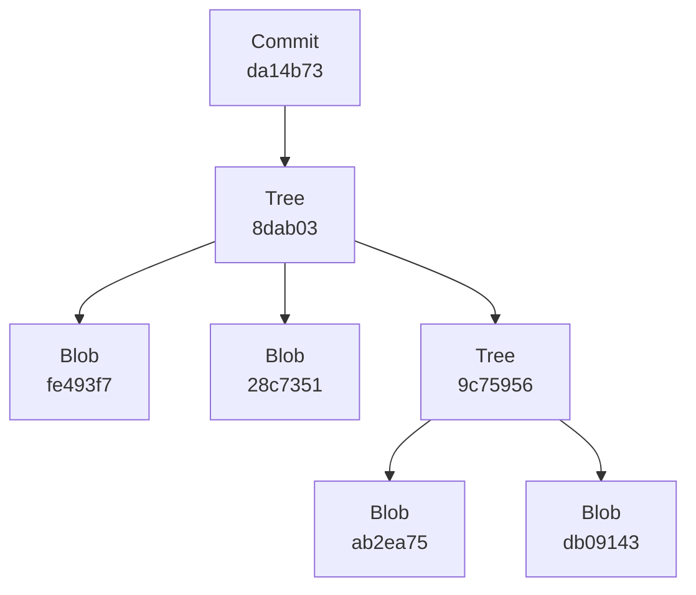
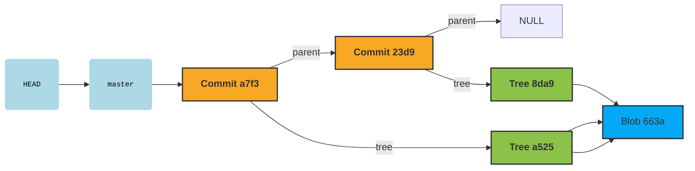
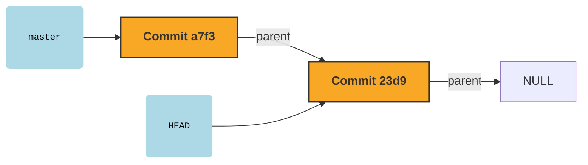
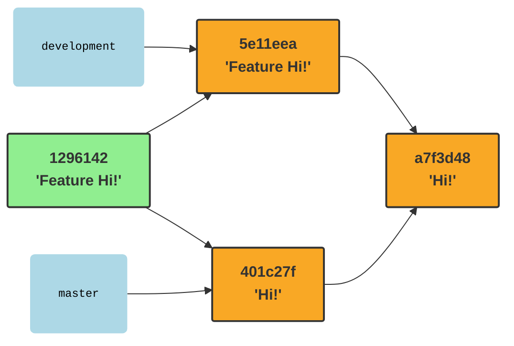
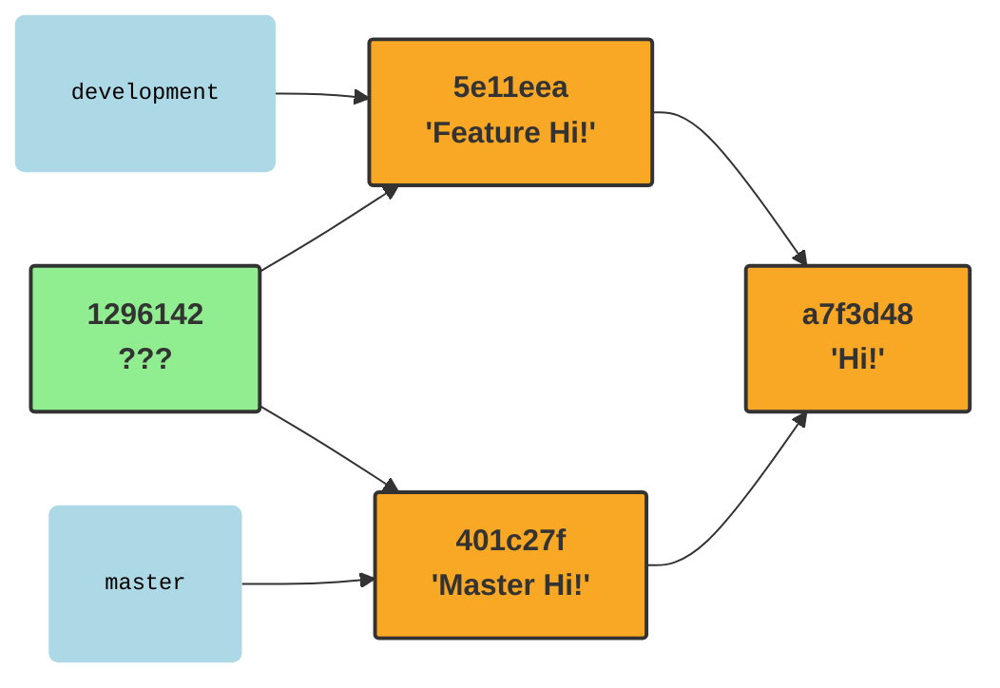
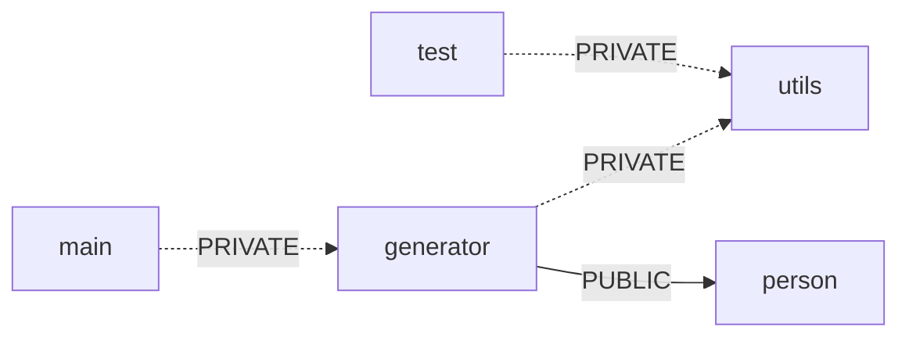

# Wykład 4 - Narzędzia

Zakres:

* Git
* Budowanie:
  * build types
  * cmake
* Debugging:
  * gdb
  * coredumps
  * sanitizers
  * protectors
  * valgrind
  * profiling
* Zarządzanie zależnościami:
  * conan
  * vcpkg 

## Git

Git jest rozproszonym systemem kontroli wersji. Dostarcza narzędzia do zarządzania
**repozytorium**. Repozytorium to nic innego jak zbiór utrwalonych stanów **katalogu roboczego**.
Taki utrwalony stan to **commit**.

Repozytorium zwykle ma postać folderu `.git` przechowywanego wewnątrz katalogu roboczego.
W środku znajdują się pliki opisujące commity, w tym zapisana treść katalogu roboczego.

```shell
mkdir repo
cd repo
git init
ls -l .git
```

Takie polecenie utworzy w pustym katalogu roboczym puste repozytorium: niezawierające jeszcze
żadnych zapisanych wersji.

```
-rw-rw-r-- 1 saqq saqq   92 mar 22 10:11 config        # Lokalna konfiguracja repozytorium
-rw-rw-r-- 1 saqq saqq   73 mar 22 10:11 description   # Czytelny opis repozytorium
-rw-rw-r-- 1 saqq saqq   23 mar 22 10:11 HEAD          # Wskazanie na "bieżący" commit
drwxrwxr-x 4 saqq saqq 4096 mar 22 10:11 objects       # Przechowywane obiekty: commity, stany plików, stany katalogów
drwxrwxr-x 4 saqq saqq 4096 mar 22 10:11 refs          # Referencje, czyli nazwy dla commitów
```

Katalog roboczy razem z `.git` można dowolnie przenosić i kopiować, `.git` nie zawiera żadnych absolutnych ścieżek.
Usunięcie katalogu `.git` usuwa repozytorium wraz ze wszystkimi informacjami kontroli wersji, ale oczywiście
nie dotyka samego katalogu roboczego.

### Obiekty

Repozytorium składa się z obiektów, przechowywanych w katalogu `.git/objects`. 
Git definiuje 4 rodzaje obiektów (blob, tree, commit, annotated tag), z czego najistotniejsze są pierwsze 3:
* **blob**: utrwalona zawartość jakiegoś pliku z katalogu roboczego
* **tree**: utrwalony zawartość katalogu (słownika)
* **commit**: utrwalony stan katalogu roboczego z dodatkowymi informacjami nt. wersji

Obiekty po utworzeniu są niemodyfikowalne, nie można zmieniać ich zawartości. Dzięki temu zawartość obiektów
może posłużyć do ich identyfikacji! Git rozpoznaje obiekty na podstawie skrótu SHA-1 ich zawartości. Skrót zależy
tylko i wyłącznie od zawartości. Zmiana zawartości = zmiana identyfikatora = inny obiekt.

Można ręcznie wyliczyć skrót pliku poleceniem `hash-object`. Nie trzeba do tego posiadać nawet repozytorium:

```shell
echo Hi! > hi.txt
git hash-object hi.txt # 663adb09143767984f7be83a91effa47e128c735
```

Wyliczony skrót będzie taki sam na każdej maszynie, bo zawartość pliku jest taka sama. 
Zmieniając treść, zmienimy skrót.

Plik dodany do repozytorium, np. jako element commit'a zostanie umieszczony w katalogu objects
jako obiekt typu blob i będzie identyfikowany jego skrótem.

```shell
cd repo
echo Hi! > hi.txt
git add hi.txt
git commit -m "Initial commit"
cat .git/objects/66/3adb09143767984f7be83a91effa47e128c735 | zlib-flate -uncompress | xxd
git cat-file blob 663ad
```

Katalog `.git/objects` jest partycjonowany po dwóch pierwszych znakach skrótu.
Jak widać na powyższym przykładzie, do identyfikacji obiektów
wystarczy podać kilka pierwszych znaków sumy SHA1. Wystarczy tyle, 
żeby nie było niejednoznaczności.

Utrwalenie stanu pliku nie jest wystarczające do wersjonowania projektu: 
trzeba zapisywać stany całych katalogów. Do tego służy obiekt typu tree.

Za pomocą polecenia git commit utworzyliśmy kilka obiektów:
```shell
cd repo
find .git/objects -type f
git cat-file -t 8da9 
git ls-tree 8da9
```

Jeden z nich to właśnie tree. Jego zawartość to listing katalogu, którego stan opisuje.
```
100644 blob 663adb09143767984f7be83a91effa47e128c735    hi.txt
```
Nasz obiekt zawiera tylko jeden wpis, bo katalog roboczy miał tylko 1 plik w momencie wywołania polecenia `git commit`.
Obiekt tree listuje elementy katalogu, każdy z nich jest innym obiektem git'a. Dla każdego obiektu zawiera:
* uprawnienia (100644 = rw-r--r--)
* typ (blob/tree)
* identyfikator obiektu (SHA1)
* nazwę obiektu w katalogu (hi.txt)

Tree może zawierać inne obiekty tree. Pozwala opisywać dowolnie zagnieżdżone struktury katalogów.



Jeżeli katalog zawiera kilka plików o tej samej zawartości, 
to tree będzie wielokrotnie listował ten sam obiekt.

```shell
cd repos
cp hi.txt hey.txt
git add hey.txt
git commit -m "Copied hi.txt"
git ls-tree a5250
```

```
100644 blob 663adb09143767984f7be83a91effa47e128c735    hey.txt
100644 blob 663adb09143767984f7be83a91effa47e128c735    hi.txt
```

Identyfikator obiektu tree to skrót SHA1 tej listy, zawierającej skróty zawieranych elementów.
Zmiana zawartości hi.txt skutkuje zmianą jego skrótu, to z kolei spowoduje zmianę zawartości tree katalogu głównego
i w konsekwencji zmianę jego skrótu.

Commity to główne obiekty repozytorium tworzone w momencie utrwalania wersji projektu.

```shell
git cat-file commit a7f3
```

```
tree a5250f7c6ad5260e28003ba5a0b1841b752918e3
parent 23d9585ca2a2fe493f79c75956ab4d815da14b73
author Paweł Sobótka <pawel.sobotka@pw.edu.pl> 1742665566 +0100
committer Paweł Sobótka <pawel.sobotka@pw.edu.pl> 1742665566 +0100

Copied hi.txt
```

Można z niego odczytać:
* identyfikator utrwalonego stan katalogu roboczego (`tree`)
* identyfikatory poprzednich commitów (`parent`) 
* autor (`author`) 
* czas autorstwa (utrwalenia stanu) (`1742665566 +0100`)
* committer (`commiter`)
* czas commiterstwa (nałożenia commita) (`1742665566 +0100`)
* wiadomość opisująca wersję (`Copied hi.txt`)

> Commit zawiera stan całego projektu, a nie wprowadzone zmiany!

Podobnie jak wcześniej, SHA1 commit'a to skrót liczony za powyższe pola.
Zmiana któregokolwiek wymusza powstanie nowego commita o innym SHA1.

### Branche

Posługiwanie się sumami SHA1 nie należy do najprzyjemniejszych dla człowieka.
Zamiast mówić: popatrz sobie na wersję `23d9585ca2a2fe493f79c75956ab4d815da14b73` łatwiej
byłoby mieć mnemoniczną nazwę dla rewizji. Takie referencje to znane powszechnie **branche**.

Branche można wylistować:

```shell
git branch -v
# * master a7f3d48 Copied hi.txt
```

Technicznie branche to pliki w folderze `.git/refs/heads/` przechowujące SHA1 commita, który nazywają:

```shell
cat .git/refs/heads/master
# a7f3d48e135b4f4deb9a985ed7058b70491d7c71
```

Listowanie branchy to tak naprawdę listowanie tego katalogu.
Tworzenie brancha wskazującego na jakiś commit po prostu tworzy podobny plik.

```shell
git branch feature a7f3d48
git branch -v
#   feature a7f3d48 Copied hi.txt
# * master  a7f3d48 Copied hi.txt
ls -l .git/refs/heads
# feature master
```

Stąd ważny fakt:

> Branch to nic więcej jak nazwa dla commita!

Branche mogą być modyfikowalne. W momencie tworzenia nowego commita aktywny branch
jest _przepinany_ na nowy commit. Git wspiera również niemodyfikowalne nazwy dla commitów, 
czyli tzw. tagi.

### HEAD

A co to jest _aktywny branch_? Repozytorium zawiera specjalną referencję o nazwie `HEAD`
(w pliku `.git/HEAD`), która pokazuje najnowszy, aktualny commit, na którym pracujemy.
`HEAD` może pokazywać na commit pośrednio poprzez branch lub bezpośrednio. 
Typową sytuacją jest wskazanie pośrednie:

```shell
cat .git/HEAD
# ref: refs/heads/master
```

To sytuacja, w której kolokwialnie mówimy, że jesteśmy _na branchu_. `HEAD` wskazuje
na `master`, który wskazuje na konkretny commit. Zarówno `HEAD` jak i `master` są nazwami tego samego
commita.



Do manipulacji `HEAD`'em służy operacja `git checkout`, która oczekuje jako argumentu jakiegoś
commita. Zmiana HEAD'a zmienia stan katalogu roboczego na ten zapisany w docelowym commicie.

```shell
git checkout 23d9
cat .git/HEAD
# 23d9585ca2a2fe493f79c75956ab4d815da14b73
```

`HEAD` wskazuje teraz bezpośrednio na commit. To tzw. _detached HEAD state_: normalny w przypadku przeglądania
starych rewizji.



Commit wskazywany przez `HEAD` staje się automatycznie rodzicem nowo tworzonych rewizji.

```shell
git checkout master # HEAD -> master -> a7f3
touch empty.txt
git add empty.txt
git commit -m "Add empty file"
# [master eef04fe] Add empty file
#  1 file changed, 0 insertions(+), 0 deletions(-)
#  create mode 100644 empty.txt
git cat-file commit eef0
# tree 580e44691fcd53fb04aebbd71fe23b5c626afec8
# parent a7f3d48e135b4f4deb9a985ed7058b70491d7c71
# author Paweł Sobótka <pawel.sobotka@pw.edu.pl> 1742673019 +0100
# committer Paweł Sobótka <pawel.sobotka@pw.edu.pl> 1742673019 +0100
# 
# Add empty file
```

Dodatkowo podczas takiej operacji aktywny branch jest przesuwany na nowy commit.
W przypadku detached HEAD nie ma aktywnego brancha, więc nie jest to naturalny stan 
do tworzenia nowych commitów.

### Index

Przed wyprodukowaniem commita zwykle wydajemy polecenie `git add` - po co?
Istnieją 3 niezależne stany katalogu roboczego, które biorą udział w procesie tworzenia commita:
* Sam katalog roboczy z bieżącym stanem plików
* `HEAD` - względem niego wypracowywujemy zmianę (będzie rodzicem)
* Indeks - stan pośredni, do którego selektywnie dodajemy zmiany przed utworzeniem commita

Pozwala to na selektywne wypracowywanie treści następnego commita. Możemy, np. mieć 
jakieś prywatne, brudne zmiany w części plików, których nie chcemy uwzględniać w nowej rewizji.
Nie chcemy ich też wycofywać, bo są przydatne.

Indeks technicznie znajduje się wpliku `.git/index`. Można go wydrukować poleceniem `ls-files`:
```shell
git ls-files --stage
# 100644 e69de29bb2d1d6434b8b29ae775ad8c2e48c5391 0       empty.txt
# 100644 663adb09143767984f7be83a91effa47e128c735 0       hey.txt
# 100644 663adb09143767984f7be83a91effa47e128c735 0       hi.txt
```

Wygląda zaskakująco podobnie do obiektu `tree` bo właśnie nim (prawie) jest!
W momencie operacji `git commit` to właśnie stan indeksu utrwalany jest w postaci 
nowego obiektu `tree`, wokół którego powstaje nowy obiekt `commit`.

Operacja `git checkout` przywraca nie tylko stan katalogu roboczego, na taki jak jest zapisany
w checkoutowanym commicie, ale też zrównuje z nim stan indeksu.

W _czystym_ stanie repozytorium mamy `HEAD == index == workdir`.

```shell
git status
# Na gałęzi master
# nic do złożenia, drzewo robocze czyste
```

Wprowadzając zmiany w katalogu roboczym otrzymujemy: `HEAD == index != workdir`.

```shell
echo "not really" > empty.txt
git status 
# Na gałęzi master
# Zmiany nie przygotowane do złożenia:
#   (użyj „git add <plik>...”, żeby zmienić, co zostanie złożone)
#   (użyj „git restore <plik>...”, aby odrzucić zmiany w katalogu roboczym)
#         zmieniono:       empty.txt
# 
# brak zmian dodanych do zapisu (użyj „git add” i/lub „git commit -a”)
git diff
# git diff
# diff --git a/empty.txt b/empty.txt
# index e69de29..4d0c7d7 100644
# --- a/empty.txt
# +++ b/empty.txt
# @@ -0,0 +1 @@
# +not really
```

Polecenie `git diff` porównuje stan katalogu roboczego ze stanem indeksu.

Dodając zmianę do indeksu otrzymujemy `HEAD != index == workdir`:

```shell
git add empty.txt
git status
# Na gałęzi master
# Zmiany do złożenia:
#   (użyj „git restore --staged <plik>...”, aby wycofać)
#         zmieniono:       empty.txt
git diff
# 
git diff --cached
# diff --git a/empty.txt b/empty.txt
# index e69de29..4d0c7d7 100644
# --- a/empty.txt
# +++ b/empty.txt
# @@ -0,0 +1 @@
# +not really
```

`git diff --cached` pokazuje indeks ze stanem `HEAD`.
W momencie dodania do indeksu powstają nowe obiekty `blob` i `tree`, które będą później
utrwalane w nowym commicie.

Można teraz ponownie zmienić stan katalogu roboczego uzyskując `HEAD != index != workdir`:

```shell
echo "hey!" > empty.txt
# git status
# Na gałęzi master
# Zmiany do złożenia:
#   (użyj „git restore --staged <plik>...”, aby wycofać)
#         zmieniono:       empty.txt
# 
# Zmiany nie przygotowane do złożenia:
#   (użyj „git add <plik>...”, żeby zmienić, co zostanie złożone)
#   (użyj „git restore <plik>...”, aby odrzucić zmiany w katalogu roboczym)
#         zmieniono:       empty.txt
# 
git diff
# diff --git a/empty.txt b/empty.txt
# index 4d0c7d7..d4c3701 100644
# --- a/empty.txt
# +++ b/empty.txt
# @@ -1 +1 @@
# -not really
# +hey!
```

Wykonując teraz polecenie `git commit`:
* indeks zostanie utrwalony w postaci nowego obiektu `tree`
* powstanie nowy obiekt `commit`:
  * wskazujący na nowo powstałe `tree`
  * obecny `HEAD` wstawiony zostanie do atrybutu `parent`
* gałąź wskazywana przez `HEAD` zostanie przestawiona na nowy commit

Otrzymamy w ten sposób `HEAD = index != workdir`. W katalogu roboczym pozostanie
ostatnio wprowadzona zmiana. `git commit` nie dotyka katalogu roboczego.

```shell
git commit -m "Filled empty file"
# [master 401c27f] Filled empty file
#  1 file changed, 1 insertion(+)
git status
# Na gałęzi master
# Zmiany nie przygotowane do złożenia:
#   (użyj „git add <plik>...”, żeby zmienić, co zostanie złożone)
#   (użyj „git restore <plik>...”, aby odrzucić zmiany w katalogu roboczym)
#         zmieniono:       empty.txt
# 
# brak zmian dodanych do zapisu (użyj „git add” i/lub „git commit -a”)
```

### Reset

Jedna z podstawowych operacji: `git reset`, często powoduje trudności ze względu
na swoją wielofunkcyjność. Wbrew destrukcyjnie brzmiącej nazwie `reset` w istocie
przestawia branch na wskazany commit. Dodatkowo potrafi w tym samym momencie zmieniać stan indeksu 
i katalogu roboczego na stan z danej rewizji.

`git reset` ma 3 tryby:

`git reset --soft` przestawia referencję zapisaną w `HEAD` na wskazany commit.
Nie zmienia przy tym stanu katalogu roboczego ani indeksu.

```shell
git reset --soft HEAD^
# git status
# Na gałęzi master
# Zmiany do złożenia:
#   (użyj „git restore --staged <plik>...”, aby wycofać)
#         zmieniono:       empty.txt
# 
# Zmiany nie przygotowane do złożenia:
#   (użyj „git add <plik>...”, żeby zmienić, co zostanie złożone)
#   (użyj „git restore <plik>...”, aby odrzucić zmiany w katalogu roboczym)
#         zmieniono:       empty.txt
```

Wróciliśmy tym samym do stanu `HEAD != index != workdir`, niejako odwracając operację `git commit`.
Commit, mimo że nienazwany ciągle istnieje, możemy do niego wrócić:
```shell
git reset --soft 401c
```

`git reset --mixed` robi to co `--soft` i dodatkowo przywraca stan indeksu na wskazany commit:

```shell
git reset --mixed HEAD^
git diff
# diff --git a/empty.txt b/empty.txt
# index e69de29..d4c3701 100644
# --- a/empty.txt
# +++ b/empty.txt
# @@ -0,0 +1 @@
# +hey!
```

Mamy teraz `HEAD = index != workdir`. Katalog roboczy został niedotknięty.

`git reset --hard` zmienia wszystko: HEAD branch, stan indeksu i stan katalogu roboczego
na stan ze wskazanej rewizji. **Nieodwracalnie porzuca zmiany w katalogu roboczym!**

```shell
git reset --hard 401c
git status
# Na gałęzi master
# nic do złożenia, drzewo robocze czyste
``` 

### Merge

Repozytorium to zbiór commitów. Każdy commit zawiera listę odniesień do swoich przodków (0-n).
Każde repozytorium jest zatem acyklicznym grafem skierowanym, w którym węzłami są commity,
a krawędziami wskazania na przodków.

Graf można zwizualizować poleceniem `git log`:
```shell
git log --oneline --graph --all
# * 401c27f (HEAD -> master) Filled empty file
# * eef04fe Add empty file
# * a7f3d48 (feature) Copied hi.txt
# * 23d9585 Initial commit
```

Na tą chwilę nasz graf jest listą. Projekt rozwijał się liniowo.

Jeden commit może być przodkiem kilku różnych rewizji. Dzieje się tak zwykle, gdy kilku autorów
w podobnym czasie zaczyna rozwijać projekt, wychodząc z tej samej rewizji.

```shell
git checkout feature
echo "Feature Hi!" > hi.txt
git add hi.txt
git commit -m "Featurized hi.txt"
git log --oneline --graph --all
# * 5e11eea (HEAD -> feature) Featurized hi.txt
# | * 401c27f (master) Filled empty file
# | * eef04fe Add empty file
# |/  
# * a7f3d48 Copied hi.txt
# * 23d9585 Initial commit
```

Na commicie `a7f3d48` nastąpiło rozwidlenie historii projektu. Zwykle, w pewnym momencie 
niezależnie rozwijane gałęzie muszą ulec połączeniu celem wypracowania jednej, spójnej rewizji
integrującej całą równoległą pracę. Służy do tego operacja `git merge` tworząca commity
o wielu przodkach.

```shell
git merge --no-edit master
git log --oneline --graph --all
# *   1296142 (HEAD -> feature) Merge branch 'master' into feature
# |\  
# | * 401c27f (master) Filled empty file
# | * eef04fe Add empty file
# * | 5e11eea Featurized hi.txt
# |/  
# * a7f3d48 Copied hi.txt
# * 23d9585 Initial commit
git cat-file -p HEAD
# tree 8c1f710ff54a3848913a130fbd58b1247827b1ed
# parent 5e11eea4a4f3199d1a097e0716c4afa1c0724317
# parent 401c27fd94595bc9565d76e389fa5923febf2302
# author Paweł Sobótka <p.sobotka@oxla.com> 1742684714 +0100
# committer Paweł Sobótka <p.sobotka@oxla.com> 1742684714 +0100
# 
# Merge branch 'master' into feature
```

Nowo utworzony merge-commit scala stan katalogu roboczego zapisany w jego dwóch przodkach.
Jednym przodkiem zawsze jest `HEAD`, drugim to co wskazaliśmy w argumencie.
Integracja przebiegła automatycznie, bo zmiany nie były konfliktujące.

Do scalania zmian git stosuje algorym znany jako _three way merge_. Bierze on pod uwagę
trzy stany katalogu roboczego: dwa ze scalanych commitów (`HEAD -> development` -> `5e11eea` i `master` -> `401c27f`)
oraz ich najbliższego wspólnego przodka: punkt rozwidlenia `a7f3d48`.



W powyższym przypadku zawartość blob'a jest taka sama w jednej ze scalanych wersji jak w ich wspólnym
przodku. To czyni operację merge trywialną: wybierana jest wersja, która się odróżnia.
Algorytm zakłada, że jeżeli stan w jednej z gałęzi się nie zmienił a w drugiej tak, to
ta druga jest pożądaną zmianą po scaleniu.

Jeżeli wszystkie 3 wersje są takie same, sprawa jest jasna.
Co jednak w przypadku, kiedy wszystkie są różne?
W takim przypadku mamy do czynienia z **konfliktem** zmian.

```shell
git reset --hard HEAD^
git checkout master
echo "Master Hi!" > hi.txt
git add hi.txt && git commit -m "Masterized hi.txt"
git merge feature
# Auto-scalanie hi.txt
# KONFLIKT (zawartość): Konflikt scalania w hi.txt
# Automatyczne scalanie nie powiodło się; napraw konflikty i złóż wynik.
```



Operacja `git merge` jest wykonana częściowo i została zatrzymana przed 
wypracowaniem scalonego commita. Katalog roboczy i indeks zawierają teraz częściowo scalony stan.
Pliki, których algorym nie mógł przetworzyć automatycznie,
zawierają znaczniki w miejscach, w których wykryto konflikty.

```shell
cat hi.txt 
# <<<<<<< HEAD
# Master Hi!
# =======
# Feature Hi!
# >>>>>>> feature
```

Odpowiedzialnością użytkownika jest teraz ręczne rozwiązanie konfliktów,
pozostawiając zamiast tych oznaczonych miejsc poprawną treść.

```shell
echo "Feature master Hi!" > hi.txt
git add hi.txt
git commit
```

Merge to tylko jedno z narzędzi do łączenia zmian, które posiada git.
Zachęcamy do zapoznania się z innymi: `rebase`, `rebase -i`, `cherry-pick`. 

### Remote

Git jest **rozproszonym** systemem kontroli wersji służącym do pracy nad tym samym projektem 
na wielu stacjach roboczych. Typowo, każdy autor posiada na swojej maszynie
własne repozytorium i synchronizuje jego zawartość z repozytoriami zdalnymi,
korzystając z danego protokołu sieciowego do wymiany obiektów (np. http lub ssh).
Identyfikatory obiektów (SHA1) wyliczane z ich zawartości są identyfikatorami globalnymi,
będą zgodne we wszystkich repozytoriach.

Adresy zdalnych repozytoriów muszą być skonfigurowane w lokalnym repozytorium w pliku `.git/config`
za pomocą polecenia `git remote`. Na potrzeby nauki można wskazać jako remote inny katalog
na tej samej maszynie.

```shell
mkdir origin && cd origin
git init -b null
```

```shell
cd repo
git remote add origin ../origin
```

Klonując repozytorium git automatycznie dodaje remote
o nazwie `origin` wskazujący na miejscie z którego klonujemy.

Istnieją jedynie 4 polecnia komunikujące się ze zdalnym repozytorium:
* `git clone`
* `git fetch`
* `git pull`
* `git push`

Wszystko inne nie dotyka w żaden sposób zdalnej kopii.

`git push` aktualizuje zdalne referencje.
Powoduje, że branch w zdalnym repozytorium odpowiadający lokalnemu branchowi 
pokazuje na ten sam commit co lokalnie. W konsekwencji przesyła obiekty: `commit`, `tree`, `blob`
które mogą nie być obecne w repozytorium zdalnym.

```shell
git push --set-upstream origin master
# Wymienianie obiektów: 11, gotowe.
# Zliczanie obiektów: 100% (11/11), gotowe.
# Kompresja delt z użyciem do 8 wątków
# Kompresowanie obiektów: 100% (7/7), gotowe.
# Zapisywanie obiektów: 100% (11/11), 976 bajtów | 976.00 KiB/s, gotowe.
# Razem 11 (delty 0), użyte ponownie 0 (delty 0), paczki użyte ponownie 0
# To ../origin
#  * [new branch]      master -> master
# branch 'master' set up to track 'origin/master'.
```

Domyślnie git nie wie jaka zdalna gałąź odpowiada lokalnej gałęzi `master`.
Konfigurujemy to jednorazowo za pomocą `--set-upstream`.

Zdalne repozytorium było puste - nie zawierało żadnych obiektów.
`git push` utworzył zdalną gałąź master, a następnie ustawił ją na commit `401c`.
Musiał do tego przesłać ten commit i wszystkie jego zależności, przechodząc
przez wskazania `parent` aż do _początku_ repozytorium.

```shell
git branch -va
#   feature               a7f3d48 Copied hi.txt
# * master                401c27f Filled empty file
#   remotes/origin/master 401c27f Filled empty file
```

Operacje na zdalnych repozytoriach nie tylko manipulują referencjami w zdalnym repozytorium
ale i lokalnymi ich odpowiednikami. `git push` utworzył w lokalnym repozytorium referencję `origin/master`
która pokazuje na to samo co `master` w repozytorium `origin`. Takie referencje to nie branche,
nie można ich przestawiać inaczej, niż komunikując się ze zdalnym repozytorium.

W repozytorium mogą asynchronicznie pojawić się zmiany: nowe commity, nowe branche:

```shell
cd origin
git checkout -b development master 
echo "int main() { return 0; }" > main.cpp
git add main.cpp && git commit -m "Added main.cpp"
```

`git fetch` aktualizuje stan wszystkich lokalnych odpowiedników zdalnych branchy,
pobierając przy tym niezbędne obiekty.

```shell
git fetch
# remote: Wymienianie obiektów: 4, gotowe.
# remote: Zliczanie obiektów: 100% (4/4), gotowe.
# remote: Kompresowanie obiektów: 100% (2/2), gotowe.
# remote: Razem 3 (delty 1), użyte ponownie 0 (delty 0), paczki użyte ponownie 0
# Rozpakowywanie obiektów: 100% (3/3), 287 bajtów | 287.00 KiB/s, gotowe.
# Z ../origin
#  * [nowa gałąź]      development -> origin/development
git branch -va
#   feature                    a7f3d48 Copied hi.txt
# * master                     401c27f Filled empty file
#   remotes/origin/development e0e64f5 Added main.cpp
#   remotes/origin/master      401c27f Filled empty file
```

W lokalnym repo pojawiła się nowa referencja `origin/development` wskazująca na ten sam, nowy commit co w repo zdalnym.
Możemy teraz utworzyć tam gałąź i rozwijać dalej z teog miejsca:

```shell
git checkout development
```

`git pull` to złożenie dwóch operacji: `git fetch` + `git merge [remote ref]`.
Czyli robi dokładnie to co fetch i następnie łączy lokalną gałąź z jej zdalnym odpowiednikiem
potencjalnie tworząc merge commit.


## Rodzaje kompilacji


## Systemy Budowania

C++ nie ma wystandaryzowanego systemu budowania. Różne platformy dostarczają swoje narzędzia:
* GNU Make (Linux)
* MinGW Make (Windows + MinGW)
* NMake (Windows + VisalStudio)
* Ninja
* Visual Studio Solutions
* XCode projects

Do tej pory wykorzystywaliśmy GNU Make.

Projekty wieloplatformowe, których kod jest rozwijany, np. dla platform Windows i Linux
potrzebują systemu budowania opisującego projekt w sposób niezależny od platformy.
Środowisko programistów stworzyła kilka takich narzędzi, np.:
* [CMake](https://cmake.org/)
* [Bazel](https://bazel.build/)
* [Meson](https://mesonbuild.com/)
* [Buck2](https://buck2.build/)

Każde z nich to zupełnie inne narzędzie wymagające nauki.

Spośród wszystkich wymienionych, CMake można uznać za de-facto standard w zakresie systemu budowania dla języka C++.
Ma ogromny (> 50%) udział w rynku. Rozpoczynając pracę w projekcie pisanym w C++ lub tworząc nowy, istnieje duża szansa,
że to właśnie CMake będzie systemem budowania.

## CMake

[CMake](https://cmake.org/) to tzw. meta system budowania (_meta build system_). To narzędzie, które na podstawie skryptowego opisu projektu
generuje właściwy system budowania, odpowiedni dla platformy (np. Unix Makefiles), na którą w danej chwili budujemy oprogramowanie.
Ten sam opis może posłużyć do generacji innego systemu budowania, budując projekt w odmiennym środowisku (np. VS Solutions).

CMake to zwykły program, który trzeba zainstalować, najlepiej przy pomocy menadżera pakietów.
Narzędzie `cmake` odczytuje konfigurację z gównego katalogu projektu, tzw. **source directory** 
i generuje właściwy system budowania w innym katalogu, tzw. **build directory**, często zagnieżdżonym w źródłach.
Istnieje też możliwość wygenerowania systemu budowania w tym samym katalogu, co źródła, czyli tzw. _in-source-build_.
To odradzana opcja ze względu na zaśmiecanie katalogu źródłowego plikami tymczasowymi.

Projekt jest opisywany za pomocą tekstowych skryptów konfiguracyjnych `CMakeLists.txt`. Uruchomienie `cmake`
zawsze przebiega przez następujące po sobie fazy: **configure**, **generate**. Potem zwykle następuje uruchomienie
wygenerowanego systemu budowania, czyli tzw. faza **build**.

Minimalny projekt składa się z pliku [main.cpp](cmake/intro/main.cpp) i opisu [CMakeLists.txt](cmake/intro/CMakeLists.txt):

```cmake
cmake_minimum_required(VERSION 3.16)
project(intro VERSION 1.0.0)

add_executable(main main.cpp)
```

Język opisu projektu to język skryptowy. `cmake` interpretuje i wykonuje treść pliku `CMakeLists.txt` linijka po linijce
tak jak powłoka. Narzędzie ma kilka podstawowych sposobów wywołania:

```shell
cmake [<options>] <path-to-source-dir> # Wygeneruj system budowania w katalogu roboczym (cwd)
cmake [<options>] <path-to-build-dir>  # Re-generuj system budowania obecny we wskazanym katalogu
cmake [<options>] -S <path-to-source-dir> -B <path-to-build-dir> # Jawnie wskazane katalogi źródłowe i docelowe
```

```shell
rm -Rf build && mkdir build && cd build
cmake ../cmake/intro
```

```shell
rm -Rf build
cmake -S cmake/intro -B build
```

Powyższe wywołania robią to samo: generują buildsystem w katalogu `build` dla projektu w katalogu `cmake/intro`.
Warto zwrócić uwagę na wyjście generowane przez program:

```
-- The C compiler identification is GNU 13.3.0
-- The CXX compiler identification is GNU 13.3.0
-- Detecting C compiler ABI info
-- Detecting C compiler ABI info - done
-- Check for working C compiler: /usr/bin/cc - skipped
-- Detecting C compile features
-- Detecting C compile features - done
-- Detecting CXX compiler ABI info
-- Detecting CXX compiler ABI info - done
-- Check for working CXX compiler: /usr/bin/c++ - skipped
-- Detecting CXX compile features
-- Detecting CXX compile features - done
-- Configuring done (0.2s)
-- Generating done (0.0s)
-- Build files have been written to: /cpp-site/content/wyk/w4/build
```

Narzędzie wykonało mnóstwo pracy niejawnie:
* odnalazło w systemie kompilator dla języków C i C++ (`gcc` i `g++`).
* sprawdziło, czy kompilatory działają poprawnie (budując mały program generowany w locie)
* przetestowało kompilatory pod względem wspieranych funkcjonalności i interfejsu
* wygenerowało buildsystem w katalogu `build`

To wszystko efekt wykonania funkcji `project()`.

### Configure

W pierwszym kroku `cmake` odczytuje i wykonuje plik `CMakeLists.txt` z katalogu źródłowego.
Wykonując instrukcje w nim zawarte generuje plik `CMakeCache.txt` w katalogu wyjściowym wypełniając
go tzw. **cache variables**. Są zmienne tekstowe, pary klucz-wartość, których wartości są zachowywane
pomiędzy następującymi po sobie wywołaniami `cmake`. Dzięki zapamiętywaniu re-generacja jest znacznie szybsza.
Przykładowe informacje cache'owane w zmiennych to:
* wykryty kompilator i inne narzędzia do budowania
* rodzaj kompilacji, flagi kompilatora
* opcje specyficzne dla projektu

Wyjście z ponownego uruchomienia jest znacznie krótsze:

```shell
cmake -S cmake/intro -B build
```
```
-- Configuring done (0.0s)
-- Generating done (0.0s)
-- Build files have been written to:/cpp-site/content/wyk/w4/build
```

Zawartość cache zwykle nie zmienia się pomiędzy wywołaniami, choć czasami może być to przydatne (np. zmiana rodzaju kompilacji).
Użytkownik ma możliwość edycji wartości zmiennych w `CMakeCache.txt`. Może to zrobić ręcznie, przy użyciu `cmakegui`
lub z poziomu linii zlecenia za pomocą opcji `-D <var>:<type>=<value>`:

```shell
cmake -DCMAKE_BUILD_TYPE:STRING=Release build # Zapisz wartość CMAKE_BUILD_TYPE przed re-konfiguracją
```

### Generate

Po zakończeniu wykonania skryptu `CMakeLists.txt` narzędzie natychmiast wykonuje drugi krok: generację natywnego buildsystemu.
O tym, jaki buildsystem zostatnie wygenerowany (makefile, ninja, VS Solutions, etc.) decyduje wartość zmiennej
`CMAKE_GENERATOR` w `CMakeCache.txt`.

Ten krok jest w większości całkowicie automatyczny. Skrypty, które pisze użytkownik są w całości wykonywane wcześniej.
Istnieje pewna klasa wyrażeń, tzw. [generator expressions](https://cmake.org/cmake/help/latest/manual/cmake-generator-expressions.7.html),
których ewaluacja jest opóźniana aż do kroku generacji.

### Build

Po wygenerowaniu systemu budowania można w końcu go uruchomić i zbudować nasz projekt.
Znając jego rodzaj, można to zrobić ręcznie, np.:

```shell
cd build
make
```

Albo lepiej, skorzystać z tego że CMake potrafi wywołać buildsystem:

```shell
cmake --build build --target clean
cmake --build build
```

Większość generowanych systemów budowania na począku sprawdza, czy czasem opis projektu się nie zmienił (`CMakeLists.txt`).
Jeśli tak to automatycznie ponownie wykonuje `cmake` przed krokiem build.


Żródło: [CGold 0.1 documentation](https://cgold.readthedocs.io/en/latest/tutorials/workflow.html)

Po zmianie czegokolwiek w pliku `CMakeLists.txt` uruchomienie budowania powoduje re-generację:

```shell
cmake --build build
# -- Configuring done (0.0s)
# -- Generating done (0.0s)
# -- Build files have been written to:/cpp-site/content/wyk/w4/build
# [ 50%] Building CXX object CMakeFiles/intro.dir/main.cpp.o
# [100%] Linking CXX executable intro
# [100%] Built target intro
```


### Struktura projektu

Żródła większych projektów zwykle są podzielone hierarchicznie na podkatalogi reprezentujące różne komponenty systemu.
Skrypt `CMakeLists.txt` zwykle też jest podzielony na pod-skrypty. Te nie są wykonywane automatycznie,
interpreter nie przegląda automatycznie podkatalogów. Wymagane jest użycie jawne użycie dyrektywy `add_subdirectory()`.
`cmake` w jej miejscu wykonuje skrypt `CMakeLists.txt` znaleziony we wskazanym podkatalogu.

Popatrzmy na przykładowy projekt składający się z biblioteki `utils`, pliku wykonywalnego
`main` korzystającego z tej biblioteki, oraz pliku wykonywalnego `test` zawierającego
testy dla biblioteki `utils`.

```
.
├── CMakeLists.txt
├── generator
│   ├── CMakeLists.txt
│   ├── generator.cpp
│   └── include
│       └── generator.hpp
├── main
│   ├── CMakeLists.txt
│   └── main.cpp
├── person
│   ├── CMakeLists.txt
│   └── include
│       └── person.hpp
├── test
│   ├── CMakeLists.txt
│   └── test.cpp
└── utils
    ├── CMakeLists.txt
    ├── impl.cpp
    ├── impl.hpp
    ├── include
    │   └── utils.hpp
    └── utils.cpp
```
Sources:


Główny skrypt `CMakeLists.txt` wykonuje skrypty w podkatalogach, gdzie definiowane są
poszczególne elementy projektu:

```cmake
cmake_minimum_required(VERSION 3.16)
project(libs VERSION 1.0.0)

add_subdirectory(utils)
add_subdirectory(main)
add_subdirectory(test)
```

```shell
rm -Rf build 
cmake -S cmake/libs -B build
```

Zwykle każda biblioteka i plik wykonywalny są umieszczane w osobnym katalogu źródłowym
razem z towarzyszącym opisem.

### Targets

Kluczowym zadaniem skryptów `CMakeLists.txt` jest zadeklarowanie
budowalnych elementów projektu: bibliotek i plików wykonywalnych.
Służą ku temu dyrektywy [`add_executable`](https://cmake.org/cmake/help/latest/command/add_executable.html) 
i [`add_library`](https://cmake.org/cmake/help/latest/command/add_library.html):

```
add_executable(<name> [source1] [source2 ...])
```
```
add_library(<name> [STATIC | SHARED | MODULE] [<source>...])
```

Ścieżki do źródeł są podawane względem katalogu, w którym znajduje aktualnie wykonywany plik `CMakeLists.txt`. 

Biblioteki i programy mają różnorodne [**właściwości**](https://devdocs.io/cmake~3.24/manual/cmake-properties.7#properties-on-targets)
pozwalające sterować procesem ich budowania. Do najważniejszych należą:
* `INCLUDE_DIRECTORIES` katalogi, w których poszukiwane są pliki nagłówkowe podczas budowania biblioteki/programu 
* `INTERFACE_INCLUDE_DIRECTORIES`: katalogi, w których poszukiwane są pliki nagłówkowe podczas budowania bibliotek/programów zależnych  
* `LINK_LIBRARIES`: biblioteki linkowane podczas budowania danej biblioteki/programu
* `INTERFACE_LINK_LIBRARIES`: biblioteki linkowane podczas budowania bibliotek/programów zależnych 
* `COMPILE_DEFINITIONS`: makrodefinicje ustawiane podczas budowania danej biblioteki/programu 
* `INTERFACE_COMPILE_DEFINITIONS`: makrodefinicje ustawiane podczas budowania bibliotek/programów zależnych

Poszczególne właściwości są modyfikowane za pomocą dedykowanych procedur.

#### Include directories

Biblioteki definiują swój interfejs publiczny za pomocą zbioru plików nagłówkowych położonych w pewnym katalogu.
Konsumenci biblioteki, używający dyrektyw `#include "..."` muszą móc odnajdywać te pliki nagłówkowe.
Korzystanie ze ścieżek względnych lub bezwzględnych w kodzie źródłowym nie jest dobrym rozwiązaniem.
Konsumenci biblioteki `libfoo` powinni po prostu pisać `#include "foo.hpp"` bez względu na to,
gdzie ta biblioteka się fizycznie znajduje. Służą do tego flagi kompilatora takie jak `-I<dir>`
dodające daną ścieżkę do listy przeszukiwanych katalogów. CMake dostarcza wygodny interfejs to ustawiania tych flag.

```cmake
add_library(utils utils.cpp impl.cpp)
target_include_directories(utils PUBLIC include)
```

Komendy kompilacji plików źródłowych biblioteki `utils` jak i programów, które jej potrzebują
będą posiadały opcję `-I/cpp-site/content/wyk/w4/cmake/libs/utils/include` pozwalając na poprawne wykonanie
dyrektywy `#include "utils.hpp"`.

```shell
cmake --build build -- VERBOSE=1
# ...
# [ 25%] Building CXX object utils/CMakeFiles/utils.dir/utils.cpp.o
# cd /home/saqq/repos/cpp-site/content/wyk/w4/build/utils && 
# /usr/bin/c++  
#   -I/home/saqq/repos/cpp-site/content/wyk/w4/cmake/libs/utils/include  
#   -MD -MT utils/CMakeFiles/utils.dir/utils.cpp.o 
#   -MF CMakeFiles/utils.dir/utils.cpp.o.d 
#   -o CMakeFiles/utils.dir/utils.cpp.o 
#   -c /home/saqq/repos/cpp-site/content/wyk/w4/cmake/libs/utils/utils.cpp
# ...
```

Pełna składnia dyrektywy wygląda następująco:

```
target_include_directories(<target> [SYSTEM] [AFTER|BEFORE]
  <INTERFACE|PUBLIC|PRIVATE> [items1...]
  [<INTERFACE|PUBLIC|PRIVATE> [items2...] ...])
```

Każda grupa katalogów (`items...`) jest poprzedzona słowem `PUBLIC`, `PRIVATE` lub `INTERFACE`.
Te mówią o tym, do których z dwóch własności `*INCLUDE_DIRECTORIES` dopisać ścieżki:
* `INTERFACE` dodaje wyłącznie do własności `INTERFACE_INCLUDE_DIRECTORIES`
* `PRIVATE` dodaje wyłącznie do własności `INCLUDE_DIRECTORIES` 
* `PUBLIC` dodaje jednej i drugiej

Ścieżki we własności `INCLUDE_DIRECTORIES` są uwzględniane wyłącznie podczas kompilacji samej biblioteki.
Jest to więc prywatny detal implementacyjny biblioteki niewpływający na jej konsumentów.

Ścieżki we własności `INTERFACE_INCLUDE_DIRECTORIES` są uwzględniane podczas kompilacji programów i bibliotek
zależnych. Populując tę własność biblioteka mówi innym gdzie znajdują się jej nagłówki.

Kiedy zatem używać jakiego trybu? Najlepiej podsumuje to tabela:

| Kto potrzebuje?<br/>ja/konsumenci | Potrzebują | Nie potrzebują |
|-----------------------------------|------------|----------------|
| Nie potrzebuję                    |            | `INTERFACE`    |
| Potrzebuję                        | `PRIVATE`  | `PUBLIC`       |


#### Link libraries

Zależności między bibliotekami i programami definiujemy _linukując_ elementy do bibliotek.

```cmake
add_executable(main main.cpp)
target_link_libraries(main PRIVATE generator)
```

W powyższym przykładzie program `main` zależy od biblioteki `generator`.
* biblioteka `generator` musi być zbudowana jako pierwsza;
* podczas linkowania programu `main` zostanie włączona biblioteka `generator`;
* własności `INTERFACE_*` biblioteki `generator`, takie jak `INTERFACE_INCLUDE_DIRECTORIES` będą uwzględnione podczas budowania programu `main`.

Dla naszego projektu graf zależności wygląda następująco:




Dyrektywa `target_link_libraries()` ma podobną składnię do `target_include_directories()`:

```
target_link_libraries(<target>
                      <PRIVATE|PUBLIC|INTERFACE> <item>...
                     [<PRIVATE|PUBLIC|INTERFACE> <item>...]...)
```

Znaczenie słów `PRIVATE`, `PUBLIC`, `INTERFACE` jest analogiczne: 
* `PRIVATE` jeżeli to ja potrzebuję biblioteki, a moi konsumenci nie
* `PUBLIC` jeżeli zarówno ja, jak i moi konsumenci potrzebują danej biblioteki do budowania
* `INTERFACE` jeżeli tylko moi konsumenci powinni linkować bibliotekę, ja nie muszę

Słowa te wpływają na to, które z własności `LINK_LIBRARIES` i `INTERFACE_LINK_LIBRARIES` zostaną rozbudowane.

> Biblioteka, która w swoich publicznych nagłówkach zawiera dyrektywy `#include ""` załączająca 
> nagłówki jej zależności, musi deklarować tę zależność jako PUBLIC!

## Testowanie


## Debugging

## Profiling


