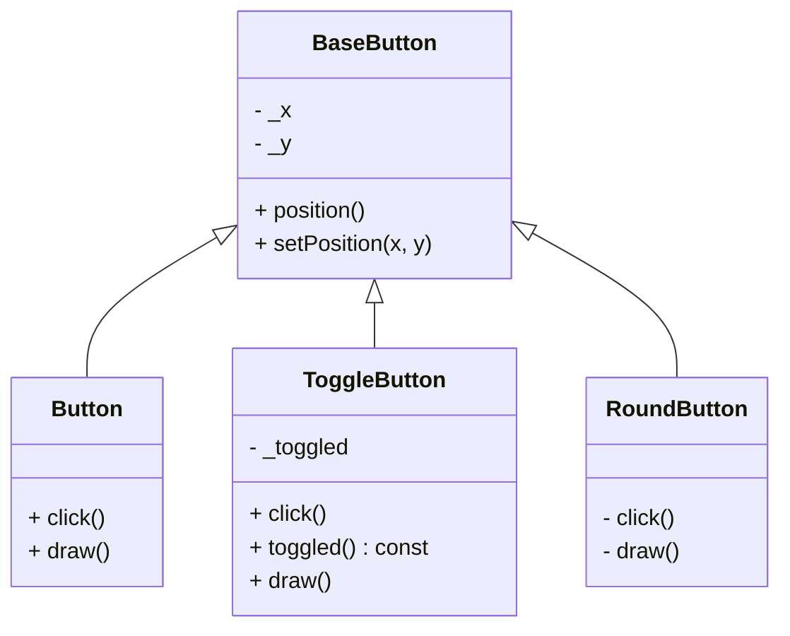
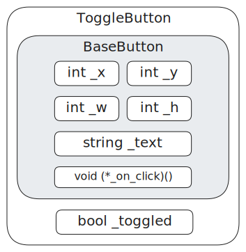
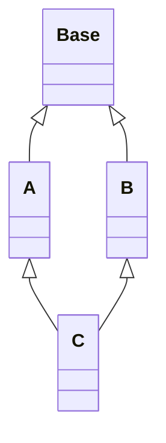
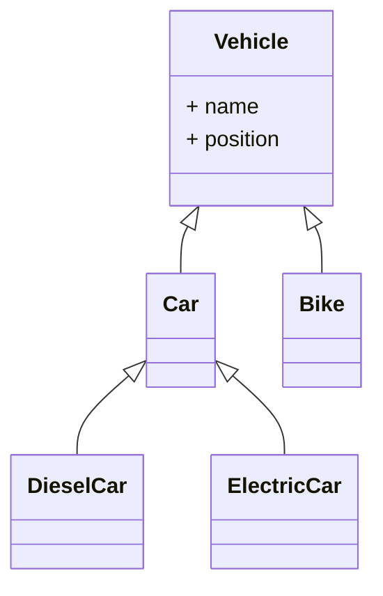
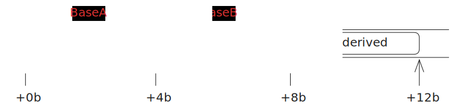
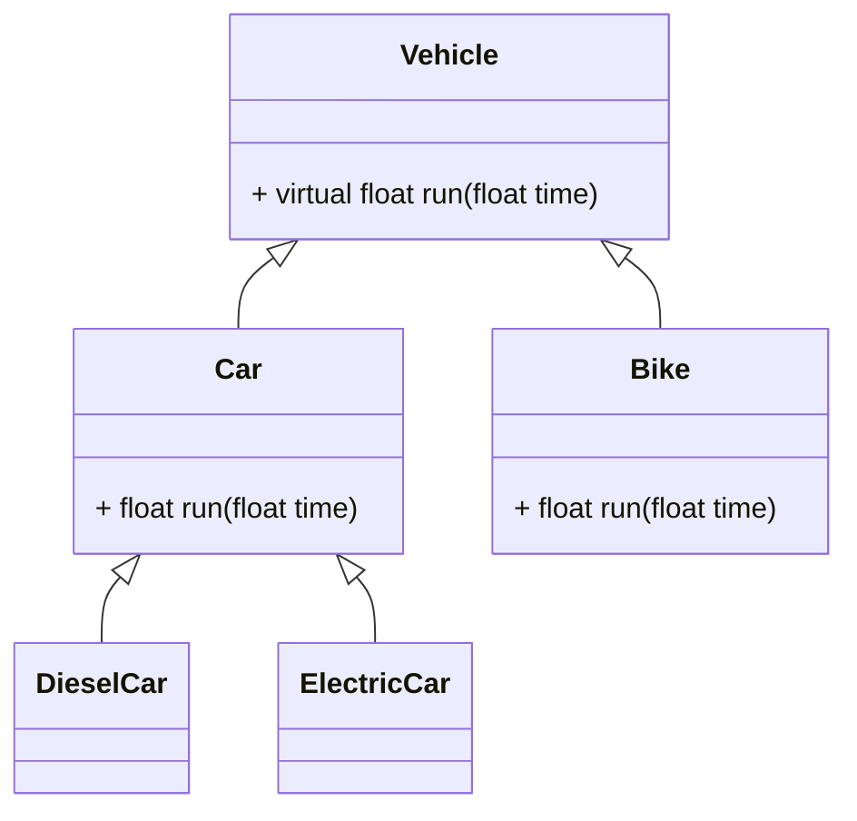
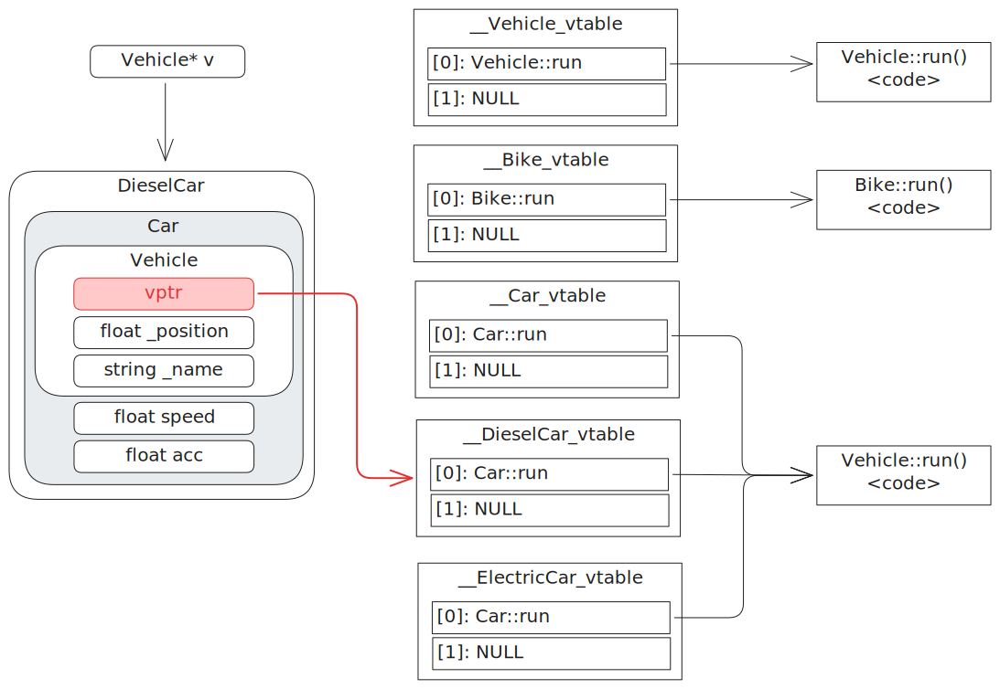
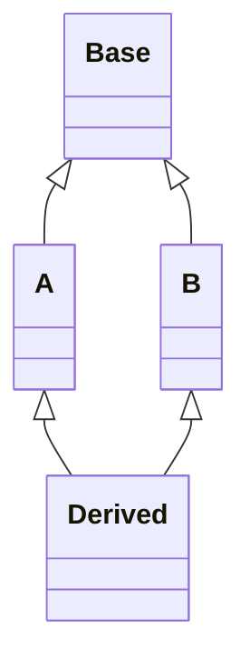

# Wykład 6 - Polimorfizm i Wyjątki

Zakres:

* Dziedziczenie
* Polimorfizm
* Funkcje wirtualne
* RTTI
* Wyjątki

## Dziedziczenie

Typy obiektów w programowaniu obiektowym bywają bardzo podobne. Mogą współdzielić
między sobą dużą część stanu i/lub zachowania. Rozważmy przykład modelujący różne przyciski w aplikacji graficznej:

```cpp
class Button {
    double _x = 0, _y = 0;
    double _w = 100, _h = 50;
    std::string _text;
    void (*_on_click)() = nullptr;

   public:
    Button() = default;
    std::pair<double, double> position() const { return {_x, _y}; }
    void setPosition(double x, double y) { _x = x; _y = y; }
    std::pair<double, double> size() const { return {_w, _h}; }
    void setSize(double w, double h) { _w = w; _h = h; }
    const std::string& text() const { return _text; }
    void setText(const std::string& text) { _text = text; }
    void setOnClick(void (*fn)()) { _on_click = fn; }
    void click() {
        _on_click();
    }
    void draw();
};

class ToggleButton {
    double _x = 0, _y = 0;
    double _w = 100, _h = 50;
    std::string _text;
    void (*_on_click)() = nullptr;
    bool _toggled = false;

   public:
    /* duplikacja */
    void click() {
        _toggled = !_toggled;
        _on_click();
    }
    bool toggled() const { return _toggled; }
    void draw();
};

class RoundButton {
    double _x = 0, _y = 0;
    double _r = 50;
    std::string _text;
    void (*_on_click)() = nullptr;
   private:
    RoundButton() = default;
    std::pair<double, double> position() const { return {_x, _y}; }
    void setPosition(double x, double y) { _x = x; _y = y; }
    double radius() const { return _r; }
    void setRadius(double r) { _r = r; }
    const std::string& text() const { return _text; }
    void setText(const std::string& text) { _text = text; }
    void setOnClick(void (*fn)()) { _on_click = fn; }
    void click() {
        _on_click();
    }
    void draw(); // draws rounded edges
};
```

Source: [button.cpp](button.cpp)

Trzy klasy różnią się bardzo nieznacznie. `ToggleButton` dodaje drobną logikę przechowującą stan wciśnięcia.
`RoundButton` różni się tylko w wewnętrznej implementacji rysowania. Podobieństwo trzech klas wynika z tego, że modelują
prawie te same typy. `Button`, `ToggleButton` i `RoundButton` to wszystko **są przyciski**. Widać więc relację 1 do
wielu
z pewnym uproszczonym typem modelującym wspólne elementy stanu i zachowania: uproszczonym przyciskiem.

Relację między typami _A to B_, _obiekty A to też obiekty typu B_ implementujemy w językach obiektowych za pomocą
mechanizmu **dziedziczenia**. W C++ definicja klasy może specyfikować jeden lub wiele typów bazowych, których
stan i zachowanie zostaną automatycznie włączone w typ pochodny.

```cpp
class BaseButton {
    double _x = 0, _y = 0;
    double _w = 100, _h = 50;
    std::string _text;
   protected:
    void (*_on_click)() = nullptr;

   public:
    BaseButton() = default;
    std::pair<double, double> position() const { return {_x, _y}; }
    void setPosition(double x, double y) { _x = x; _y = y; }
    std::pair<double, double> size() const { return {_w, _h}; }
    void setSize(double w, double h) { _w = w; _h = h; }
    const std::string& text() const { return _text; }
    void setText(const std::string& text) { _text = text; }
    void setOnClick(void (*fn)()) { _on_click = fn; }
};

class Button : public BaseButton {
  public:
    void click() {
        _on_click();
    }
    void draw();
};

class ToggleButton : public BaseButton {
    bool _toggled = false;

   public:
    void click() {
        _toggled = !_toggled;
        _on_click();
    }
    bool toggled() const { return _toggled; }
    void draw();
};

class RoundButton : public BaseButton  {
   public:
    void click() {
        _on_click();
    }
    void draw(); // draws rounded edges
};
```

Source: [abstract_button.cpp](abstract_button.cpp)

Wspólne pola (elementy stanu) zostały wydzielone do klasy bazowej `BaseButton`.
Podobnie, wspólne metody (elementy zachowania), charakterystyczne dla dowolnego przycisku stały się częścią klasy
bazowej.

Klasy pochodne definiują swoją bazę za pomocą składni `class A : public B { ... };` wymieniając po dwukropku
klasy, z których dziedziczą. Obiekty klas pochodnych posiadają pola i metody wszystkich klas bazowych, co można
zaobserwować, np. wywołując metody:

```cpp
void do_click() {
    std::cout << "click" << std::endl;
}

int main() {
     Button b;
     b.setText("Button");
     b.setPosition(0, 0);
     b.setOnClick(do_click);
     ToggleButton tb;
     tb.setText("Toggle");
     tb.setPosition(100, 0);
     tb.setOnClick(do_click);
     RoundButton rb;
     rb.setText("Round");
     rb.setPosition(200, 0);
     rb.setOnClick(do_click);

     b.click();
     tb.click();
     rb.click();

     return 0;
}
```

Relacja dziedziczenia pozwala mówić o skierowanym grafie zależności
między typami. Pracując z projektami złożonymi z wielu klas, często można spotkać diagramy
prezentujące hierarchię dziedziczenia, np. _diagramy klas_:



Technicznie, każdy obiekt klasy pochodnej zawiera pod-obiekt klasy pochodnej, a w nim, wszystkie jego składowe.
Różnica między dziedziczeniem, a zwyczajnym zadeklarowaniem podobiektu polega na tym, że nazwy składowych podobiektu
są włączane w zakres nazw składowych obiektu dziedziczącego.



Hierarchia dziedziczenia może być dowolnie zagłębiona:

```cpp
class A { ... };
class B : public A { ... };
class C : public B { ... };
```

### Przysłanianie

Klasa pochodna może definiować swoje składowe, rozszerzając funkcjonalność klasy bazowej.
Nasuwa się pytanie: co, jeżeli nazwie je tak samo, jak istniejące składowe w bazie?

```cpp
class Base
{
public:
    int value = 10;
    void bump() { value++; }
};

class Derived : public Base
{
public:
    int value = 20;
    void bump() { value--; }  // Które to value?
};

Derived d; // Jaka jest wartość d.value?
std::cout << d.value << std::endl;
d.bump(); // Która to metoda? Którego `value` użyje?
std::cout << d.value << std::endl;
```

Source: [shadowing.cpp](shadowing.cpp)

Obiekty klasy `Derived` posiadają dwa pola o nazwie `value` i dwie metody `bump`. Nazwy wymienione w ciele
klasy pochodnej **przysłaniają** te z klasy bazowej, przez co wyrażenia `d.bump()` i `d.value`
odnoszą się do metody i składowej zdefiniowanej przez klasę `Derived`.

Można jawnie odnieść się do składowej z bazy prefiksując nazwę operatorem zakresu:

```cpp
class Derived : public Base {
public:
    // ...
    void bump_base() { Base::bump(); }
};

d.Base::bump();
std::cout << d.Base::value << std::endl;
```

Obiekt `d` typu `Derived` zawiera zatem dwa niezależne podobiekty `value` typu `int`, o czym można przekonać się,
chociażby patrząc na ich adresy:

```cpp
Derived d;
std::cout << d.value << " at " << static_cast<void*>(&d.value) << std::endl;
std::cout << d.Base::value << " at " << static_cast<void*>(&d.Base::value) << std::endl;
```

```text
19 at 0x7ffd25ffa6b4
11 at 0x7ffd25ffa6b0
```

### Widoczność

Jaka jest widoczność odziedziczonych składowych? To zależy od dwóch czynników:

1) Od ich widoczności zdefiniowanej w klasie bazowej
2) Od typu dziedziczenia określonego na liście klas bazowych

Klasa pochodna określa, jaka ma być widoczność odziedziczonych składowych poprzedzając klasy bazowe na liście
dziedziczenia słowami `public`, `private` lub `protected`. Mówi w ten sposób o tym, czy
dziedziczymy w trybie publicznym, prywatnym lub chronionym. Dla klas domyślnym trybem jest `private`,
dla struktur: `public`.

Niezależnie od trybu dziedziczenia, składniki prywatne klasy bazowej są niedostępne dla nikogo,
nawet dla klasy dziedziczącej! To dobrze, bo inaczej moglibyśmy złamać hermetyzację podobiektu bazowego.

```cpp
class Base
{
private:
    int x = 1;

protected:
    int y = 2;

public:
    int z = 3;
};

class DerivedPublic : public Base
{
public:
    void foo()
    {
        // x *= 2; // Błąd! x to prywatna składowa Base
        y *= 2;
        z *= 2;
    }
};

DerivedPublic pub;
// pub.x *= 2;  // Błąd! x nie jest publiczną składową DerivedPublic
// pub.y *= 2;  // Błąd! y ma widoczność protected
pub.z *= 2;     // ok, z jest public
```

Przy dziedziczeniu publicznym, składniki `protected` pozostają `protected`, a składniki `public` pozostają `public`.
Dostęp do składowych `protected` będzie miała zatem klasa pochodna, ale nikt z zewnątrz. To najpowszechniejszy tryb
dziedziczenia, oznaczający naturalne rozszerzanie klasy bazowej. Słowo `protected` oznacza więc _dostępne, ale tylko
dla implementacji klas dziedziczących_.

Przy dziedziczeniu prywatnym składniki `protected` i `public` stają się prywatnymi składowymi klasy pochodnej.

```cpp
class DerivedPrivate : private Base
{
public:
    void foo()
    {
        // x *= 2;
        y *= 2;
        z *= 2;
    }
};

DerivedPrivate priv;
// priv.x *= 2;  // błąd! x, y, z są niewidoczne z zewnątrz
// priv.y *= 2;  //
// priv.z *= 2;  //
```

Ukrywamy w ten sposób fakt, że dziedziczymy dla wszystkich z zewnątrz.
Wewnętrznie klasa pochodna może korzystać ze składowych klasy bazowej,
ale nie udostępnia ich dla innych.

Przy dziedziczeniu protected składniki `protected` i `public` stają się chronionym składowymi klasy pochodnej.
Podobnie jak przy private, są niedostępne z zewnątrz, ale będą mogły z nich korzystać
klasy położone niżej w hierarchii dziedziczenia.

### Konstruktory i destruktory

Konstruktory potrafią inicjalizować obiekty typu, w którym zostały zdefiniowane,
i tylko tego typu. W szczególności nie potrafią _robić_ obiektów typów pochodnych,
więc **nie są dziedziczone**. Podobnie nie są dziedziczone destruktory.

W czasie konstrukcji obiektu pochodnego musi zostać skonstruowany pod-obiekt klasy bazowej,
czyli wywołanie jego konstruktora. Kompilator, o ile może, sam wygeneruje konstruktor domyślny,
który to robi. Możemy też zrobić to ręcznie na początku listy inicjalizacyjnej.

```cpp
class A
{
   public:
    A() { std::cout << "A()\n"; }
    explicit A(int a) { std::cout << "A(int)\n"; }
    ~A() { std::cout << "~A()\n"; }
};

class B
{
   public:
    B() { std::cout << "B()\n"; }
    explicit B(int a) { std::cout << "B(int)\n"; }
    ~B() { std::cout << "~B()\n"; }
};

class C : public A
{
    B b;
   public:
    C() { std::cout << "C()\n"; }
    explicit C(int a) : A(a), b(b) { std::cout << "C(int)\n"; }
    ~C() { std::cout << "~C()\n"; }
};

C c;
```

Source: [constructors.cpp](constructors.cpp)

Tworząc obiekt `C c`, rozpoczyna się wywołanie konstruktora `C()`. Najpierw wykonywana jest
inicjalizacja podobiektów, w tym na samym początku podobiektów klas bazowych. Wołany jest więc
konstruktor `A()`. Potem inicjalizowany jest podobiekt `B b`. a na samym końcu wykonywane
jest ciało konstruktora `C()`.

```text
A()
B()
C()
~C()
~B()
~A()
```

Kolejność inicjalizacji jest zawsze taka sama: najpierw podobiekty bazowe, potem jawne podobiekty,
na końcu ja sam. Kolejność destrukcji zawsze jest odwrotna.

### Przypisania

Nie dziedziczy się również operatorów przypisania/przeniesienia. Jeżeli sami ich nie zdefiniujemy,
to kompilator sam je wygeneruje, kopiując bądź przenosząc składnik po składniku (w tym podobiekty bazowe).

```cpp
#include <iostream>

class Base
{
   public:
    Base& operator=(const Base&)
    {
        std::cout << "operator=(const Base&)\n";
        return *this;
    };
    Base& operator=(Base&&)
    {
        std::cout << "operator=(Base&&)\n";
        return *this;
    };
};

class Derived : public Base
{
};

int main()
{
    Derived o1, o2;
    o1 = o2;
    o1 = std::move(o2);
    return 0;
}
```

Source: [assignments.cpp](assignments.cpp)

Jeżeli potrzebujemy zaimplementować inną logikę, to oczywiście możemy dostarczyć
własne operatory przypisania. Można w ich ciele skorzystać z operatora klasy bazowej
do skopiowania pod-obiektu bazowego:

```cpp
Derived& operator=(const Derived& other)
{
    Base::operator=(other);
    return *this;
};
```

### Wielodziedziczenie

Klasa może mieć kilka typów bazowych. Obiekty tej klasy będą wtedy
składały się z kilku pod-obiektów bazowych.

```cpp
class A {
   public:
    int x;
    A(int x) : x{x} {}
};

class B {
   public:
    int x;
    B(int x) : x{x} {}
};

class C : public A, public B {
   public:
    int x;

    C() : A{1}, B{2}, x{3} {

    }

    void print() const {
        std::cout << A::x << ", " << B::x << ", " << x << std::endl;
    }
};
```

Jeżeli odniesienia do składników klas bazowych nie są jednoznaczne, możemy
je doprecyzować, poprzedzając nazwy operatorem zakresowym jak w przypadku zwykłego przysłaniania.

Dopuszczenie wielodziedziczenia wprowadza problem. Programista może stworzyć klasę, która
ma tego samego przodka wielokrotnie. To problem znany jako _Deadly Diamond of Death_.
Rozbudujmy poprzedni przykład o klasę `Base`, będącą wspólnym przodkiem `A` i `B`.



To powoduje, że obiekty klasy `C` zawierają 2 pod obiekty bazowe typu `Base`.
Odwołania do składowych `Base` będą niejednoznaczne.

```cpp
class C {
    // ...
    void print() const
    {
        std::cout << A::x << ", " << B::x << ", " << x << std::endl;
        // std::cout << value << std::endl; // błąd!
        std::cout << A::value << std::endl;
        std::cout << B::value << std::endl;
    }
    // ...
};
```

Source: [multiple_inheritance.cpp](multiple_inheritance.cpp)

Jężeli programista chciałby, aby jednak pod-obiekt `Base` występował
jednokrotnie, może skorzystać z mechanizmu _wirtualnego dziedziczenia_,
deduplikującego powtarzające się klasy bazowe.

```cpp
class A : virtual public Base { /* ... */ };
class B : virtual public Base { /* ... */ };
class C : public A, public B { /* ... */ };
```

Kompilator analizując hierarchię dziedziczenia typu `C`
zbierze wszystkie krawędzie wirtualnego dziedziczenia odnoszące się do typu `Base`
i pozostawi tę klasę bazową jednokrotnie.

Z tego powodu, wiele języków obiektowych nie pozwala na wielodziedziczenie,
albo je ogranicza, np. pozwalając tylko na jedną klasę bazową zawierającą pola
(reszta może mieć tylko funkcje).

## Polimorfizm

Klasa pochodna, dziedzicząc, mówi, że jej obiekty **są** też obiektami klasy bazowej.
Można je więc traktować jako obiekty typu bazowego. W końcu odziedziczyły (mają) komplet stanu
i zachowania taki sam, jaki mają obiekty klasy bazowej. Rozważmy hierarchię:



Source: [polymorph.cpp](polymorph.cpp)

Bez względu na to, czy dany obiekt jest typu `Car`, `Bike` czy `Motorcycle`
zawsze będzie miał atrybuty `name` i `position`. Można więc odnosić się do niego
tak jak gdyby był to obiekt typu `Vehicle`, bez względu na konkretny typ.

Język dostarcza nam wspaniałe narzędzie odzwierciedlające ten fakt. Odwołania do obiektów,
czyli wskaźniki i referencje, mogą być niejawnie rzutowane na wskaźniki i referencje
typu bazowego. Posługując się takimi bazowymi odniesieniami,
jesteśmy w stanie programować algorytmy w oderwaniu od konkretnych typów.
To właśnie jest **polimorfizm**.

Wskaźnik na obiekt typu `Bike` można traktować jak wskaźnik na typ bazowy `Vehicle`.
Technicznie adres przed i po konwersji zwykle będzie identyczny, ponieważ pod-obiekt bazowy
jest przechowywany _na początku_. Nie będzie to prawdą w przypadku wielodziedziczenia.

```cpp
Bike b ("Romet");

Vehicle* vb = &b;
vb->name();
```

Podobnie, można odwoływać się do obiektu za pomocą referencji na typ bazowy, np. przekazać go do funkcji:

```cpp
void print(const Vehicle& v) {
    std::cout << "Vehicle " << v.name() << " at " << v.position() << "m" << std::endl;
}
print(b);
```

Odwołania do obiektów różnych typów można umieścić w jednym kontenerze:

```cpp
DieselCar dc("Toyota Fortuner");

Vehicle* vehicles[] = {&b, &dc};
for (auto v : vehicles) {
    print(*v);
}
```

### Wielodziedziczenie

Rzutowania okazują się bardziej skompilowane, jeżeli klasa dziedziczy z wielu innych klas.
Rozważmy prosty przykład:

```cpp
struct BaseA {
    int first;
};

struct BaseB {
    int second;
};

struct Derived : BaseA, BaseB {
    int derived;
};

void processA(BaseA* obj) { std::cout << "process(BaseA* obj = " << static_cast<void*>(obj) << ")\n"; }

void processB(BaseB* obj) { std::cout << "process(BaseB* obj = " << static_cast<void*>(obj) << ")\n"; }

Derived d = {1, 2, 3};
std::cout << "&d = " << static_cast<void*>(&d) << "\n";
BaseA* a = &d;
BaseB* b = &d;
std::cout << "a = " << static_cast<void*>(a) << "\n";
std::cout << "b = " << static_cast<void*>(b) << "\n";
std::cout << "b - a = " << reinterpret_cast<std::byte*>(b) - reinterpret_cast<std::byte*>(a) << "b\n";

processA(&d);
processB(&d);
```

Source: [multipolymorphism.cpp](multipolymorphism.cpp)

Obiekt `d` klasy `Derived` wygląda w pamięci następująco:



Traktowanie adresu tego obiektu jak adresu obiektu pierwszej klasy bazowej `BaseA` jest trywialne.
Tę samą wartość adresu można traktować zarówno jako `Derived*` jak i `BaseA*`, co widać, drukując adresy po rzutowaniu
lub przekazaniu obiektu do funkcji:

```text
&d = 0x7ffd6291c2cc
a = 0x7ffd6291c2cc
```

Rzutując w dół na drugi typ bazowy `BaseB`, trzeba przekazać adres obiektu typu `BaseB`. Konwersja nie będzie trywialna,
trzeba dodać rozmiar poprzedzającego pod-obiektu bazowego, czyli 4 bajty:

```text
b = 0x7ffd6291c2d0
b - a = 4b
```

## Funkcje wirtualne

Dopełnieniem polimorfizmu możliwość implementowania tego samego elementu zachowania obiektu (metody) na różne sposoby
w zależności od typu. Dzięki temu, nie wiedząc, czy dany obiekt jest samochodem, czy rowerem, dysponując tylko
wskazaniem/referencją na `Vehicle` będziemy w stanie uruchomić pewne zachowanie, np. `float run(float time)` 
i wykonać kod inny ze względu na rzeczywisty typ wskazywanego obiektu.

```cpp
class Vehicle {
    /* ... */
public:
    virtual float run(float time) {
        std::cout << "Vehicle::run(" << time << "s)" << std::endl;
        const float speed = 1.0f;
        _position += time * speed;
        return _position;
    }
};

class Car : public Vehicle {
    float speed = 0.0f;
    /* ... */
public:
    float run(float time) override {
        std::cout << "Car::run(" << time << "s)" << std::endl;
        _position += speed * time;
        speed += acceleration * time;
        return _position;
    }
};

class DieselCar : public Car { /* ... */ };

class ElectricCar : public Car { /* ... */ };

class Bike : public Vehicle {
    /* ... */
public:
    float run(float time) override {
        std::cout << "Bike::run(" << time << "s)" << std::endl;
        const float speed = 0.2f;
        _position += speed * time;
        return _position;
    }
};
```

Source: [virtuals.cpp](virtuals.cpp)



Klasa bazowa `Vehicle` dostarcza metodę `run()` oznaczoną jako `virtual`.
Jeżeli klasa pochodna dostarczy metodę o tym samym prototypie,
to ją nadpisze! Implementacje `Car::run()` i `Bike::run()` dostarczają logikę
ruchu dedykowaną dla obiektów typu `Car` (i pochodnych) oraz `Bike`.

```cpp
Bike b ("Romet");
DieselCar dc("Toyota Fortuner");
ElectricCar ec ("Ford Mustang Mach-E");

for (float time = 0.0f; time < 3.0f; time += 1.0f) {
    Vehicle* vehicles[] = {&b, &dc, &ec};
    for (auto v : vehicles) {
        v->run(1.0f); // Skok do różnych funkcji
    }
}
```

Jeżeli `v` jest typu `Car` (lub pochodnego) to zostanie wywołana
metoda `Car::run()`. Jeżeli `v` jest typu `Bike` to zostanie wywołana metoda `Bike::run()`.
Jeżeli rzeczywisty typ nie nadpisuje metody `run()` to zostanie wywołana implementacja z klasy bazowej
`Vehicle::run()`.

> Patrząc na deklarację metody w jakiejś dziedziczącej klasie, ciężko stwierdzić,
> czy nadpisuje ona jakąś metodę z klasy bazowej. Opcjonalne słowo kluczowe `overrides`
> dokumentuje fakt nadpisania funkcji wirtualnej i generuje błąd kompilacji, gdyby tak nie było.

Typy posiadające funkcje wirtualne C++ nazywa _typami polimorficznymi_.

### Jak to działa?

Kompilując wyrażenie typu `v->run(1.0f)`, gdzie `v` jest typu `Vehicle*`
kompilator nie może wiedzieć, jaki będzie rzeczywisty typ wskazywanego obiektu.
Dysponuje tylko adresem przechowywanym w zmiennej `v` faktem, że jest tam obiekt typu `Vehicle`, lub pochodnego.
Co zatem generuje? Skąd ma wiedzieć, do jakiej funkcji skoczyć?
Jak są implementowane funkcje wirtualne?

Typowa implementacja wykorzystuje tzw. _tablice funkcji wirtualnych_.
Każdy obiekt typu zawierającego funkcje wirtualne ma ukryte pole `vptr`
wskazujące na tablicę wskaźników do funkcji. Wskaźnik `vptr`
pokazuje na różne tablice w zależności od typu obiektu: jest inicjalizowany
podczas konstrukcji, kiedy typ jest znany.



Dla każdego typu zawierającego funkcje wirtualne kompilator generuje tablicę `vtable` w pamięci programu.
Tablica zawiera tyle komórek, ile typ ma funkcji wirtualnych. Wartościami w komórkach tablicy są adresy konkretnych
funkcji.

Kompilator analizując wywołanie wirtualne typu `v->run()` generuje instrukcje realizujące wyrażenie
`*(v->vptr[func_idx])(args...)`:

* na podstawie adresu `v` ładowana jest wartość `vptr`
* na podstawie wołanej funkcji z tablicy wskazywanej przez `vptr` wybierany jest odpowiedni indeks
* następuje skok do funkcji pod adresem zapisanym w komórce tablicy `vtable`

To skakanie po pamięci, najpierw do tablicy funkcji wirtualnych, a dopiero potem
do docelowej funkcji nosi różne nazwy: _późne wiązanie_ (_late binding_), _wiązanie w czasie wykonania_,
_dynamic dispatch_, _wywołanie polimorficzne_ (_polymorphic dispatch_).
Wszystkie odnoszą się do tego samego procesu: ustalenia adresu wywoływanej funkcji
w czasie wykonania programu. Często stawia się ten mechanizm w odróżnieniu od _wczesnego wiązania_ albo
_wiązania w czasie kompilacji_, używanego w przypadku zwykłych funkcji, kiedy to kompilator dokładnie wie,
gdzie skoczyć.

### Funkcje czysto wirtualne

W przykładzie z pojazdami ciało metody `Vehicle::run()` jest niejako nadmiarowe: nie powołujemy w końcu do życia
obiektów typu `Vehicle`. Często nie wiadomo jak zaimplementować metodę w klasie bazowej, bo ma ona jedynie
deklarować abstrakcyjny interfejs, a nie dostarczać konkretną implementację.

Typ bazowy może jedynie deklarować, że typy pochodne będą implementować jakąś funkcję wirtualną,
nie dostarczając implementacji samemu:

```cpp
class Vehicle {
  /* ... */
public:
  virtual float run(float time) = 0;
};
```

Taka konstrukcja `= 0` jest dozwolona tylko dla funkcji wirtualnych i nosi nazwę _pure virtual function_.
Klasy posiadające funkcje czysto wirtualne często nazywamy _klasami abstrakcyjnymi_.
W konsekwencji nie da się powołać do życia instancji obiektu typu abstrakcyjnego.
Kompilator nie generuje dla takiego typu tablicy funkcji wirtualnych, bo nie miałby jak jej wypełnić.

### Destruktory

Konstruktor wirtualny być nie może. Tworząc obiekt, zawsze podajemy jego typ.
Natomiast destruktor może i często musi być wirtualny! Rozważmy następujący kod implementujący tablicę dynamiczną
tablicę na stercie:

```cpp
class AbstractArray {
   public:
    virtual std::size_t size() const = 0;
    virtual int get(std::size_t idx) const = 0;
};

class FakeArray : public AbstractArray { /* ... */ };

class HeapArray : public AbstractArray
{
    std::size_t _size;
    int* _data;

   public:
    HeapArray(std::size_t size) : _size(size), _data(new int[size]) {
        for (std::size_t i = 0; i < size; i++)
            _data[i] = i;
    }

    ~HeapArray() { delete[] _data; }

    std::size_t size() const override { return _size; }
    int get(std::size_t idx) const override { return _data[idx]; }
};

int main() {
    AbstractArray* arr = new FakeArray(10);

    for (std::size_t i = 0; i < arr->size(); i++)
    {
        std::cout << arr->get(i) << ", ";
    }
    std::cout << std::endl;

    delete arr;
    return 0;
}
```

Source: [virtual_destructor.cpp](virtual_destructor.cpp)

Ten program nie zwalnia całej zaalokowanej pamięci:

```shell
g++ -fsanitize=leak virtual_destructor.cpp -g -o /tmp/virtual_destructor && /tmp/virtual_destructor
```

```text
==25858==ERROR: LeakSanitizer: detected memory leaks

Direct leak of 40 byte(s) in 1 object(s) allocated from:
    #0 0x7ef37c416362 in operator new[](unsigned long) ../../../../src/libsanitizer/lsan/lsan_interceptors.cpp:250
    #1 0x5dfebd44e562 in HeapArray::HeapArray(unsigned long) /home/saqq/repos/cpp-site/content/wyk/w6/virtual_destructor.cpp:26
    #2 0x5dfebd44e2b0 in main /home/saqq/repos/cpp-site/content/wyk/w6/virtual_destructor.cpp:43
    #3 0x7ef37bc2a1c9 in __libc_start_call_main ../sysdeps/nptl/libc_start_call_main.h:58
    #4 0x7ef37bc2a28a in __libc_start_main_impl ../csu/libc-start.c:360
    #5 0x5dfebd44e184 in _start (/tmp/virtual_destructor+0x1184) (BuildId: 4fead369add96fe2771035ebb6352e20b88ffd3b)

SUMMARY: LeakSanitizer: 40 byte(s) leaked in 1 allocation(s).
```

Dlaczego? Kompilator analizując wyrażenie `delete arr` nie zna typu obiektu wskazywanego przez `arr`.
Jest w stanie jedynie wywołać destruktor `~AbstractArray()`, który nic nie robi.

Destruktor typu abstrakcyjnego musi być zatem funkcją wirtualną:

```cpp
class AbstractArray {
   public:
    virtual ~AbstractArray() = default;
    virtual std::size_t size() const = 0;
    virtual int get(std::size_t idx) const = 0;
};
```

### Wielodziedziczenie

Ponownie, w przypadku obecności wielodziedziczenia, sprawa staje się bardziej skomplikowana.
Rozważmy przykład dziedziczenia z dwóch klas polimorficznych:

```cpp
struct BaseA {
    virtual void foo();
    virtual void common();
    int first;
};

struct BaseB {
    virtual void bar();
    virtual void common();
    int second;
};

struct Derived: public BaseA, public BaseB {
    void bar() override;
    void common() override;
    int derived;
};

void process(BaseB* b);

Derived d;
process(&d);
```

Nie wystarczy pojedyncze pole `vptr` w obiekcie typu `Derived`. Ktoś może w końcu chcieć rzutować adres `&d`
na typ bazowy, np. `BaseB`, który też jest polimorficzny! Adres wynikowy musi być wtedy poprawnym adresem obiektu typu
`BaseB`, z polem `vptr` umożliwiającym dynamiczne wywoływanie metody `bar()`. Stąd układ w pamięci będzie wyglądał
następująco:


Obiekty klas bazowych, np. `BaseB` zaczynają się od pola `vptr` wskazującego na tablicę zawierającą adresy funkcji
`bar()` i `common()`.

Obiekt klasy pochodnej zawiera dwa pod-obiekty bazowe, każdy zaczynający się od swojego pola `vptr`.
Tablica funkcji wirtualnych klasy `Derived` to niejako konkatenacja tablic typów bazowych. Dwa pola `vptr` pokazują
na początek _swoich_ części. Dzięki temu rzutując w dół adres obiektu typu `Derived` obydwa typy bazowe wszystko się
zgadza.
Przykładowo, rzutowanie `static_cast<BaseB*>(d)` efektywnie przesunie adres o rozmiar pierwszego pod-obiektu bazowego.
Otrzymany wskaźnik pokazuje na miejsce, w którym pierwszym elementem jest `vptr`, tak jak powinno być dla wskaźników
`BaseB*`. Co więcej, ten `vptr` wskazuje na tablicę, w której pierwszym elementem jest adres funkcji `bar()`, a drugim
`common()`!

> To wszystko to tylko namiastka problemów, z którymi musi mierzyć się kompilator w przypadku wielodziedziczenia.
Zainteresowanych zachęcam do lektury [bardziej szczegółowego artykułu](https://nimrod.blog/posts/what-does-cpp-object-layout-look-like).

## Run Time Type Information

### Operator `typeid()`

Obiekty polimorficzne w C++ trzymają w pamięci informacje o swoim typie w postaci struktury
[`std::type_info`](https://en.cppreference.com/w/cpp/types/type_info).
Można ją pozyskać za pomocą operatora `typeid()`.

```cpp
struct Shape {
    virtual ~Shape() = default;
    virtual float area() = 0;
};

struct Square : Shape {
    float size;
    explicit Square(float size) : size{size} {}
    float area() override { return size * size; }
};

struct Circle : Shape {
    float radius;
    explicit Circle(float radius) : radius{radius} {}
    float area() override { return M_PI * radius * radius; }
};

Shape* shapes[] = {new Square(2), new Circle(1)};

for (auto shape : shapes)
{
    const std::type_info& type = typeid(*shape);
    std::cout << "Shape of type " << type.name() << std::endl;
    if (type == typeid(Square)) {
        std::cout << "It's a square!\n";
    } else if (type == typeid(Circle)) {
        std::cout << "It's a circle!\n";
    }
}
```

Source: [typeid.cpp](typeid.cpp)

Pozyskane obiekty `std::type_info` można porównywać. Zawierają też metodę `name()` zwracającą nazwę typu,
której dokładny format zależy od implementacji języka (kompilatora).

> Implementacyjnie wskazanie na `std::type_info` jest przechowywane w tablicy funkcji wirtualnych

### Rzutowanie `dynamic_cast<T>`

O ile rzutowania w górę hierarchii dziedziczenia są zawsze poprawne, to rzutowania w dół za pomocą `static_cast<T>`
już być takie nie muszą. Do bezpiecznego rzutowania obiektów w polimorficznej hierarchii dziedziczenia
można wykorzystać dedykowany rodzaj rzutowania: `dynamic_cast<T>`,
sprawdzający w czasie wykonania, czy na pewno wskazywany obiekt jest pożądanego typu.
Jeśli nie to takie rzutowanie zwróci błąd.

```cpp
Shape* shapes[] = {new Square(2), new Circle(1)};

for (auto shape : shapes)
{
    auto square = dynamic_cast<Square*>(shape);
    if (square != nullptr) {
        std::cout << "It's a square!\n";
        square->size = 10;
    }

    auto circle = dynamic_cast<Circle*>(shape);
    if (circle != nullptr) {
        std::cout << "It's a circle!\n";
        circle->radius = 10;
    }

    std::cout << "Area is " << shape->area() << std::endl;
    delete shape;
}
```

Rzutowania `dynamic_cast<T>` można używać tylko do konwersji wskaźników i referencji.
Dla wskaźników, jeżeli wskazywany obiekt nie jest pożądanego typu, zwrócony zostanie `nullptr`.
Dla referencji operator rzuci wyjątek `std::bad_cast`.

Rzutowanie w dół to prosty przypadek. `dynamic_cast<T>` potrafi być o wiele bardziej zadziwiający:

```cpp
struct Base {
    virtual ~Base() = default;
};

struct A : Base {
    int a = 0;
};

struct B : Base {
    int b = 0;
};

struct Derived : A, B { };

Derived obj;

A& a = obj; // upcast
a.a = 1;
B& b = dynamic_cast<B&>(a); // sidecast!
b.b = 2;
Derived& d = dynamic_cast<Derived&>(b); // downcast
```

Ten typ rzutowania potrafi dowolnie przechodzić po drzewie dziedziczenia
w bezpieczny sposób. W szczególności zamienić referencję `A&` na `B&`
o ile obiekt dziedziczy po obu typach.



`dynamic_cast<T>(expr)` jest przez to dość ciężkim narzędziem. Kompilator do jego realizacji
generuje kod algorytmu przeszukiwania grafu dziedziczenia od typu rzeczywistego `typeid(expr)` do typu docelowego
`typeid(T)`. Jeżeli ścieżka istnieje to rzutowanie się powodzi. Dzieje się to w czasie działania programu.

> Do implementacji innej logiki w zależności od typu obiektu zawsze preferujemy
> funkcje wirtualne nad mechanizmy RTTI!

